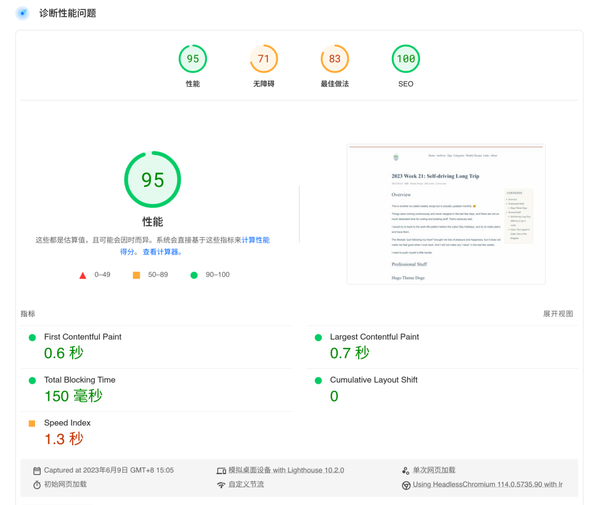

This post was assisted by Notion AI.

You may have noticed that all images on my blog load from webp.strrl.dev. So, what exactly is that?

## My Story

I write and publish posts on `strrl.dev`. To make the stories more vivid and interesting, I always include images, canvases, or stickers.

However, the original images from my phone can be several megabytes in size. Additionally, I sometimes record GIFs to introduce interactions, which can also cause issues with large file sizes.

Nova has informed me of a service they offer that can act as a middle layer to shrink the image size.

## What is WebP Cloud Services?

This is a cloud service that could speed up the load time of your website by delivering images in modern image formats.

## Where can WebP Cloud Services be used?

This service can be used on any website that cares about:

- loading speed, and/or
- reducing network data traffic usage.

## Why use WebP Cloud Services?

Because it could really reduce the size of the image, and the loading time.

Comparison

Before:

After:

Full reports:

- [https://pagespeed.web.dev/analysis/https-strrl-dev-post-weekly-recap-2023-21-selfdrivinglongtrip/i4gxdepubp](https://pagespeed.web.dev/analysis/https-strrl-dev-post-weekly-recap-2023-21-selfdrivinglongtrip/i4gxdepubp?form_factor=mobile)
- [https://pagespeed.web.dev/analysis/https-strrl-dev-post-weekly-recap-2023-21-selfdrivinglongtrip/z04jigvyme](https://pagespeed.web.dev/analysis/https-strrl-dev-post-weekly-recap-2023-21-selfdrivinglongtrip/z04jigvyme?form_factor=desktop)

## How to use WebP Cloud Services?

I use hugo to generate my blog, with Hugo "Markdown Render Hooks", I could customize the way to render images. So I could just replace the URL of the image.

Follow the documentation at https://docs.webp.se/webp-cloud/access/ for various ways to integrate it with your site.
