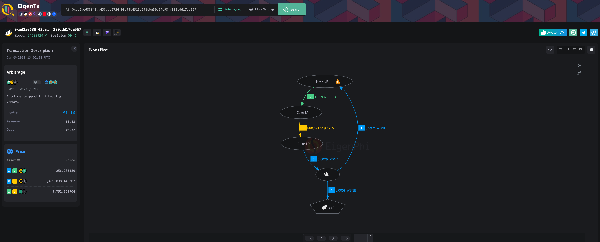

这篇文章的目的仅是记录自己一些有趣的尝试经历, 不足以作为技术参考, 也不包含任何建议.

## 前言

我想做什么: 想通过自动化交易赚点钱.

目前状况如何: 钱没赚到, 花了大约 70 USD 当学费了.

未来的计划: 从工程上来分析, 还是有通过统计的方式, 再次进行优化的空间的. 但是兴趣到了, 不打算再投入更多时间了.

## 套利

套利是在不同的市场上同时购买和出售相同或类似的资产, 以便在两个市场之间获得利润的交易策略.

举个例子, 背景是:

- 你看好可乐, 屯了 100 瓶可乐.
- 可乐在城西的超市卖 2 元一瓶, 在城东的超市卖 2.5 元一瓶.

你可以这样做:

- 你在城东卖出 100 瓶可乐, 并在城西又买了 125 瓶可乐, 你就多屯了 25 瓶可乐.
- 你在城东卖出 100 瓶可乐, 并在城西买了 100 瓶可乐, 你屯的可乐数没有变化, 但是赚了 50 元.

但是这个例子并不准确, 因为在现实世界交易并不是那么自由且简单的.

但是在某一个小领域里, 它确实变的非常简单且可预测.

那就是**在不同去中心化交易所(DEX)之间的交易.**

### DEX 之间的套利

> 我这次只尝试了币安智能链(BSC)上, 在基于 uniswap v2 fork 出来的 DEX 上进行套利的研究, 其余的链和其余的 DEX 并没有尝试.

去中心化交易所本质上一一系列的程序, 通过特定的算法使用户可以在某些价格区间内进行 token 之间的交换. 很多 DEX 的代码是开源的, 可以预测出下一个区块里各个 DEX 之间的价格, 然后寻找差价, 寻找利润.

有一个网站统计了 ETH 和 BSC 上发生的套利事件:

<https://eigenphi.io/>

我就从写这篇文章时, 随便捞一个套利事件来尝试分析一下:

<https://eigenphi.io/mev/bsc/tx/0xad2ae688f43da438cca6724f98a95b4515d291cbe50d24e98ff380cdd17da567>

> 选这个的原因是它的利润比较高, 足足有 $1.16, 而且只用默认的 Gas Price(5 Gwei)就拿下了这个交易, 太羡慕了.

来看一下它的 Token Flow Chart:

序号代表发生的顺序, 以 LP 结尾的是 Liquidity Provider, 可以简单理解为是可以交换某两个 Token 的池子, `to` 是合约本身, `leaf` 是最终的收益方.

我们可以发生了这么一段事:

- 首先, Cake LP 转了 0.6029 个 WBNB 给合约
- 然后合约用 0.5971 个 WBNB 换了 152.9923 个 USDT
- 然后合约用152.9923 个 USDT 换了 880,091.9197 个 YES
- 然后合约用 880,091.9197 个 YES 填回了最初的 Cake LP
- 最后合约把空手套白狼来的 0.0058 个 WBNB 转给了最后收益方

也就是 0.0058 个 WBNB 再减去 gas fee, 剩下的就是利益了; 就这样完成了 WBNB / USDT / YES 三个 Token 之间的套利.

俺接下来尝试解释一些大家可能存在的疑问:

- 为什么这笔套利交易的中 WBNB 利润是 `0.6029` - `0.5971`
- 为什么 Cake LP 在交换代币时,可以先转出 WBNB, 而 YES 是后续才转进来的?
- 如何发现这种机会?
