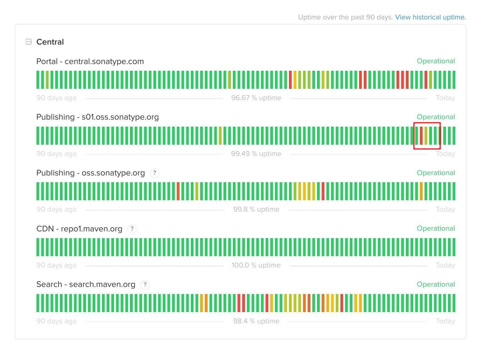

## Overview

This weekly recap spans from February 22nd to February 26th, 2023.

You might notice that I changed the name of this series from "Weekly Report" to "Weekly Recap." I was inspired by [yuchanns's weekly recap](https://yuchanns.xyz/notes/weekly-recap/2023-02-27). "Weekly Report" would make me feel stressed because I used to have to write a weekly report for my previous jobs. "Weekly Recap" is more relaxed as an informal summary of my week.

## Professional Stuff

### New Idea: Using ChatGPT/GPT-3 Davinci to build a Grammar Explainer

ref: <https://twitter.com/strrlthedev/status/1628950852185788416>

> AI is a popular topic in social media, especially chatGPT. There was a traffic spike on this twitter from the data of twitter analytics, even though it's only an **IDEA**, not a product or PoC Demo. 🤪

The background is I am learning English and preparing for the language exams. The long sentences in the reading part still took effort to comprehend. Maybe AI could help me understand it, I searched on the internet, and there were only a few products as grammar explainers. Still, products like Grammarly as a grammar checker differ from what I want.

Occasionally, I tried to ask the ChatGPT with my question, and it works pretty well:

Then I found another kind of usage of chatGPT: processing the unstructured text into structured information:

ref: <https://twitter.com/shing19_eth/status/1627258771071463424>

One more thing, I heard that ChatGPT could guide the developer in writing codes. I think it would also work for me.

Until now, the whole process settled in my mind:

- And ask ChatGPT to guide me in writing this application
- .. to use ChatGPT to explain the grammar of the sentence
- .. as the structured format, like JSON
- .. also append the translation of the sentences
- Streaming as Live Coding
- ... and youtube would also record the streaming automatically

Kind of a funny idea, but it's definitely worth trying. 🤪

### Mirroring iPad or iPhone on Linux

I demanded to mirror my iPad to my screen because sometimes I would draft my idea on the iPad, and I would like to share it with others during the meeting. I used to join the meeting with the Zoom app on my iPad. Still, it's weird because of duplicated personal identities appear on the zoom participants.

I wonder if there is a way to mirror the iPad screen to my desktop, and I also heard that there is a hacked version of the AirPlay server on Raspberry Pi.

At last, I found that open-source software: [UxPlay](https://github.com/antimof/UxPlay), and luckily, someone has packed it on AUR.

The experience of UxPlay is pretty good, the sound and the video are both fluent, and the latency is hard to notice:

> That's also good news for my girlfriend. She always likes to watch some videos on her iPad, complaining that the screen is not big enough.

### OSSRH Outage

OSSRH is one of the upstreams of Maven Central, hosting lots of open-source project artifacts. It's one of the most critical infrastructures for the open-source java ecosystem.

But such an important infrastructure is not stable (like enterprise service). It's been down for nearly 2 days:

Ref:

- <https://status.maven.org/incidents/1wlz7yhdm0wp>
- <https://twitter.com/strrlthedev/status/1628199303457169408>

The outage is caused by abuse by publishing too many artifacts, intentionally or unintentionally. And the OSSRH team could only recover from it by manually deleting them:

- <https://issues.sonatype.org/projects/OSSRH/issues/OSSRH-89036?filter=allopenissues>

Finally, the issue was resolved. Maybe the publisher realized the misuse of OSSRH, or the OSSRH team banned the publisher's account.

## Personal Stuff

### Beijing Sucks

I traveled to Beijing and Tianjin last week, and I was so disappointed about Beijing.

I lived in a hotel near the Tiantan(天坛), and there are lots of hutongs around it. I walked across them and found that they would not be worse anymore: even though the hutongs were narrow, there was lots of debris on each side of the hutong. And there are lots of cars parked on the side of the hutong, it seems these cars are not unused, but I have no idea how to park the car into the hutong and drive out of there.

I walk further to the Soshow Mall, and the entire 6 floor is full of ACG derivatives. Both my girlfriend and I were obsessed with a statue of Devil Hunter Valla:

I asked the store owner for the price, and he told us it cost about 2800 CNY, and the statue was the handcrafted limited edition, was the 34th of 128 items. 

We did not buy it but would eventually buy it in the future.

Another day, I went to Wangfujing Street and got shocked after I walked out of the subway station: lots of ravens flew on my head and quacked loudly:

ref: <https://twitter.com/strrlthedev/status/1626061065787441152>

And Wangfujing Street is not prosperity as I expected, there are not soo many people and shops, and one of the shops has even got closed since the pandemic. A foreign book store intrigued me, and there are lots of comic posts and game posts for sale, and other technical books in several languages:

Then I went to the Forbidden City, as a kind of boring tourism, because I do not get any interest in the historical sites.

On the last day, I went to Universal Studios Beijing. In summary: it is not as good as Shanghai Disneyland.

But the butter beer (no alcohol edition) is delicious, and we bought a cup for another 30 CNY as a souvenir:

> After we backed to Hangzhou, we found we could buy butter beer with alcohol in the supermarket, so we drank a taste of it again. 😜

Most of the activities in Universal Studios Beijing only have the funny on the form. Still, there are no good stories behind them.

And most of the forms are roller coasters, roller coasters, roller coasters... (same as the most popular activity in the Harry Potter section as the roller coasters, we nearly took about 90 mins to queue it 🥲) It's too bad for older people like my girlfriend and me.

But there are still a few good activities:

- One activity in Minions Section, but I forgot the name, though it is a kind of in-room roller coaster, I feel much safer. 😇
- A flash mod in the square near the entrance. I still have no idea about the activity name, but I will upload a video to Youtube later.
- The parade. But it lacks the Happy Potter theme. 🤷‍♂️

### Healthier Breakfast and Sleep Habits

I tried to build healthier breakfast and sleep habits, like:

- sleep at 22:30 pm and wake up at 6:30 am
- less sugar and starch in the breakfast

I found that I had too much sleep, which would cause listlessness in the daytime. Also, eating carbohydrates as primary food would make me feel very tired in the 30 - 60 mins after breakfast.

To make me feel more energetic, I must take care of the above habits. Also the exercise, I would go back to the gym and resume the training this week.

### Sponge AirPods Earbuds Replacement

Several days ago, some friends told me that the AirPods Pro earbuds would trigger ear infection/inflammation, and they did: <https://twitter.com/strrlthedev/status/1626024009572958208>

I brought another sponge replacement, which is much better than the original one, and the inflammation did not worsen recently.

### Star Guardian Vlogs from LOL Official Youtube Channel

I am a big fan of the Star Guardian series and am excited about the new heroes that will be released, including the Star Guardian series.

I found the official League of Legends Youtube channel released 3 short videos about the Star Guardian series: <https://www.youtube.com/watch?v=5rAeyo3K36g>

So I am sure there are several new heroes: Seraphine, Orianna, and Senna.
