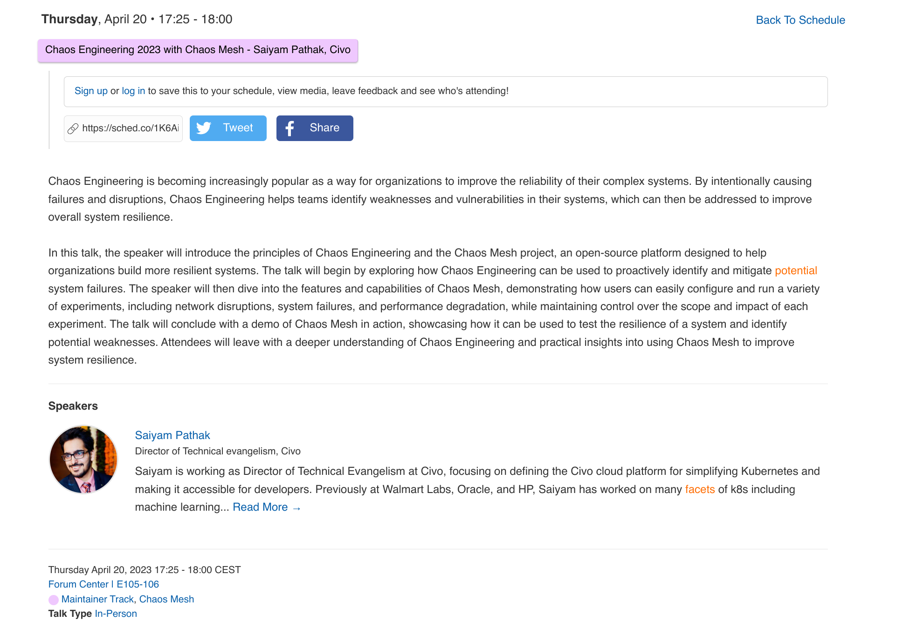
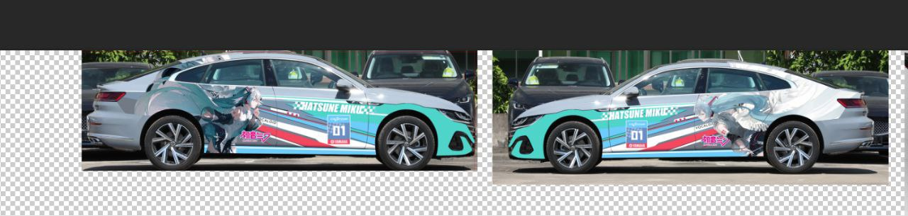
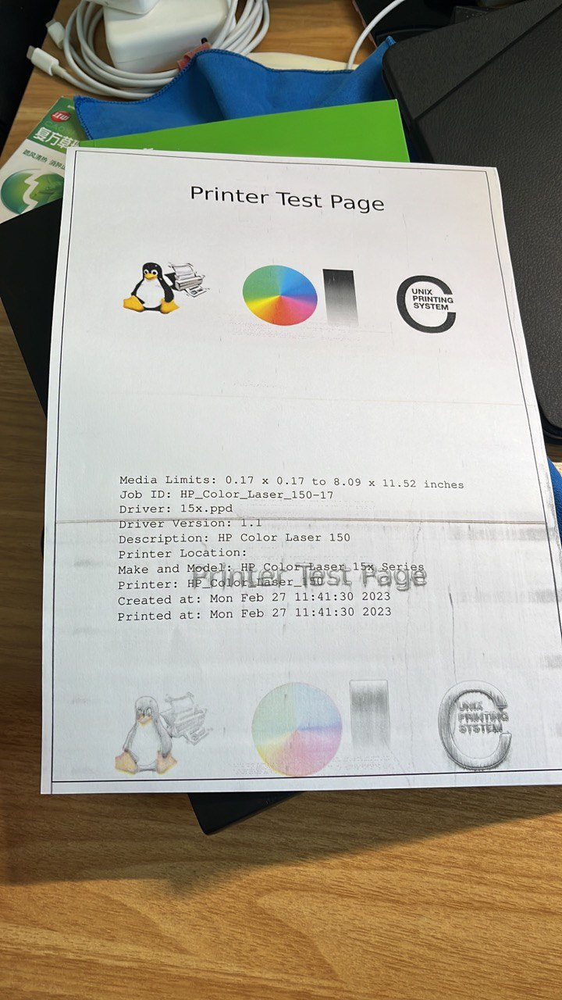
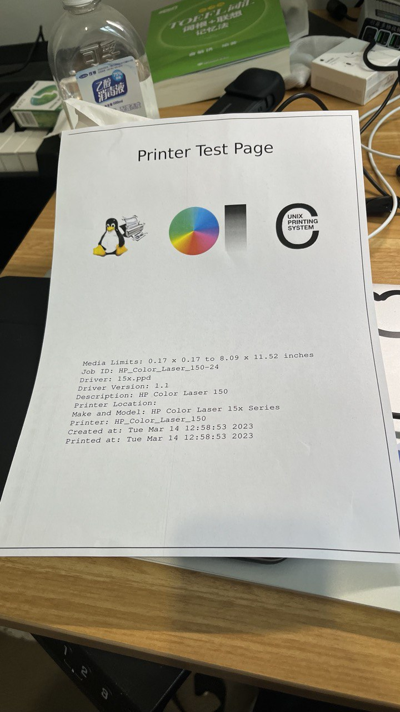

## Overview

## Professional Stuff

### Chaos Mesh presentation on KubeCon 2023 EU

Due to diverted personal priorities, we were not able to prepare the Maintainer track in time for Kubecon EU.

Several weeks a go, Saiyam noticed that and he wanted to schedule a presentation for Chaos Mesh, and it was already pass the deadline of CFP.

Saiyam encouraged us sending the email to the "CNCF Events" and "CNCF Speakers", to ask if there is a chance to let him present about Chaos Mesh on the KubeCon 2023 EU.

And we did, luckily, we got the response which CNCF would make an exception for us, and there was a available slot for the presentation coincidentally, so there it is:

<https://kccnceu2023.sched.com/event/1K6Ai>

### Itasha Car and Overcommunicate

TLDR; If you want to decorate your car as itasha car, do NOT find a personal designer.

Here is a concept called "Overcommunicate" in open source community. It means that the information carried in your message should be as much as possible, and the receiver could understand the basic idea of the message without asking more questions. I think that's a good practice for the async communication.

Once I got out of the engineering community, I suffered a totally different communication style in contrast.

In the past few weeks, I spent lots of time on the itasha car. I experienced a terrible time on the communication both in the QQ group and with the designer.

I found and joined the QQ group called "浙痛组", and as same as other ACG group, this group fully occupied with the low-energy content, memos, repeated messages, and tons of stickers. I tried to ask some question about the precess of the itasha car, only get few responds, and most of them are just "only answer the very next step, and show off that I know how to do it". There is not kind of a friendly community.

During the communication with the designer, I realized that I made a bad decision in that I over-trust the business ability of the so-called "designer." He started the design without the accurate size data of the car, just building a mask based on an internet image of the car. He just made up the final design with a simple combination of original stuff, with no way to re-draw or paint based on the original art. He refused to accept my suggestion and refused to explain why, with simply saying "it just can not do it." I was a student of Digital Media major, something I think it's possible and even easy to change, but he just refused to accept it. Later, both of us got frustrated, and we just finished the work with no more fundamental changes to the final design.

By now, everything goes well. I would wait another 7 - 10 days for an appointment with the printing guy. And I hope I could finish the itasha cat in the next 2 or 3 weeks.

At last, a quick peek of the final design:

### Refine the Blog Theme

I still miss my first theme used in this blog, it's a Material Style theme for hexo, simple and clean.

I started to think maybe I should build my own theme, with some features I want, like the preview of panorama images and embedded cards for links (like twitter and youtube).

Several days ago, I noticed that Material 3 / Material You finally get out, and replace the Material 2, became the default page of material.io. But there are not many available components in web, so maybe later, I could build a Material 3 theme for hugo.

## Personal Stuff

### Self-Driving Tour at Qiandao Lake

Too far to remember, but still a good trip.

### Hidden Drawer

I brought a hidden drawer, for store the phones.

The Phone it self is a huge trigger to disrupt my focus, so I decided to put it in somewhere I could not see it.

It works well.

### Fix the printer

My printer broken mightily caused by the long-term unuse and lack of maintenance.

I clean the "Imaging Drum" with alcohol, and it works much better now, except there is an area in the left side of the paper, which is not printed.

Before:

After:

### Diablo IV Public Beta

Diablo IV started its public beta in the last 2 weeks, and I played it.

It's a great game, more better than Diablo 3. It is definitely optimized with game controller, and I think I would not use the keyboard and mouse in the future gameplay.

I record the gameplay with OBS and youtube, maybe I would review them before the release day of the Diablo IV.

<https://www.youtube.com/playlist?list=PL2CnjpVBS-U8GwOPNMiXP1hz9s2F8Stgl>
