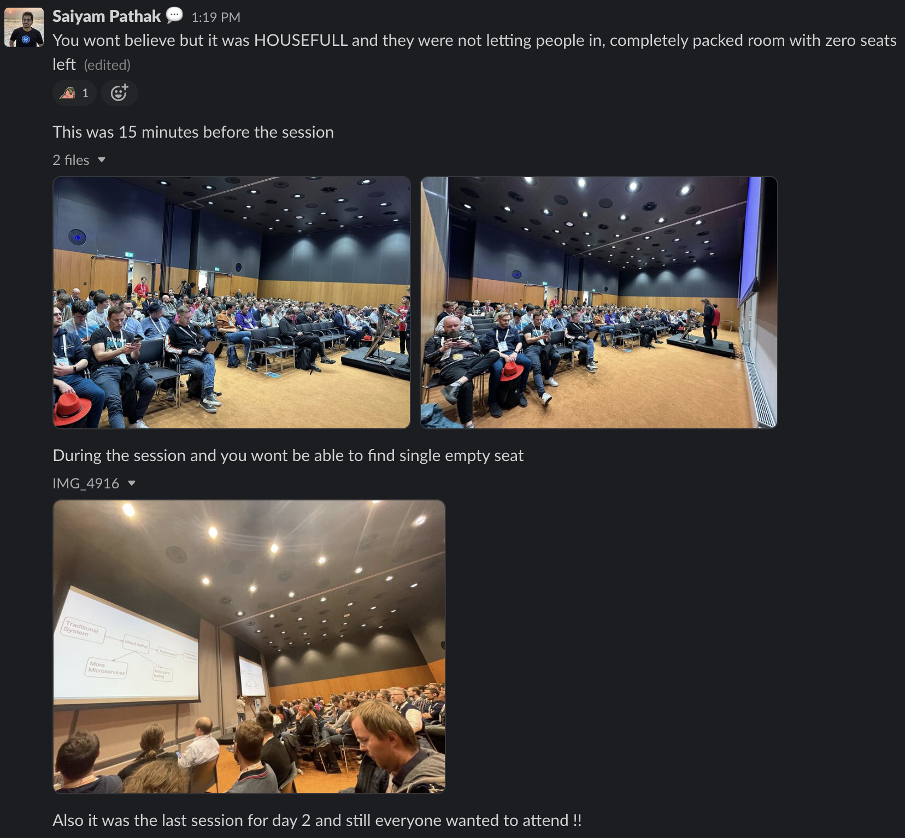
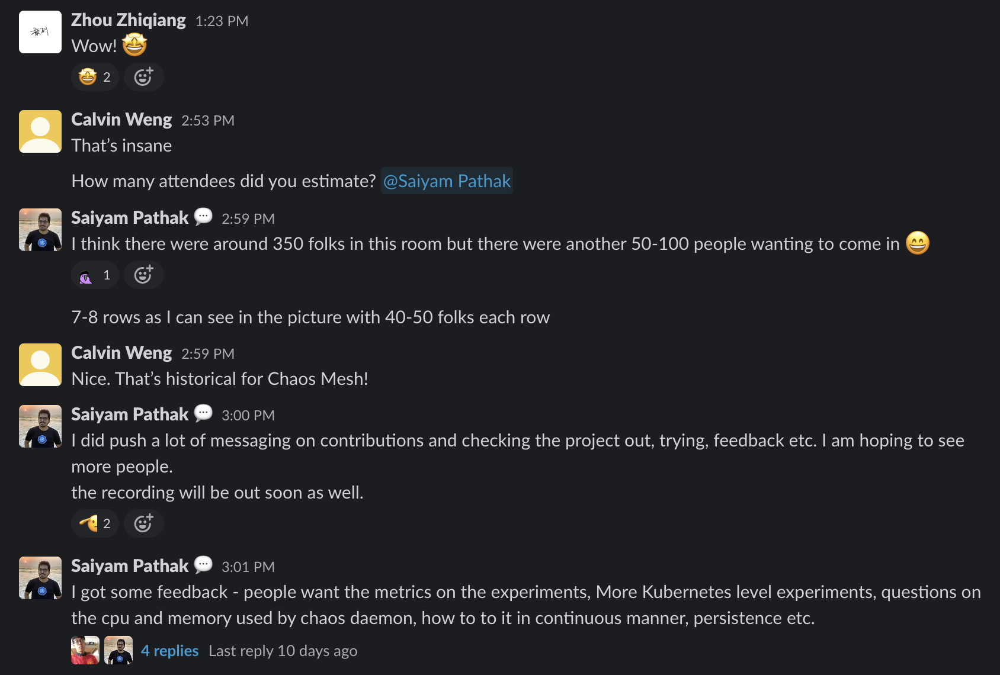
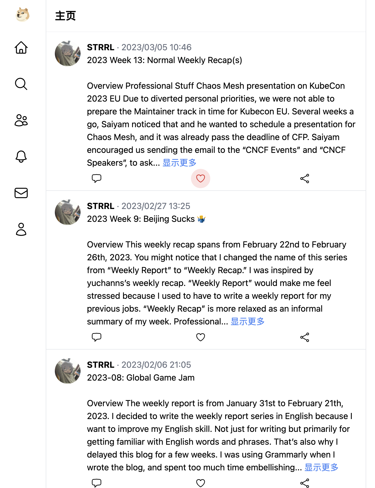

The ordinary days that we live in may, in fact, be a series of miracles.

The reason why I make such an exclamation is that in the past several weeks, my mood really turned a lot, from depressed to relaxed, from anxiety to calm down. We(my girlfriend and I) also completed tons of things on our plan, and these things were completed in a tight schedule.

It seems all the things were followed one by one, and we resolved each of them without breaks. And finally, we made it very well. Happy Ending(, temporarily).

## Overview

It has been a long time since I wrote the last "weekly recap". It's about 4 weeks.

I took the TOEFL exam in mid-April, and it consumed lots of my mental energy, so I just did not record the journal during these days.

But as you know, I did not get a good enough score, so I have to prepare it again. Wish I would get a better score next time.

Although I have a few journal as the materials for this weekly recap, but I really really tweeted a lot. I will collect the funny stuff  from my history tweets, and express some of my thoughts.

So basically, this weekly recap is kind of monthly recap for my April.

And this is the query I used to collect these tweets:

<https://twitter.com/search?q=(from%3Astrrlthedev)%20until%3A2023-05-01%20since%3A2023-04-01&src=typed_query>

## Professional Stuff

### TOEFL Exam

I want to share the differences between how I prepare the exam as a student and how I do it after I graduated.

When I was in high school, there was only one mid-term exam and only one final-term exam each semester, and there is no chance to re-take the exam. I had no other way but only prepared for exams as hard as I can, without any measure or standard to evaluate the preparation. The most extreme case is the "Gao Kao"(高考), the college entrance exam, one for all as a single exam.

After I took into the university, things got a little change: the final score would consider the ordinary class performance, the mid exam and the final exam, but the final exam still tool 70% weight.

After I graduated from the university and got the first job, I found that the project and engineering runs in a different way:

- project managers and engineers make a research on possible potential ways
- then we figure out the tradeoff between different ways
- then we choose the best / most efficient way
- if it does NOT work, we would repeat the process, re-evaluate the tradeoff and choose another way

I decided to use the engineering way to prepare this exam: first, take general preparation for a exam, evaluate the situation, then make the rest decisions.

I use a word book and some online courses for preparing the exam, and actually, I did not complete all of them before the exam. 🤣 I took the exam, got a intermediate score, also got confidence and experience.

For **reading and listening**, there are still lots of words and phrases that I can not understand. The target is **understanding all the sentences** of the mock testing material. I should memorize more words, and keep reading and listening more materials, like *WSJ Journal*, *TED/TEDx*, *stuff you should know*, etc. Maybe practice some **dictation** in the future.

For **speaking**, put more attention on the pronunciation of the words and the intonation of the sentences. The target is **expressing the thoughts(with notes) clearly without hesitation and repetition** and **always thinking in English**. Just keep practicing with friends in the weekly English Club. Maybe practice some "following up" with the podcast and videos.

For **writing**, I just have no other ideas about that. Maybe just keep the habit of writing the weekly recap and the daily journal. But they did not help a lot, because the TOEFL does not test the storying skill, but the ability to write a formal essay.

> Another funny story is that I just learned some tricks and writing templates from my girlfriend as "TOEFL Writing Crash Course", and it worked perfectly, I got 21 in the writing section.



Take it easy! Good luck to us! 🎉

### SSD Broken

Just the day before the TOEFL exam day, my primary dev machine SSD got broken.

I noticed some phenomenon that might caused by the SSD, but I did not take it seriously.



And one day, things got worse, the whole system became unavailable, any commands would report "IO Error", and Kernel Message shows that the nvme controller is down.



So I think there must be something broken in hardware level, maybe just incompatibility, or maybe dated / aging firmware / hardware. At that time, I did not have much mental energy to find the root cause, I just want to fix it ASAP.

I bought a new SSD(with the same capacity and sector size, for exactly `dd` command to copy the data), and just replaced the old one, but used another nvme slot on the mother board.

Finally, the primary dev machine was back to work, with better IO performance from the next generation of the same series SSD.



But I also noticed that the "broken" (suspiciously) SSD just works well on my Desktop during the `dd` process, and I use the an external PCIE-NVME card to connect the SSD to the Desktop. So I guess the problem might be the compatibility between the SSD and the motherboard, or some power management issues.

Maybe I could use the old one as another storage for games! Yeah! 1 TiB more Storage!

### KubeCon EU 2023

I do not even registered the online KubeCon EU 2023 virtual. I have bad experiences with past online confluences, there are lots of interesting presentations happened at the same time, and I finally need to watch the recording after the streaming.

I decide just watch the recording, no online streaming anymore. Another relaxing way to enjoy the summit.

The recording videos are still not available on youtube yet, after they are uploaded to youtube, I will make a wishlist of topics, and take some notes / reviews. I would also collect / tidy my wishlists and reviews for past KubeCons into my knowledge base site. I would publish them at the same time.

**Again, special thanks to Saiyam**. He brought the talk for Chaos Mesh, and tell us the in-person presentation worked very well: lots of listeners, and some feedbacks from users.

### New idea: Kubernetes Auditing Dashboard

It seems there is NO such project that works as a dedicated Kubernetes Auditing System, even as the most simple one.

Some cloud service suggest their integration with Kubernetes auditing, some blogs post the ELK integration with auditing log, and KubeSphere also provide an log based integration.

And it seems there is NO open source project exists in this area.

So I just created a new project: [Kubernetes Auditing Dashboard](https://github.com/STRRL/kubernetes-auditing-dashboard)

> The last time I have similar idea, new project on new area which have no predecessors, is the [kubectl-image](https://github.com/STRRL/kubectl-image). The vision of the project is providing user-friendly interface to interact with images on each kubernetes node, like warming up and garbage collection, even like repository-less container images distribution. But as you can see, this project is still working-in-progress for unlimited time. 🤣

### New idea: Hugo Theme Doge

My primary domain is Backend developing and infrastructure, also some practice as System Admin. I have only a few skill in Frontend developing and UX Design.

I tried the online course like Google UX, but I do not finish it yet. (Shame, I know. I definitely should find some time and finish it in the future.) And I also like "learning-by-doing".

A designer friends told me that one of the important thing of design is the layout of the each component, and he suggested me imitating some sites by yourself, and I would find the "feeling" about the design. He also suggested me this site: <https://dribbble.com/>. Many designers "showoff" their portfolios on this site.

I just have a demand of new hugo theme: [2023 Week 13 / Refine the Blog Theme](https://strrl.dev/post/weekly-recap/2023/13-normalweeklyrecap-s/#refine-the-blog-theme). Why not create a new theme by myself, also imitating some sites?

That's the work:

- [hugo-theme-doge](https://github.com/STRRL/hugo-theme-doge)
- also I would publish my blog in the theme: <https://doge.strrl.dev/>

Preview:

But as you know, a static personal blog site based on Hugo could not act exactly the same as the social media platform. I have made some bypass solutions with discussion plugin integration for reaching similar functions.

I would keep constructing this theme in the next weeks, and it will replace with hugo-theme-even as the primary theme of my site. 🤩

## Personal Stuff

### ITASHA CAR

My Itasha Car completed, and I really love it.

No more words to say, just follow this twitter thread:



### Trip at Labor Day Holiday

We take a trip during Labor Day Holiday, and we get fully relaxed.

We attended the Itasha Car Party in ChangSha, also went to the comic exhibition nearby.





The only one thing I want to say is: there are too many Genshin Impact stuffs here, and Hatsune Miku becomes dated star.  I am hardly to find some peripheral products of Miku, but tons of them for Genshin. 😢😢

When I writing this post, it is still during the holiday. So I would not write too much about the trip, just tell you we have definitely great time. 😜

Maybe I would write something about the trip in the next weekly recap.

### New Twitter Account Maybe

I am considering about create a new Twitter account, only for technical stuffs in English. The current twitter account have to many daily life content, and I think it's not good for my professional branding(if I have it. 🤣)

And I also consider that maybe I should lock my current twitter account, and only accept the followers I know in person. I am not sure about this for now. I want to share the happiness from my daily life, but a locked account is not good for this.

### Funny Stuff

Fel Walnut



You Looking "Perfect" Today


