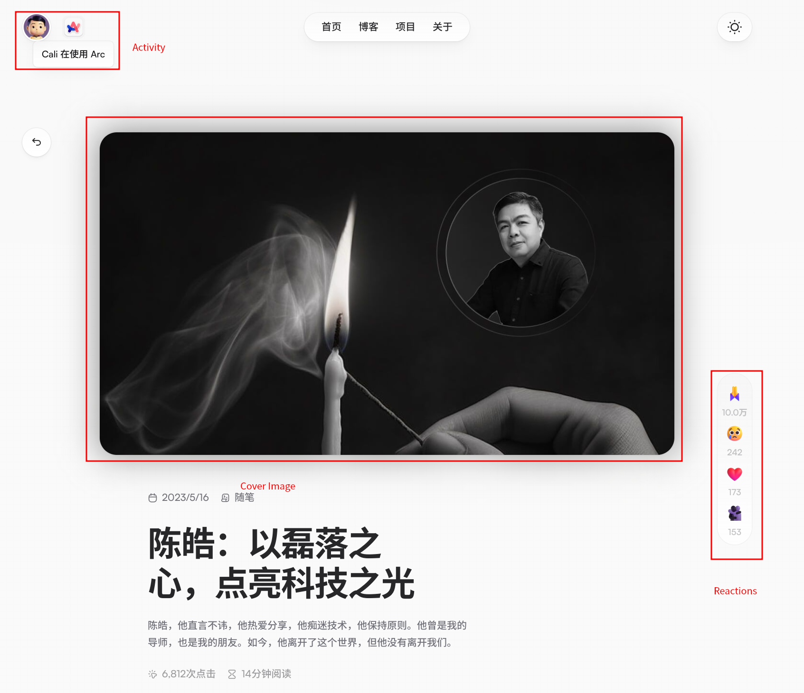
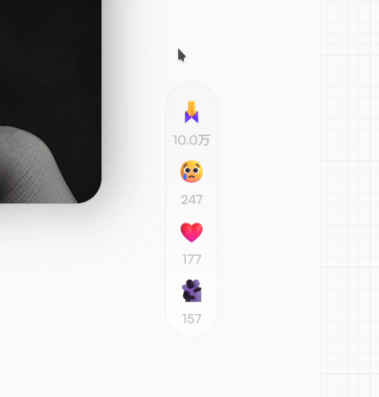

## Overview

This is another so-called weekly recap but is actually updated monthly. 😅

Things were coming continuously and never stopped in the last few days, and there are not so much dedicated time for coding and building stuff. That's seriously bad.

I would try to back to the work-life pattern before the Labor Day Holidays, and try to make plans and trace them.

The lifestyle "just following my heart" brought me lots of pleasure and happiness, but it does not make me feel good when I look back. And I did not make any "value" in the last few weeks.

I need to push myself a little harder.

## Professional Stuff

### Hugo Theme Doge

I still keep discovering the solution of bring some dynamic content into hugo theme.

[Cali](https://twitter.com/thecalicastle) built a beautiful and full-featured personal site:

<https://cali.so>

There are several amazing features I also want to bring them into my site:

- The cover image of the post
- Open Graph Card
- Link Preview Card
- Light/Dark Theme Switch
- Reactions, like giscus reactions based on GitHub Issue/Discussion, but it's more beautiful with motion animations
- Personal Activity, show the application I am using on the website
- also, lots of motion animations!

Activity, Cover Image, Reactions

Open Graph Card (on Twitter, as Twitter Card)



Link Preview



Light/Dark Theme Switch

Animations:

I also noticed a library could be used to decorate site with animations:

<https://github.com/framer/motion>

This library is designed for React, but hugo is a static site generator. So I need to compound React with Hugo.

Better animation is one of the reason that I decide to compound React with Hugo, another reason is the discussion system.

I am considering keep using GitHub Discussion as the backend of the discussion system, just like Giscus, maybe also keep compatibility with Giscus. But the view is displayed like "Twitter Style": comments and reactions are displayed like on Twitter. I think maybe I could use React to write the view much easier, and manually bind it to the DOM. I also find that Giscus is also built with React, and it works in the same way.

## Personal Stuff

### Self-driving Long Trip, 4000 km in last 4 weeks

In the last several weeks, I drove my car for about 4000 km, acrossing Zhejiang, Jiangsu, Anhui, Hubei, Hunan, Shandong provinces.

Before the trip, I had just completed the first maintenance of my car (as 5000 km driving for the first car maintenance), and I have to make the second maintenance soon as 10k km.

Long distance driving is definitely energy consuming, it would take me about 10 hours to drive about 800 km. And I do not want to take long distance driving in the recent future.

I noticed that one high-speed expressway might be splited into different parts, and different expressways might also use same fragment of the road, as 共线段. As differnet expressways are built by local province goverments, there are differnet styles of the road in the different parts of the road. That's kind of very interesting! I would introduce the different styles of different provinces' expressways.

In Zhejiang Province, esperially Hangzhou, the most obvious characteristic is "扫码事故救援", which means you could use your phone to scan the QR code on the top of the safe barrier stub when you face the car accident. I think each QR code might have more accurated location infomation, it's very useful for the emergency rescue.

In Anhui Province, one of the thing I noticed is the huge economic gap between different districts. For example, the expressway nearby Huangshan(黄山) is 8-ways expressway, but after driving out of Huangshan district, it would be 4-ways expressway. Another thing is ther are more speed bump on the expressway, and there are lots of tunnnels which has 80 km/h speed limit. That's not good, because the speed limit for ground road is 120 km/h, it's dangerous to change the speed frequently.

In Hunan Province, the thing is the huge emergency refuge area.

In Hubei Province, the safe barrier is painted as blue. And the speed limits in Hubei Province are weird: 90 km/h and 110 km/h.

### Game: The Legend of Zelda: Tears of the Kingdom

That's a amazing game and I played it every day since it was released.

And I do not want to make much comments on it, after I finish it, I would write a dedicated post for it, maybe.
