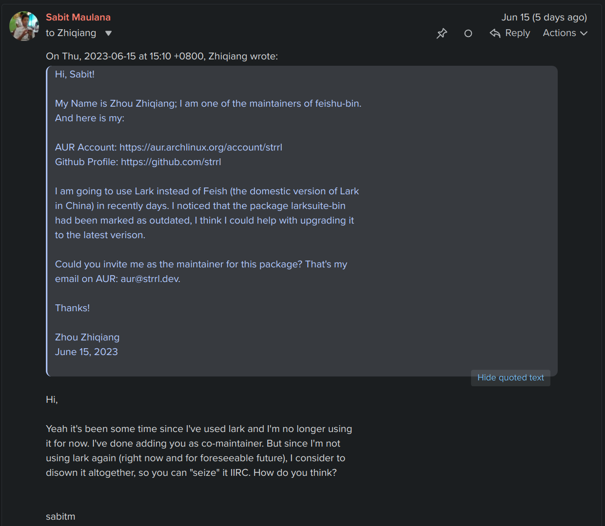
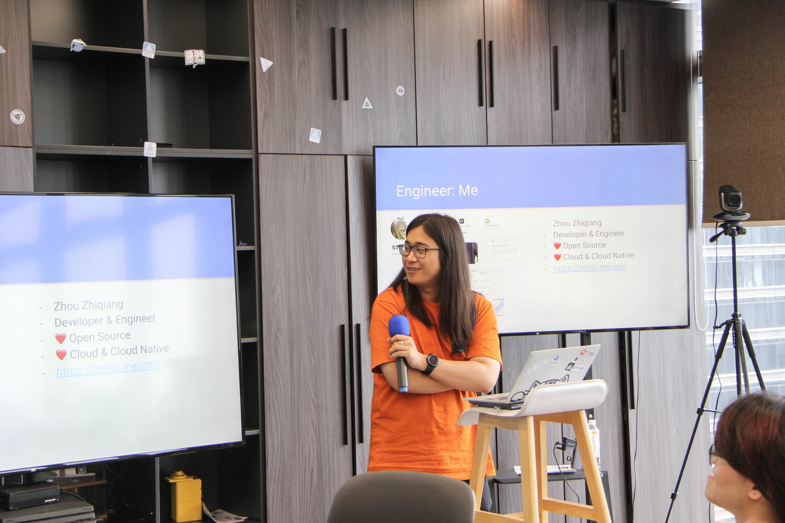
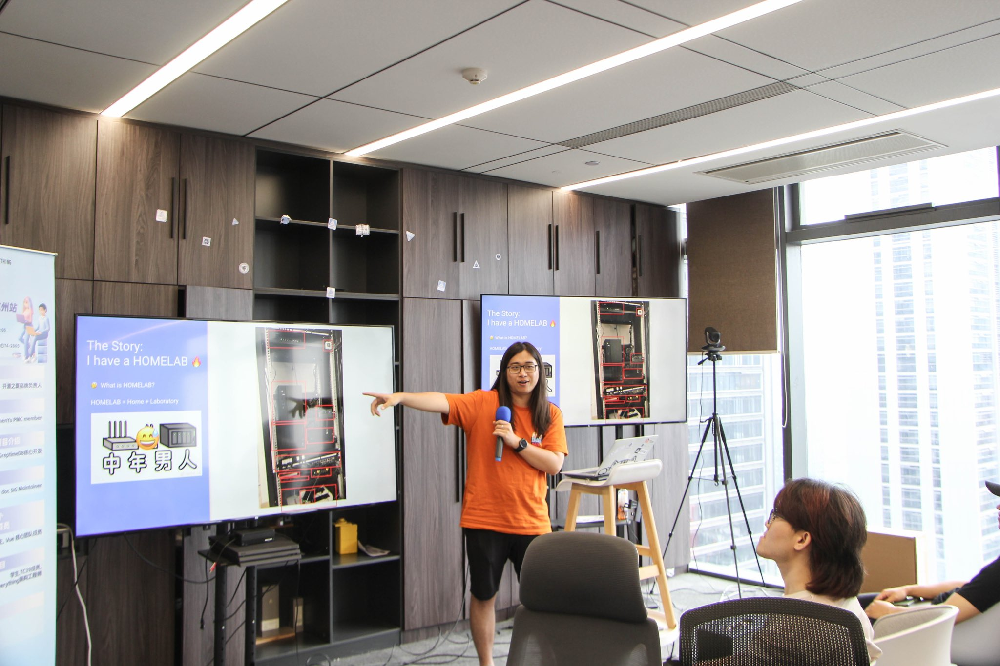
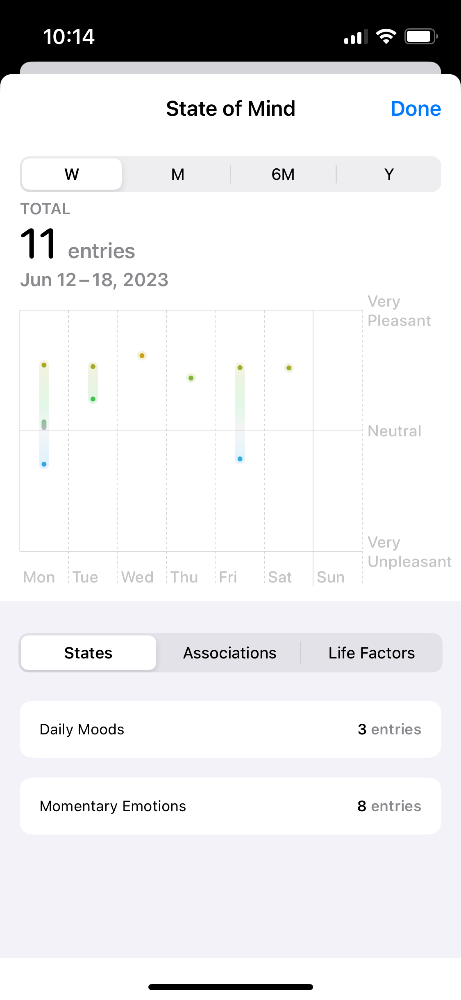

## Overview

This is the weekly recap post spans from May 21 to June 16, 2023.

This post might be longer than usual, because I do **NOT** spend much time on preparing language tests. 🤡 Instead, I spent lots of time on social activities and playing video games. 😅

So there are lots of things to write down.

> Actually, I'm almost exhausted just listing these things on titles. 😵

Here we go.

## Professional Stuff

### New Idea: Cloudflare Tunnel Ingress Controller

TLDR; I build a Kubernetes Ingress Controller which could expose the Kubernetes Ingress to the Internet,

- easily, quickly, and securely
- without requiring a public IP address
- without maintaining any Tunnel / Jump Server (like frpc, zerotier, tailscale)

I have a homelab, which contains 4 x86/arm computing devices and 1 storage device. And I use Kubernetes for manage and orchestrate workloads.

The networking model in Kubernetes is complex, there are several different kind of networks:

- Host Networking, the real network for the Control Plane host or Worker host
- Pod Networking, the virtual/real network for Pods, usually a virtual overlay networking, which only accessible on Layer 3 (IP Layer)
- Service Networking, the virtual network for Services, usually virtual IP addresses, and bunch of iptables / ipvs rules.

For exposing a workload running in Kubernetes to the Internet, a system administrator need to understand all these networking, and all of them must be configured correctly.

I used to use:

- Cilium CNI as Pod Networking
- MetalLB as Service LoadBalancer
- Nginx Ingress / Traefik Ingress as Ingress Controller

Then I have DNS records like:

```bash

$ dig nodes.worker.kiu.strrl.cloud              

; <<>> DiG 9.18.15 <<>> nodes.worker.kiu.strrl.cloud
;; global options: +cmd
;; Got answer:
;; ->>HEADER<<- opcode: QUERY, status: NOERROR, id: 2408
;; flags: qr aa rd ra; QUERY: 1, ANSWER: 4, AUTHORITY: 0, ADDITIONAL: 1

;; OPT PSEUDOSECTION:
; EDNS: version: 0, flags:; udp: 1232
;; QUESTION SECTION:
;nodes.worker.kiu.strrl.cloud.  IN      A

;; ANSWER SECTION:
nodes.worker.kiu.strrl.cloud. 30 IN     A       192.168.1.207
nodes.worker.kiu.strrl.cloud. 30 IN     A       192.168.1.203
nodes.worker.kiu.strrl.cloud. 30 IN     A       192.168.1.154
nodes.worker.kiu.strrl.cloud. 30 IN     A       192.168.1.184

;; Query time: 163 msec
;; SERVER: 192.168.1.1#53(192.168.1.1) (UDP)
;; WHEN: Tue Jun 20 09:36:20 CST 2023
;; MSG SIZE  rcvd: 121
```

So I could use any of these IP addresses to expose a HTTP service locally, like this:

```bash

curl --insecure -v -H Host:jellyfin.strrl.cloud https://nodes.worker.kiu.strrl.cloud

```

And I use Cloudflare Tunnel to expose these service to the Internet.

With this solution, I need to manually configure the Cloudflare Tunnel for each domain, and the ingress layer (traefik ingress) is actually not needed.

I imagine that maybe I could use cloudflared as a Ingress Controller directly, and I found that:

[cloudflare/cloudflare-ingress-controller](https://github.com/cloudflare/cloudflare-ingress-controller)

It's the official Cloudflare Ingress Controller, but it is not maintained for a long time, and it's not working with the latest version of Kubernetes.

So I built the successor of it:

[STRRL/cloudflare-tunnel-ingress-controller](https://github.com/STRRL/cloudflare-tunnel-ingress-controller)

I have used it to expose my several services to the Internet, and it works well for a while. Great!

### Package on AUR: larksuite-bin

For some reason, I need to use Lark Suite, which is a International version of Feishu. I installed the latest `feishu-bin` from AUR, but Feishu noticed me that I can NOT use Feishu as Lark. Then I noticed the `larksuite-bin` on AUR has been marked as outdated.

Fortunately, I did explore the `feishu-bin` package before, I think I could package a new version for `larksuite-bin`.

> Actually, the maintainer of `feishu-bin` on AUR is an ex-colleague of mine, also an old friend from Hangzhou Linux User Group. 😄

Then I sent a email to the current maintainer of `larksuite-bin` on AUR, for asking me as the co-maintainer:



So the final result is I became the maintainer of `larksuite-bin` on AUR now, and I upgraded the package to the latest version.

{/*  */}

<div class="flex justify-center p-4">
https://twitter.com/strrlthedev/status/1669262247674388481
</div>

Great!

### Summer OSPP Hangzhou

I attended the Summer OSPP Hangzhou, and giving a lighting speech:





Slides: https://docs.google.com/presentation/d/1PUwXGVGcI6Ibk_FcFBqwFYnMfcAxNYX3QT_IyxsGtFQ/edit?usp=sharing

### Chaos Mesh on KubeCon China 2023

KubeCon finally come back to China, the previous one was still held before the COVID-19 pandemic.

I have applied for a offline booth for Chaos Mesh, as the benefit of being a CNCF Incubating project.

So, I will be there, welcome to visit our booth, and talk with us!

### Onboarding WebP Cloud Service

[Nova](https://nova.moe/) asked me to try his new service, which is a WebP Cloud Service.

This site has been configured with that service, and it really reduces the size of images, and speeds up the loading.

I have posted another article about this service, take a look if you are interested:

http://strrl.dev/post/2023/speed-up-image-loading-with-webp.se/

## Personal Stuff

### Apple WWDC

There are soo many new software features announced on WWDC, and I am so excited about them:

- NameDrop, it's so cool to exchange the contact, but it's not available in current beta version.
- Offline Map, it's useful, but it's not available in China.
- CheckIn in Message app, it's also an amazing feature, I always share my location and direction to my girlfriend, and check-in would enhance it. But it's also not available in China now.
- Mental Health! I have used it for several days, as the objective reflection of my mood.
- Journal! I want the Journal App so much! The AI generated daily summary is so cool! It would be reflection and summary for my life!



I am thinking about buying iWatch instead of my current Samsung Watch, and fully use the Apple Ecosystem.

I researched / explored lots of solutions and methodologies to make me happy and improve the productivity, and I think Apple Ecosystem would help me to achieve them.

### Meet with Friends

#### 🍞

🍞 is a young but professional front-end developer. We have 3 meals together, and talked a lot about the engineering, technology, and life.

I am so impressive about his passion about the engineering, I have saw the bright future of him.

#### Teacher 🐟

We came to a Piano Cafe one day afternoon, and played a KAWAI Grand Piano. (Or Steinway? I did not remember.)

{/*  */}

The key of Grand Piano is even much lighter than my digital piano, YAMAHA P115.

I took some sheet books for some Game Original Soundtrack, like NieR and Monster Hunter. Teacher 🐟 played them as sight-reading, that's so impressive!

#### TualatriX

TualatriX is a professional iOS developer and also a freelancer, we are both villagers in Liangzhu Culture Village.

The first time we meet each other was introduced by Lakr. We have a lunch together, and we talked and coded at the Starbucks for a whole afternoon.

{/*  */}

He also taught me some SwiftUI stuff, and I am so impressive about that, the declarative way to build the UI!

#### pseudoyu

We came to the Rokid company's activity, which is watching WWDC 2023 together. We tried the unreleased AR devices, it's not kind of great experience, but it's still cool.

{/*  */}

#### Xiaowen

Xiaowen and I meet also at the Liangzhu Culture Village, we have a dinner in the "甘其食 Baobao 小酒馆".

{/*  */}

I learned something about recording personal cash flow and budget management, he also mentioned a good application called "you need a budget". And he also suggested me to get some knowledge about the CFA I certification, it would cover the basic economics and finance knowledge as a bachelor degree.

### Game: The Legend of Zelda: Tears of the Kingdom

Great Game! I have cleared the main story when I wrote this post.

And there are still lots of funny content like these:

{/*  */}

### Game: Diablo IV

Another Great Game! I have played 4 different classes, and it consumed me most of the gaming time in the past several weeks.

I also extended my friend list on battlenet, it's great to see lots of friends playing this game at the same time.

I also streaming my game play on youtube, and here is the recording:

https://www.youtube.com/playlist?list=PL2CnjpVBS-U9sBtUAut_d1g0xj6jw9wcQ

## At last

It have been too long from last updates, I need to find a new way to build the weekly recap, or it consumed too much time to write it.
