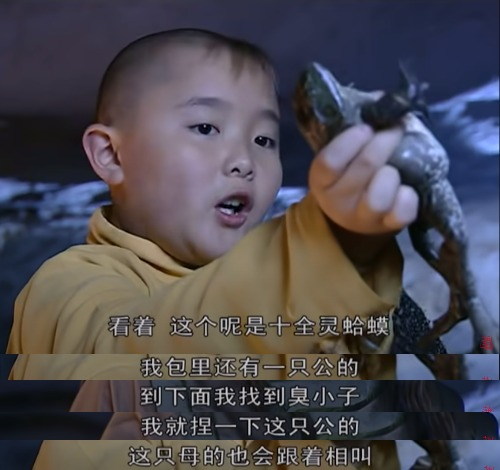
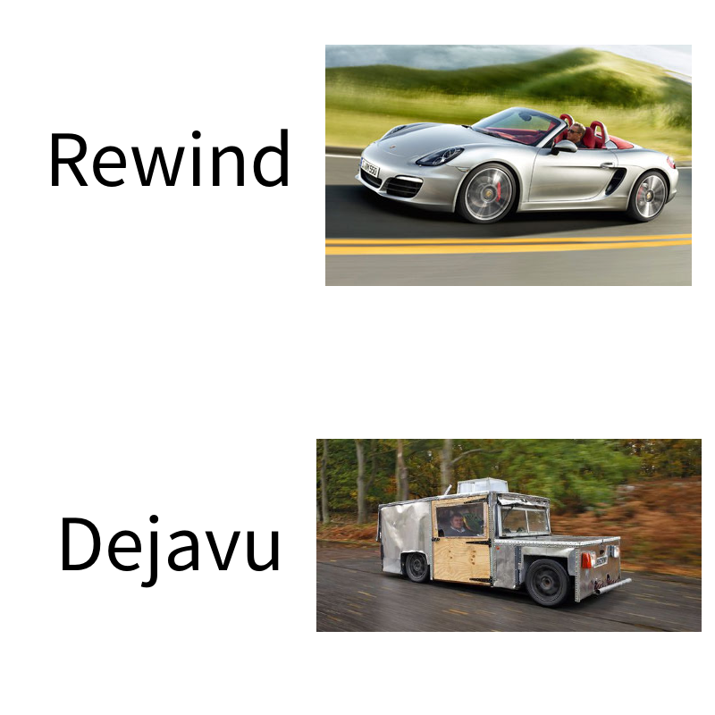
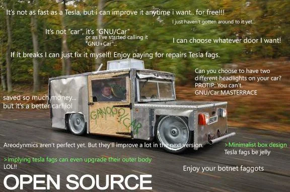

## Overview

I want to back to write the weekly recap regularly.

No need content-rich post, just record what happened.

## Professional Stuff

### Project Benefit on KubeCon: Maintainer Track and Kiosk

We (Chaos Mesh Maintainers) have submitted the application form for Maintainer Track and Offline Booth(Kiosk) on KubeCon China 2023 in Shanghai. If everything goes well, we would have a presentation and a part-time booth here.

We are also planning the Maintainer Track part for KubeCon NA 2023. We asked Saiyam to participate in, and he agreed. He also suggested us make a micro-survey to collect some voice from community.

All in all, see you in Shanghai!

### Idea: Spirit Toad

As you might already know, I am considering walking into the Apple Developer Ecosystem. Following "learning-by-doing" principle, I would make one or several simple apps to get familiar with the ideation, design, development, and release process.

So that is my simple idea that could become my first app: Spirit Toad.

> 中文名: 十全灵蛤蟆

The idea is came from a TV series called "少年大欽差", here is the cut.

> Here, that's a Spirit Toad. There is another male one in my bag. After I find the boy, I would squeeze the male one, and this female one would also make a sound.

The business of the app is quite simple: the application would always used in pair, hit the button on one device, and the other device would make a sound / receive a notification.

I would start at making an iOS app, then move forward to other platforms.

Also I think I would publish it on App Store, walk through the whole process.

### Idea: Deja-Vu, an Open Source Alternative to Rewind.ai

Several days ago, I tried to start using Rewind.ai as the powerful tool to record my dataflow on personal computer.

But Rewind.ai has some limitations:

- Limited "Rewind"(Search data from recording) Usage.
  - 50 rewind for free plan,
  - 10 rewind per month for basic plan,
  - and unlimited rewind for pro plan.
  - ref: <https://www.rewind.ai/pricing>.
- NOT available on other platform.
  - I am a linux user and all my major process happens on linux!
  - and I do not want to use mac as the primary device.

The maker of Rewind.ai said that the power of Apple Silicon could make the recording and OCR process much efficient. But I think it is possible to make a similar tool on a more general computer, without certain devices like Apple Silicon or Nvidia GPU.

So I created an Open Source project called [Dejavu](https://github.com/STRRL/dejavu). Want to do it with existed open source tools.

I am still working in proof-of-concept stage, and it works well for now! It's quite simple for now:

- Capture screenshot every 2 seconds.
- OCR the screenshot and save the text.
- use sqlite with Full-Text-Search extension to store and index the text.
- Query API for the text.

## Personal Stuff

### I bought an Apple Watch

As just what I said in the last post, I would finally and fully fall into the Apple Ecosystem.

I stopped using my Samsung Watch 4, and bought an Apple Watch S8.

Also I started to subscribe the Apple Fitness+. Even Samsung have all the competitive alternative solution, and event some of them is free, I even would not to try it.

Because the Z flip 4, the cell phone I used, is not good as I expected. I would never buy a Samsung phone again.

For people who want to buy a foldable phone, my suggestion is: Don't buy, and wait for the Apple product.

### Diablo IV Classes

I have tried all the classes expect Barbarian in Diablo IV, and I finally I still like the rogue most.

The first Season of Diablo IV is coming at June 21, and I think I would choose the Rogue as my first class for progression, and maybe try Barbarian later.

And, Necromancer is the most powerful class now, that's totally out of our expectation at the start of the game.

## Summary

So that's the sudden end, just tell some stories, no more stress to make it content-rich and good looking.
