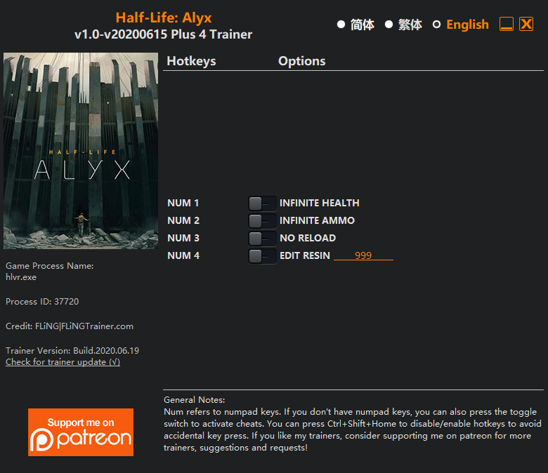

## 周报

这是俺的第一篇周报, 时间范围是 `2022-01-22` 到 `2022-01-28`. 会记录一些工作以及生活上有意思的东西.

### Chaos Mesh

#### CNCF Incubation

Chaos Mesh 的申 Incubation 已经进入了投票阶段, 这个阶段最多长达 6 个周, 在此期间, CNCF TOC 们会通过[邮件列表](https://lists.cncf.io/g/cncf-toc/topic/vote_chaosmesh_for/88571074)的方式来提交投票, 超过 `2/3` 即可通过; 目前已经有 11 席中已经有 6 票 `+1`. 满怀期待.

成为 Incubation Project 后, Chaos Mesh 将获得更多的帮助, 目前能够想到的是会有更多曝光的机会, 在 KubeCon 有单独的席位, 并且会有 webinar 的活动.

> 另外印象中 Incubating 和 Graduated  项目是有 CI 基础设施的赞助来着, 但是找不到 Reference 了.

#### 混沌实验的可观测性

大白话: 在 Chaos Dashboard 里能够看应用(已经配置好的) Grafana Dashboard.

这个 Feature 讨论许久了, 而且在最开始也[被用户吐槽过](https://cloud-native.slack.com/archives/C0193VAV272/p1640013796164600).

以后需不需要 Chaos Mesh 采集一些只有它才擅长采集的 Metrics, 比如说:

- 密度较高的 CPU, Memory, IO 等资源使用
- 被影响 Pod 网络之间延迟, 丢包率等

还不确定要不要做.

#### LFX Mentorship Q1-2022

LFX Mentorship 又来了! 这次俺又想出了一个[好玩的点子](https://github.com/cncf/mentoring/blob/main/lfx-mentorship/2022/01-Spring/project_ideas.md#interactive-katacoda-playground-for-chaos-experiment-examples), 使用 Katacoda 把 Chaos Mesh 目前提供的 examples 变得更加"具象化". 这次的 Project 应该不需要深奥的 coding, 更多的是做 scenario 的演示. 对于 Mentee 来说, 在 12 周的时间里, 完成一些较为简单的工作~~摸摸鱼划划水~~, 能够拿到 $3000 的补贴, 另外你的工作成果也会被放到 chaos-mesh.org 上.

LFX Mentorship Q1-2022 将在 2022-02-02 - 2022-02-13 开始开放 Mentee 的申请, 欢迎还在上学的同学参与! 大家可以考虑准备报名了~

最后放一个[原文链接](https://github.com/cncf/mentoring/discussions/445)

### Hangzhou Linux User Group

今年年中, zionfuo 由于工作原因去了上海, 于是把 HZLUG "托付"给了俺. 但是俺是一个愣头愣脑的工程师, 没有举办过啥活动, 再加上疫情的影响, 至今也没有玩出一个线下的活动. 反观 Shanghai LUG, 依旧每周都玩得很 high, 羡慕死了. 再看看 houge 今年新创办的 Yunnan LUG, 也开始在年关内筹办线下活动了.

在上段时间, 联系了公司内的社区运营同学, 她们答应可以把 HangZhou Office 的大会议室借给我们. 但是期望中的效果依旧是有 Hacking Saturday 这种 weekly 的活动, 每周都去占用公司的大会议室还是不太好意思的. 因此我还是想去找一个合适的咖啡馆, 大家可以有个桌子收拾自己的设备, 然后能尽兴地聊一聊. 至于大会议室, 如果未来有 Monthly Meetup, 或者是有同学想做主题分享的话, 再去使用那个场地.

### 生活方面

#### Half-Life: Alyx

由于在上届的 TiDB Hackathon 中, ~~很惭愧地~~拿到了最佳创意奖, 有五千大洋的奖金, 于是买了一台 Oculus Quest 2. 设备其实上周就到了, 但是最近一周开始了重度游玩(迷失在元宇宙里).

半衰期: 爱莉克斯是一款饭制的 VR 游戏, 目前在 Steam 平台有售. Oculus Quest 2 在进入开发者模式后, 打开 Air Link 就可以连接到 SteamVR 玩 PCVR 的游戏了.

> 从名字 "Air Link" 上来看, 不知道与 Apple 有没有什么交易.

游戏的质量还是比较高的, 甚至某个游戏场景中还有一个[可以交互的钢琴](https://twitter.com/strrlthedev/status/1485631347586920450?s=20&t=BoLFzh7A5LeLN6F4hawT7w).

但是就像其他的打僵尸游戏一样, 它依旧算是一款恐怖游戏. 我是非常介意恐怖元素的, 所以我

> 果然恐惧来源于火力不足.

#### 其他

- 阿里旁边亲橙里的新时期烤肉无了, 变成了一家 KTV. 绕远去另一家吃, 但是感觉味道没有倒闭的那家好. 🥲
- 睡眠质量变差, 入睡时间长, 又需要恰腿黑素了.
- 玩 VR 游戏对脖子负担太重了, 左边脖子痛.
- 三星要发布 S22 了, 但是依旧是异形屏.
- 想恢复运动和锻炼.

## 关于抄一抄 Xuanwo 的工作流

Zhiqiang 在尝试找到适合自己的工作/学习方式, 准备试着抄一抄 Xuanwo 哥哥的目前的流程.

### 前情提要

自从加入 PingCAP 的 Chaos Mesh 小组后, 由于工作方式不再像是之前需求 -> 评审 -> 开发 -> 交付, 而是变成了以 GitHub 为核心工具的, 更为灵活的工作流. 我的工作效率其实产生了一定的波动.

我本身是个懒人, 而且又会出现很多天马行空的想法感觉可以做, 所以最后的结果是鸽了太多太多的东西. Leader 也曾经找过我谈话, 要注重一下想法的落地.

今年 10 月份开始, 俺开始读 *Getting Things Done*, 并开始尝试依照这本书提供的方式来整理自己的任务. (但是目前的效果还不算太好, 因为书至今没读完, GTD 学了个半吊子.)

上段时间在乱刷 GitHub 的时候, 发现了 Xuanwo 哥哥的 GitHub Profile 提到了:

> I think it's a reproducible way for learning, working and thinking. Anyone with a similar background to mine can start learning incrementally with this repo. Also, It will be very interesting to see how this project will develop in the end. Whether the end result is good or bad, I believe it will be an interesting journey.

那既然有这么强的暗示了, 那我就不客气了, 开抄. ~~(你的东西很不错, 但下一秒就是我的了~~

### 拿过来一把梭

目前看上去, Xuanwo 哥哥的东西主要分为三个部分:

- logseq 用于构建知识库: [Note](https://note.xuanwo.io/)
- Blog 用于记录和总结, 主要是周报/双周报: [Blog](https://xuanwo.io/)
- GitHub Projects 用于管理项目进度: [Xuanwo's Work](https://github.com/users/Xuanwo/projects/2)

我就直接开抄:

- 同样使用 logseq 构建知识库: [whatiknown](https://whatiknown.strrl.dev/)
- 同样使用 Blog 以及周报的形式来记录和总结: [Blog](https://strrl.dev/)

关于是否使用 GitHub Projects 来管理工作进度, 我仍有顾虑. 目前用 Notion 来管理, 效果还一般, 等待看完:

- *Getting Things Done*
- [GitHub Projects Boards 文档](https://docs.github.com/en/issues/organizing-your-work-with-project-boards/managing-project-boards/about-project-boards)

后, 再决定使用哪个吧.

同时使用 logseq 的 journal 记录每天发生的事情, 免得双周报的时候没得写.
