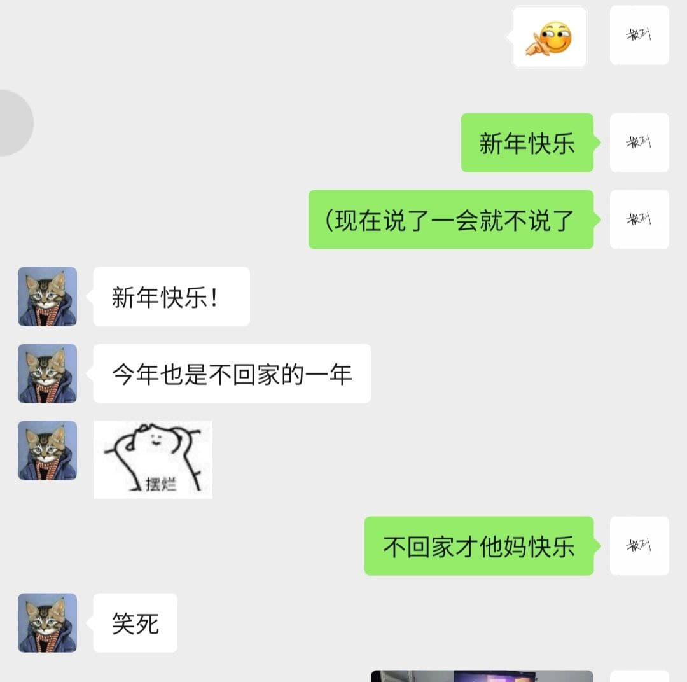

这里又是一份周报, 时间范围是`2022-01-28`到`2022-02-04`, 会记录一些工作及生活上有意思的事情.

## 撸代码相关

还是先聊聊撸代码相关的事情吧, 毕竟过去一周一直都在休假, 虽然一直没停下 coding 但是也没碰一行工作相关的代码. (doge

### 猫年水的第一个 PR

大年三十那天在整理 homelab 的时候, 发现在[上次重建了 Kubernetes 集群](https://twitter.com/strrlthedev/status/1469330815712563202)后, 监控项并没有全部恢复上去. 于是开始重新创建监控项, 顺手[修复了一个会导致 panic 的 bug](https://github.com/prometheus-operator/prometheus-operator/pull/4541).

引起 panic 的原因很简单, `err error` 是一个 interface, 它可能会是一个 `nil`. 然后 error 的 resolver 也没有判断 err 是否为 nil, 直接调用了 `err.Error()`.

> 对于代码段的"预期行为", 还是要写到注释里哇. 如果 error resolver (它这里是 `rejectFn()`) 的注释里说明, `err could not be nil`, 也能让调用者注意一下.

> 想念 Kotlin, TS, Rust "Void safety" 的各种好.

大年三十提的 PR, 大年初一合进去了, 开心哇.

### 给自己上刑, 全开 golangci-lint

在俺刚工作写 Java 那会, 因为之前接触工程太少了, 组长看了直摇头, 给俺直接上了刑: SonarQube Quality Gates 直接拉到 A. 它会给你报各种 warning:

- 没做非空处理
- `else-return` 是多余的
- 函数过于复杂(complexity 大于十几)
- 函数体太长了(印象是超过 200 行)
- 该加 `final` 没加 `final`
- 注释中没解释某个参数
- 注释中没解释为什么`@Deprecated`
- 等等...

虽然每次写完了代码, CI 跑了以后都要改不少, 但是感觉自己变强了!

最近的项目里, GitHub 推荐的 Sonatype Lift 不太好用, 一方面是因为比较慢, 另一方面是因为默认情况下不在 CI/GitHub Actions 里跑, 很容易忘记它. 因此俺又拾起了 goalngci-lint, 直接给 `kubectl-push` 上了邢, 而且除了禁用了弃用以及 issue 中提到行为有冲突的之外, 开启了其他所有的 linter. 一通修改之后, 终于变绿了!

### LFX Mentorship Q1-2022 上新

> 关于 LFX Mentorship 的简介可以参考这篇[推文](https://twitter.com/strrlthedev/status/1427527683827593221?s=20&t=BtZWay-ZGZiOBexLVVYnrw).

又到了 LFX Mentorship 上新的季节了, 这次 Chaos Mesh 又为各位新人们带了一个好玩的新玩意: [CNCF - Chaos Mesh: Interactive Katacoda Playground for Chaos Experiment Examples](https://mentorship.lfx.linuxfoundation.org/project/09847d84-5d14-4c05-8644-57cdde5b6466).

这个项目想使用 katacoda playground 把 Chaos Mesh 中的各个 example 作为可交互的例子跑起来, 这样比起冷冰冰的 yaml 文件, 有一个可以操作的环境更为直接! 这个项目不是那么硬核, 而且它的工作和产出不主要在 coding. 所以想体验作为开源软件工程师, 来写文档, 写 demo 的同学可以考虑下报名~

这次的 LFX Mentorship 的 timeline 以及可选的项目可以参考[这篇文档](https://github.com/cncf/mentoring/blob/main/lfx-mentorship/2022/01-Spring/README.md). 另外, 每个人只有一次作为 Mentee 的机会, 请慎重选择你的项目.

### Chaos Mesh Incubation

Chaos Mesh Incubation 投票已经获得了 9 票, 应该是已经达到进阶为孵化器项目的标准了! 非常的开心, 等待一个官宣!

[Mailing list](https://lists.cncf.io/g/cncf-toc/topic/88571074#6568)

### 对于备份恢复工具的新想法

最近一直在用 btrfs 的 snapshot 做备份和增量备份, 写了脚本来随缘跑跑. 之前的 send 是直接写到另一块 HDD 上去了, 最近想放到 NAS 里. 所以又多填了几步 mount nfs 的过程.

俺在想, 有没有那么一个工具, 它可以使用 zfs/btrfs 的 snapshot 机制做备份, 然后后面对接了各种存储, 文件啊, S3 啊, WebDAV 啊什么的. 俺现在也在自己寻找中, 如果有人知道的话请告诉我.

如果木有的话俺想自己撸一个. 🤩

## 一个人在杭州就地过年

年前蛮早的时候, 就和父母盘算着, 今年还是不回去了. 一方面因为山东的基层过度执行太严重了, 到地隔离 7 + 7, 没有办法快去快回, 另外一方面也是因为家里养了三条狗子, 我的作息和狗子们不重合, 休息不够实在是难受.

另外就在放假的前几天, 杭州也寄了, 貌似从 1.26 出现了病例以后, 每天都有新增. (回不去辽, 回不去辽)

但是女朋友顺利回家了, 南方比较人性化, 持核酸阴性结果就可以回家过年了. 上两天还在给我转播剧本杀, 打麻将, 真的是羡慕死了.

### 就地过年的朋友们

无论是高中同学, 还是大学同学, 都有相当一部分人选择了就地过年.

忘记什么时候看到了 "90 后不再维系亲戚关系" 类似的报道了, 对我来说确实是这样的. 在我的印象中, 走亲戚从小就是一份苦差事, 被家里大人拉着坐不知道多久的车, 见到一片不认识的人. 🤪

### 读书 读书 读书

从公司的看书群里里被安利了[*如何阅读一本书*](https://m.douban.com/book/subject/1013208/), 尝试翻看.

最近也差不多详略(不太)得当地看完了, 最大的感触是看书不应是一件根据页码顺序读, 而应是要先建索引, 再去填充内容.

小时候妈妈也曾经教过我, 看书要先略读, 再细读; 我也能依稀记得,按照这种方式能够理解一本书后的喜悦. 但是这个技能点不知道什么时候被我丢了. 根据页码顺序读也不是不行, 只是书中的内容并不全部都是重要的, 会浪费一部分时间. 大约是一两年前, 我曾经依照顺序阅读的方式看完了 *Kubernetes in Action*, 因为当时是几乎完全不理解 Kubernetes, 所以把书中的句句都当作重点来看, 现在回想起来, 确实是效率太低了.

另外在阅读的时候一定要做好记录, 因此我创建了 [Books](https://whatiknown.strrl.dev/#/page/books) 这个 logseq page, 用于记录我在阅读时发现的一些东西.

### 风暴 风暴 风暴

放假在家怎么能不打游戏呢! 年后开始了高强度的风暴英雄, 甚至一度达到了四人车五人车的盛况. 自从微软收购了暴雪以后, 真的是心情舒畅哇. 啊哈哈啊哈哈

(如果想一起打游戏可以加俺的好友, `锐凌大魔王#5955`)

### 烟花爆竹管不住哇

说起烦恼的事情, 那就不得不提居民附近内放烟花了. 虽然已经下发了通知, 小区公园, 门口的大 LED 屏上也明确标明, 不准燃放烟花爆竹, 但是依旧管不住. 因为我家在 11 楼, 二踢脚飞起来差不多就在 10 - 11 楼的高度, 二踢脚就在你脸上爆炸的感觉还是挺害怕的.

所以在某天俺终于鼓起勇气打了 96110 举报了烟花爆竹. 现象是只有三十晚上仍有较多的爆竹, 初一早上木有, 后面也木有了, 就当作是起效果了吧. 不过初六开业估计还是得有人放的.

## 总结

一个人就地过年爽的一批.
