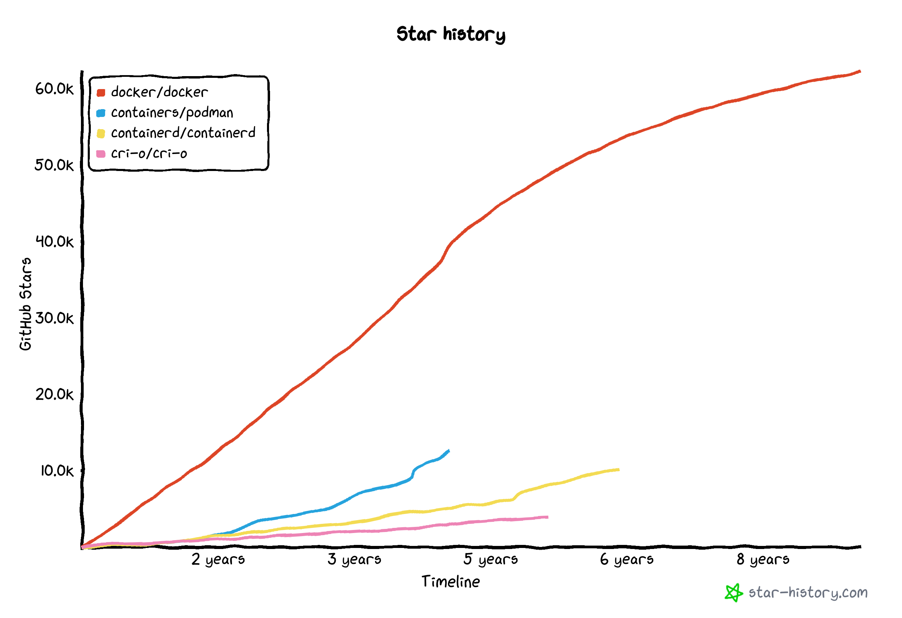
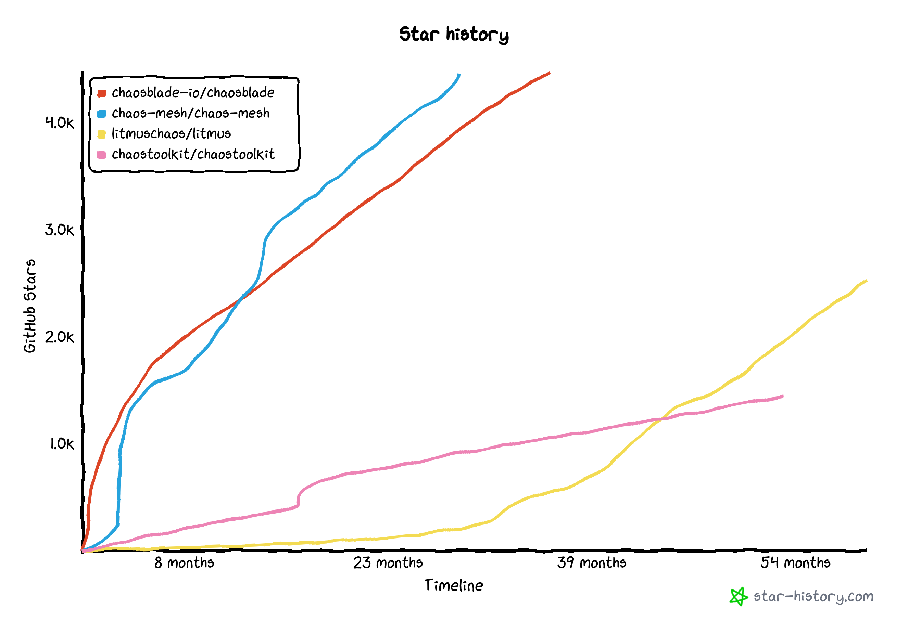

这里又是一份周报, 时间范围是`2022-02-05`到`2022-02-12`, 会记录一些工作及生活上有意思的事情.

## 撸代码/计算机相关

### 玩一玩 NAND2Tetris

俺在本科的专业是数字媒体技术, 和"正统"的计算机科学相比, 缺少了:

- 数字电路, 模拟电路等( EE 相关的课程)
- 操作系统
- 编译原理

多的是:

- 计算机图形学
- 多媒体编程
- 多媒体剪辑与后期制作
- 2D / 3D 美术
- 乐理

本科结束后, 我依旧完成不了"给你半导体和导线, 构建出通用计算机"这一目标.

偶然间在 twitter 上看到了 "Turing Complete" 这个游戏, 同时也提到了 NAND2tetris. 算是为了弥补自己的一个遗憾吧, 开始在coursera 上看 NAND2Tetris.

刚刚完成了第一周的作业, 理解了从真值表写出布尔表达式, 再到组合成门电路, 原来是这么回事.

### 绝妙的点子 - growth-of.codes

对于开源事业来说, 分析开源项目的发展历程, 是比较有趣的. 比如说通过 star-history.com 来看一个 GitHub repo 的 star 数量,一定程度上能够反映它的火热程度.



可以粗略的看出 docker 作为工业和个人使用的好工具, 它的热度以及热度增长速度是超过仅作为工业上常用的容器运行时 containerd与 cri-o 的.

而后起之秀 podman 在发展速度上显然也没有 docker 那么快.

再看一组图:



chaosblade, chaos-mesh 和 litmus 目前的斜率差不多, 说明目前整个 chaos engineering 生态还是有一定关注度的.

另外 chaos-mesh, chaosblade 中都存在较抖的地方, 说明在哪附近应该发了什么 announcement 快速吸引了一批人.

其实除了 star 数据之外, 俺自己也比较关心的另外一个数据是代码的量级与复杂度. 举个例子拿当前 chaos-mesh 来说:

```shell
$ scc .
───────────────────────────────────────────────────────────────────────────────
Language                 Files     Lines   Blanks  Comments     Code Complexity
───────────────────────────────────────────────────────────────────────────────
Go                         511    111849    12772     11190    87887      13736
YAML                       153    178816      310      1385   177121          0
TypeScript                 128     15626     1531      2180    11915       1564
Markdown                    26      1678      491         0     1187          0
Shell                       25      4863      418       757     3688        279
SVG                         22       886        0       266      620          0
Dockerfile                  10       308       87         9      212         36
JSON                        10      5793        0         0     5793          0
C                            4       239       32        64      143          9
Python                       4       376       19        88      269          7
TOML                         4        95        9        57       29          0
TypeScript Typings           4        77        3        65        9          0
gitignore                    3        78       20         9       49          0
Plain Text                   2        16        0         0       16          0
Protocol Buffers             2       320       53         0      267          0
Docker ignore                1        20        3         0       17          0
Groovy                       1       313       10        88      215          7
HTML                         1        52        0        35       17          0
JavaScript                   1        12        2         0       10          0
License                      1       201       32         0      169          0
Makefile                     1       364       82        13      269          3
Smarty Template              1       139       19         0      120         10
───────────────────────────────────────────────────────────────────────────────
Total                      915    322121    15893     16206   290022      15651
───────────────────────────────────────────────────────────────────────────────
Estimated Cost to Develop (organic) $10,402,741
Estimated Schedule Effort (organic) 33.491163 months
Estimated People Required (organic) 27.595197
───────────────────────────────────────────────────────────────────────────────
Processed 14603718 bytes, 14.604 megabytes (SI)
───────────────────────────────────────────────────────────────────────────────
```

只看 go 的话, 它目前的复杂度是 `13736`, 这是个什么概念呢, 可以和其他的项目对比一下:

- scc 的复杂度是 `1473`
- frp 的复杂度是 `2636`
- clash 的复杂度是 `3232`
- caddy 的复杂度是 `7711`
- traefik 的复杂度是 `9825`
- prometheus 的复杂度是 `14799`
- hugo 的复杂度是 `16973`
- etcd 的复杂度是 `38566`
- influxdb 的复杂度是 `60341`
- tidb 的复杂度是 `100316`
- containerd 的复杂度是 `125054`
- docker 的复杂度是 `195758`
- kubernetes 的复杂度是 `549928`

> 参考[scc#complexity-estimates](https://github.com/boyter/scc#complexity-estimates), 同语言之间的相对值比较还是有意义的.

除了项目之间对比之外, 复杂程度随着时间的变化也是非常有趣的! 而这就是 growth-of.codes 想做的事情: 展示代码的复杂程度随着时间的变化.

比如说某一天复杂度突然增加, 可能是加了什么新 feature(或者合了屎); 某一天复杂度突然降低, 可能是进行了重构(或者铲了屎).

基本上做得事情就是, 把某个项目的历史 commits 俺天 checkout 出来, 跑一下 scc 然后放到存储里, 后续再展示.

俺还是想把它做得 cool 一点, 顺便玩玩 serverless 和云数据库.

### 又一个绝妙的点子 - dodo rooster

🦤 dodo rooster, 渡渡鸟栖木.

> 借鉴了 war3 中暗夜精灵族建筑, "奇美拉栖木" (Chimaera Roost) 的名字.

至于渡渡鸟是什么, 大家可以参考 [Wiki](https://en.wikipedia.org/wiki/Dodo) 和 [这里](https://longfangsong.github.io/tipedia/zh/what/%E6%B8%A1%E6%B8%A1%E9%B8%9F.html).

dodo rooster 是一个类似于 slido 的匿名论坛. 需要接入外部的 auth 系统, 登录后可以选择匿名昵称. 为了防止过激言论, 可以允许委员会成员"开盒"匿名身份.

差不多思路如下:

1. 开启匿名讨论前, 选出 N 个公平公正的委员会成员;
1. 委员会成员全员生成一会非对称密钥, 并上传公钥.
1. N 个委员会成员开启一个 Session, 生成一対非对称密钥, 我们分别称之为 A-pub 和 A-priv
1. 持久化公钥.
1. 随即使用 Shamir's Secret Sharing 配合参数 "分成 N 份, 至少 M 份才能还原信息" 对 A-priv 进行分发, 使用委员会成员的公钥加密分发后的"碎片", 持久化加密后的信息.
1. 剩余其他 x 个成员加入, 使用 auth 登入, 将 id 与 匿名身份的对应关系使用 A-pub 加密后持久化.
1. 使用匿名身份发言
1. 尝试"开盒"某个匿名身份, 需要至少 M 个委员会成员的支持, 还原出 A-priv, 解密 id 与 匿名身份的对应关系.

> Shamir's Secret Sharing 是一中密码学的算法, 可以理解为"一个消息加密后被分成 a 份, 只有至少凑齐 b 份后才能够解密出来."

需要开盒某个匿名身份的话, 一定需要 A-priv, 而完整的 A-priv 有且只有存在于:

- 步骤 3, 4, 5 内存中
- 步骤 8 的内存中

而且完整的 A-priv 只有在 N 个委员会成员中, 至少有 M 个成员使用私钥解密后, 才会得出. 因此在有了信任的委员会成员后, dodo rooster 可以做到真正的"匿名", 没有技术手段可以破解.

> 嗯, 对比的就是某系统的前台匿名, 后台实名.

最后, 因为 A-priv 总归会出现在某台服务器的内存中的, 而 dump 内存再扣密钥我想也并不是什么难事, 所以解决这个问题的最佳方案是:

- 开源, 代码中没有后门, 偷偷传/存了一份 A-priv
- serverless, 没有人能够直接控制服务器 or 很难去控制运行时的服务器

其实俺觉得这个适用场景还蛮大的....

### YNUOSA 上新机器

感谢慷慨的 TUNA 给我们捐赠了一台 DELL Poweredge R720 机器, 之前它一直在教师办公室吃灰, 最近终于有机会放回机柜了.

我一直有一个大胆的想法, 就是在虚拟机层面用上类似于 Kubernetes Pod Networking 的大平层设计. 后来发现 VMWare 支持了这个特性, 叫做 "vSphere Distributed Switch", 功能如其名, 跨 host 的网络交换.

但是上到机柜里后, 发现了一个较为严重的问题, 两个 esxi host 之间的网不是直通的, 我们只能自己想办法做虚拟机的 overlay network 大平层了.

现在使用的方法是, esxi host 中分别起转发机器, 我们称之为 relay-alice 和 relay-bob, relay 之间使用一个都能访问到的"公网" IP 通过 wireguard 做 tunnel, 然后再使用 tinc 借助 tunnel 的 IP 做二层的转发. 现在我们有了一个大平层, 以后 workload VM 之间的互相访问会变得非常直接.

> 感谢[星云蘑菇](https://atr.me/)提的建议!

另外 workload networking 的网关其实就是一台 openwrt, 可以装 openclash, 利好安装 kubernetes.

### nix 的屈辱试用

想赶下风潮用下 nix, 结果被吃了下马威: 官方的文档建议使用 multi-user 的安装方式, 根据步骤一步一步走完后, 出现了先后出现了nix 的 daemon 启动不起来, `error: could not set permissions on '/nix/var/nix/profiles/per-user' to 755: Operation not permitted`, 和 `error: cannot connect to daemon at '/nix/var/nix/daemon-socket/socket': Connection refused` 等等问题. 而且使用搜索引擎搜索我的环境(fedora) 加问题描述基本上没有看得对眼的.

无奈铲之, 试了一下 single-user, 然后就活了...活了...

总之体验比较差, 在新的心血来潮之前不准备再摆弄 nix 了.

## 生活相关

### 睡眠质量堪忧

某天早上起来昏昏沉沉, 打开三星健康看到昨晚的深度睡眠只有 17min. 最近在看*睡眠革命*, 里面提到了几个有意思的事情:

- 少睡了的觉是没有办法补救的
- 长期的睡眠不足会使快速眼动睡眠被加入到前面的睡眠周期中, 导致深度睡眠少
- 预计入睡的 90min 前准备睡觉, 少做剧烈运动, 进入光线偏暗的环境, 少看荧幕. 允许的话洗热水澡或泡(热水)脚.

反省一下自己, 我一只都是对着屏幕一直到睡觉前的 10 - 15 分钟, 然后有需要的话快速冲个澡, 然后躺在床上期望快速睡着.

看完了书以后感觉到, 这样能快速睡着真的是见了鬼了哦.

也就是说, 如果我准备 00:00 睡觉/睡着的话, 最好是 22:30 就要从电脑前走开了, 准备洗澡, 然后再在*某个地方*(还没想好在哪, 但是我不喜欢在床上)看会纸质书, 然后到点睡觉. 这和我目前的生活习惯还是差的挺多的, 但是精神状态差实在是太痛苦了, 我认为在看完那本书后, 值得尝试一下.

### HZLUG Hacking Saturday

zion 大佬给介绍了一个合适的地方, 是一个共创空间的一楼大厅, 可以用来线下小聚. 我们在 2022-02-12 举办了恢复后了第一次HZLUG Hacking Saturday, 三个爷们就这样聊了一下午:

https://hzlug.org/0212-h6-photo/

> ylgg 真捧场! 赞美 ylgg!

## 总结

开工第一周, 效率拉胯, 静想整些没用的.
