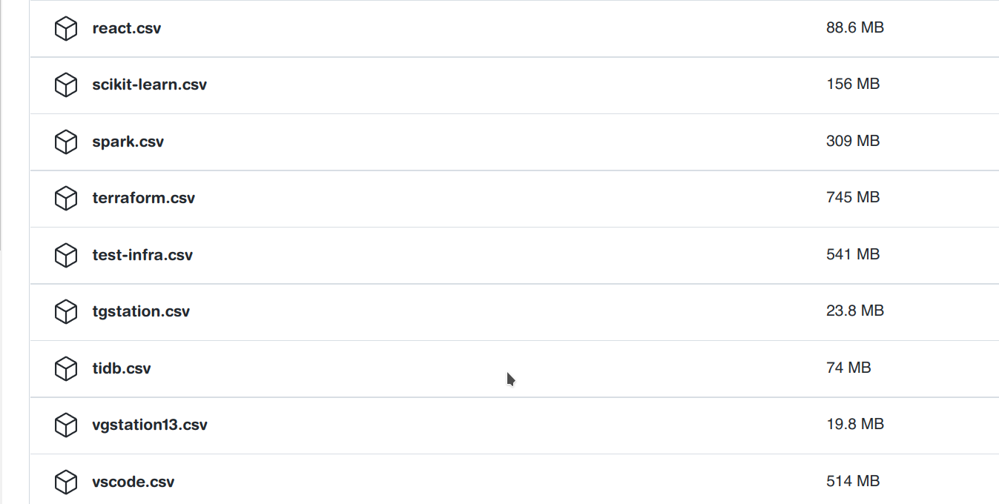
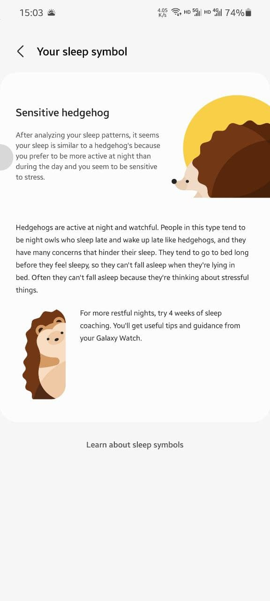
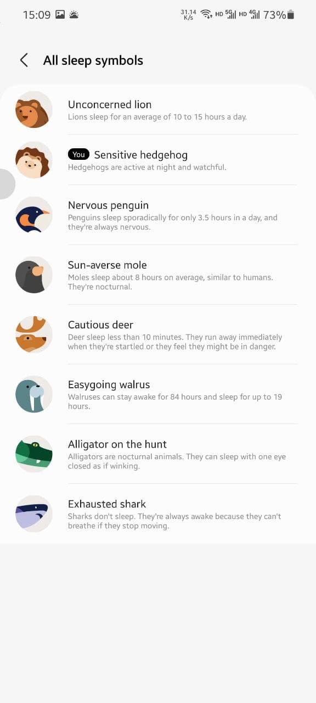

这里又是一份周报, 时间范围是`2022-02-13`到`2022-02-19`, 会记录一些工作及生活上有意思的事情.

## 撸代码/计算机相关

### NAND2Tetris 进度

第二周的 NAND2Tetris 的内容不算多, 最后的大作业是完成一个 ALU. 两位老师直接提供了一个非常 fancy 的 HACK ALU 实现, 它确实非常的精炼以及优雅, 但是这也让我感到了一个很大的问题: 如果让我去设计一个 ALU, 我依旧是做不出来的.

好吧这可能对于 NAND2Tetris 来说可能是超纲了, 毕竟它的目的是教我了解计算机如何工作, 而不是教我如何优雅设计一个 ALU.

> 不过这周的大作业还没写, 挖个坑, 写完大作业来更新一下, 在把这个坑填上.

> 2022-02-19 17:06:09 更新, 做完啦! [踩了一个坑](https://www.reddit.com/r/NandToTetris/comments/pzlf93/sub_bus_of_an_internal_node_may_not_be_used_any/), 新加 CHIP 能解决. 神奇的设定

### growth-of.codes 进度

接[上周的绝妙点子](https://strrl.dev/post/weekly-report/2022/06-%E5%BC%80%E5%B7%A5%E7%AC%AC%E4%B8%80%E5%91%A8/#%E7%BB%9D%E5%A6%99%E7%9A%84%E7%82%B9%E5%AD%90---growth-ofcodes), growth-of.codes 已经开始正式开工了.

现在做的事情是:

- 对于一个 GitHub repo, 根据特定的频率 (daily, weekly, monthly) 筛选出 commit, 以文件为单位, 使用 scc 把复杂度记录下来
- 然后存储到 TiDB Cloud 中

> 白嫖了 TiDB Cloud Dev Tier, 包括 TiDB x 1, TiKV x 1, TiFlash x 1. 包含 TiKV 和 TiFlash 的容量都是 10 GiB. 目前用量是 TiKV 2.7 GiB, TiFlash 1.1 GiB.

当前是[白嫖了 GitHub Action](https://github.com/STRRL/growth-of-codes/actions/workflows/persisted-directly-with-list.yaml) 作为跑任务的工作负载, 已经了跑了一定量的数据(大约 3700 万行了), 不过也有相当一部分任务没有跑成功.

同时数据的规模还是超乎了我的想象:

下一步的计划分成两个方向:

- 通过 serverless 实现一个分发分析任务的玩意, 再实现一个执行分析任务的 daemon, 跑到我的 homelab 里.
- 前端展示, 初步想到的两个形式是折线图和色块图(分别类比 star-history 和 codecov 的代表性图表).

### 尝鲜 Serverless

在构建 growth-of.codes 时, 因为不想再自己 self-host 任何一个对外服务了(看过俺 twitter 的人应该稍微有些了解, 俺的 homelab 做不了任何 SLA 保证. 哈哈哈哈哈). 同时 Serverless, Faas 等概念在经过一定时间的沉淀后, 我觉得是时候尝试下这种对个人开发者十分友好的交付方式了!

目前已经试过的服务有:

- AWS Lambda
- Google Cloud Functions (Delivery by Source Codes)
- Vercel Serverless Function

还未体验, 在计划中将去体验的有:

- Google Cloud Functions (Delivery by Container Image)
- Cloudflare Workers

AWS 作为老牌的云服务商, AWS Lambda 的表现非常稳定, 通过使用 API Gateway 作为 Trigger, 触发一个 Lambda 函数, 就能让我们的服务跑起来. 我的使用方式是用一个 Container Image 去部署 AWS Lambda, 在部署前它要求我把这个镜像**必须**作为一个私有项目放到 Amazon Elastic Container Registry 上, 稍微有些麻烦. 另外一点是作为 AWS 的初级用户, 各个功能要连起来好复杂, 比如说我找了好久暴露 Lambda 服务的方式, 才发现需要用过 AWS API Gateway 做暴露.

GCP Function 的使用方式不能说更加简单. 虽然 Google Functions 也支持从容器镜像里启动 Function, 但这次我换了个套路, 从源码部署. 步骤还比较简单, 把 GitHub Repository mirror 到 Google Cloud Source Repositories 里, 然后直接选择 Functions 所在的文件夹, 就可以部署了. 我选择了 Public 且无需 Auth 的暴露方式, 所以部署完成后会直接给一个 url, 就可以直接调用这个函数了. 总的来说还算好用, 用下来的感受就是部署速度有点慢.

最后俺试了 Vercel, 试用之前还发生了[乌龙](https://twitter.com/strrlthedev/status/1491660110787379201), 让我误以为 Vercel Serverless Functions 需要氪金才能使用. 但是后来还是[真香](https://twitter.com/strrlthedev/status/1493941533367992322)了, 目前也是用下来体验较好的服务.

最终选择使用 Vercel 的原因是, 它有 `vercel dev`, 我可以通过这个命令在本地启动一个几乎一模一样的服务, 方便我在本地测试和开发(说难听点, 方便糊烂摊子). 而 AWS 和 GCP 都没有做这一件事, 如果我需要在本地测试或者开发, 那么我就需要自己写另外的入口, 虽然并不是做不到的事情, 但是回带来一定的复杂度, 而且维护测试环境与生产环境的统一是一件耗费脑力的事情. AWS 与 GCP 可能更想做企业级用户吧, 不通环境的问题对企业级用户肯定是内部有个轮子来解决啦.

Vercel 的 `vercel dev` 对个人开发者来说真的是一个福音, 在本地糊好, 部署上去就行了. 虽然 `vercel dev` 有 bug, 比如说配置了 "Root Directory", 它的 `vercel dev` go-bridge 没有传递正常的 modpath, 导致不能用了, 但是还是可以用过一些小 trick (在 sub directory 新建新的 project 专门做 `vercel dev`)来绕过, 可以说是瑕不掩瑜.

Vercel 的体验可以说是非常好, 但是 cloudflare 也提供了一个叫做 `miniflare` 的本地开发工具, 看上去也很能打, 最后我应该会在这两者中选择一个来使用.

> 如果俺哪里做的不好, 或者漏掉了最佳实践, 欢迎安利给俺!

### Golang 中同时享受(受苦) GORM, Transaction, Repository Pattern 的丑陋实现

上上章节提到了需要为 growth-of.codes 写个任务分发系统, 凭着我 CRUD Boy 的经验, 这还不是很好做吗?(笑)

但是在真正上手代码的时候, 我发现了一个问题: go 生态中没有像 Spring 里的 `TransactionManager` 这个东西, 导致我写事务相关的代码时必须和 GORM 绑定起来, 它带来的坏处是: 我没有办法写一个干净的 Repository 接口, 然后为不同的存储后端写不同的实现了.

目前也暂时没办法, 就直接和 GORM 糊在一起了, 耦合高的一批.

> 呜呜 Kotlin 我的 Kotlin, 好想用 Kotlin 啊.

### 目前手上在忙的 Chaos Mesh Feature

从年前"拖"到现在的一个大 Feature 终于有了点眉目, 提交了 [RFC](https://github.com/chaos-mesh/rfcs/pull/38).

大体讲的一个事情是, 将某个监控平台的图表引入到 Chaos Mesh 中来"看", 并且通过展示混沌实验相关数据来"增强"显示.

我不确定这一步走的对不对, 它可能是 Chaos Mesh "产品化"的第一步, 也有可能是走向所谓"小而美, 生态闭环"深渊的一步.

> 下周再回复 Comments 吧, 周末休息一下玩一玩. :P

### Chaos Mesh 成为了 CNCF Incubating 级别项目

周四凌晨, [CNCF 宣布 Chaos Mesh 成为了 CNCF Incubating 级别项目](https://www.cncf.io/blog/2022/02/16/chaos-mesh-moves-to-the-cncf-incubator/). :tada:

> 负责社区的老师貌似提到, 虽然热度不酸很大, 但是比 TiKV 毕业热度还要大一些.

上次在 HZLUG Hacking Saturday 的时候, 和另一位 TiKV Committer 聊到为啥 TiKV 已经是毕业项目了, 但是没有 CNCF 没有赞助 CI 资源. 回答, 现在都是 jenkins, 难迁移到新的平台上去.

趁着 Chaos Mesh 目前 CI 还没有太复杂, 后面可以考虑一下嫖 CI 资源了! E2E test 多版本和多 platform 的 matrix 指日可待(?)

### 开始处理 LFX Mentorship Mentee 申请

这次 Chaos Mesh 的项目是在 [katacoda 中创建混沌实验示例](https://mentorship.lfx.linuxfoundation.org/project/09847d84-5d14-4c05-8644-57cdde5b6466). 总共收到 31 份申请, 俺给他们又留了小作业, 题目二选一:

- 在 katacoda 中创建一个 scenario, 完成 "新建 Kubernetes 集群", "安装 Chaos Mesh", "卸载 Chaos Mesh".
- 编写一个 Cloud Native Web App, 叫做 buddy. 当 buddy 运行在 Kubernetes 内时, 调用 `GET /buddy/list` 返回所有 `buddy` 副本的 IP 地址.

小作业是这周六上午(19日, 就在刚刚)通过邮件 bcc 给大家, deadline 是 24 日. 我们将在 25 日决定出最后的 mentee 人选.

> 不知道难度怎么样. 大家有什么想法呢?

### Cloud Native Day Tokyo

俺在 Cloud Native Day Tokyo/Observability Conference 2022 上[投的一篇 presentation](https://event.cloudnativedays.jp/o11y2022/talks/1358) 中了. 需要在 25 日前提交 40 min 的录像.

然额我的 slides 还没有做完, 下周的两天甚至三天的时间都要忙这件事了.

## 生活相关

### 好玩不累的 Beat Saber

某天晚上终于把 Beat Saber 的 Mod 与歌单收拾好了! 下了一堆二次元歌曲! 打起来十分快乐!

> 好多歌曲难度只有 Expert, Expert+, 虽然只能开 No Fail 打个 E 评分, 但可是真的快乐.

玩 Beat Saber 确实也会消耗很多体力, 出汗量比健身环还要多, 能明显感到汗从背上流到小腿. 但是运动强度显然没有健身环那么强, 心率不会超过 150.

### 睡眠质量有所改善

最近定期睡觉前一小时吃一粒腿黑素(计算了一下是 1.6mg), 在用三星表持续追踪自己的睡眠周期和深睡眠时间, 深度睡眠时间在明显地变长: 17 分钟 -> 41 分钟 -> 50 分钟 -> 1 小时 14 分钟. 白天也更有精神了. 配合中午的 coffee nap, 基本上能做到全天不会太久头疼头晕困顿发傻的的这种感觉了. Things under control! 这感觉真好.

另外三星健康睡眠有一个蛮有趣的功能, 提供了睡眠模型. 我自己的模型是刺猬:

虽然不知道可信度有多高但是这个刺猬好可爱哦!

也还有其他可爱的动物:

详情页面还会有动物睡眠的动画, 可爱!

> 不会手机录 GIF, 大家脑部一下可爱的动画吧.

### 想买一台打印机

最近有很多 checklist 需要去做, 比如说早上起来要做什么做什么, 工作到某个时间点要做什么做什么, 每周 Review 要做什么做什么.

我突然发现, 在电子设备上做这种事情, 还不如手写然后打勾好用.

> 如果你们有啥推荐的软件也可以推荐给俺.

但是手写实在是累哦, 想买台打印机, 打印出一些 checklist, 然后到时候自己打勾就好了.

另外彩打貌似可以玩纸模, 看别人的分享, 完成度很好的样子.

但是由于书房空间不太够了, 还是等女朋友回来后商量一下再说吧. =.=||

### 新发现的 up 主: 鞑厨高寒

最近比较喜欢一位 up 主[鞑厨高寒](https://space.bilibili.com/572164928). 看上去他是东北人, 厨师, 在深圳是多个餐厅的合伙人. 他是一个比较有个性的人, 外表比较粗狂, 说话也比较有能量. 另外他的店名也很有趣, 都是鸟类的名字, 八哥, 喜鹊, 夜莺, 山雀(等等). 作为一系列厨房题材的视频, 作为消遣来看是很开心的.

> 虽然经常彪英文, 以及作出一些很"凶猛"的行为显得有些"装B", 但是人家就是大大方方承认在"装B", 作为一种风格来说还挺有趣的. 他也经常提到"按我说的做, 不要按我做的做". 🤣

视频中也有一些梗了:

- 给"战友"做工作餐
- 投喂老陈(摄像师)
- "按我说的做, 不要按我做的做"
- "掰着胳膊"说定量配方

最喜欢的一期是[调酒相关的](https://www.bilibili.com/video/BV1qg411G7Fg), 高寒和调酒师之间的互动我要笑死了.

推荐给大家, 希望他的视频也能为大家带来欢乐!

### 忙碌

上周无论是工作时间还是下班后的个人时间都安排得满满当当的, 甚至有了 "我想玩风暴英雄, 但是 Beat Saber 看上去更健康一些, 然后晚上还是安排玩 Beat Saber, 但是心里由于没有玩到风暴英雄感到很空虚" 的这种感觉.

不太清楚到底应该如何取舍(或者统一?), 我该做和我想做.

## 总结

开工第二周, 俺开始作为一个生产力机器, 叮当乱响地跑起来了!
