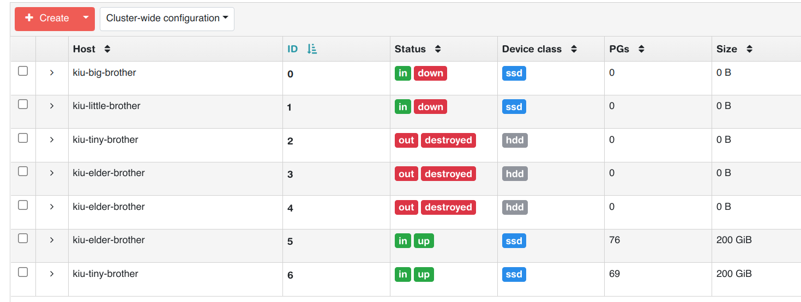
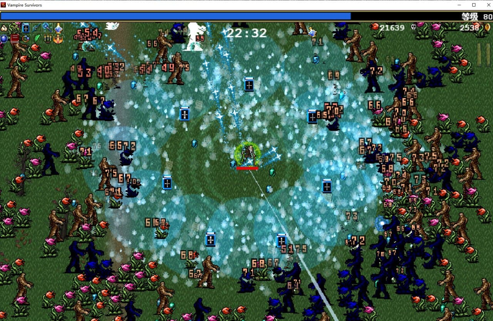
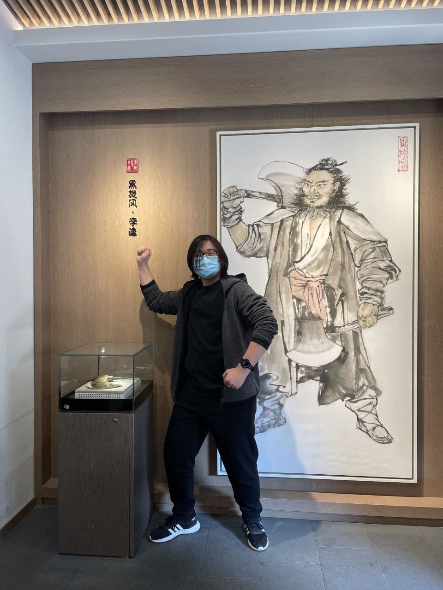

这里又是一份周报, 时间范围是`2022-02-20`到`2022-02-26`, 会记录一些工作及生活上有意思的事情.

## 代码/计算机相关

### NAND2Tetris

很惭愧, 到目前为止还没有看完时序逻辑电路部分的课程.

> 立个 flag, 明天看完, 把大作业做了.  
> 更新于 2022-02-27 13:50:49, 做完啦, 完成了 Bit, Register, RAM 8 - 16K, PC. 但是在 perspectives 提到的使用两个 NAND 实现 DFF 还是没太明白, 后面再看看.

### LFX Mentorship 候选人决定

LFX Mentorship 候选人最终决定, 选中了 Chengwei Guo 同学!

> Guo 同学是 CMU 的在读 master. (大佬带带我啊

顺便聊一下[小作业](http://localhost:1313/post/weekly-report/2022/07-%E5%85%B4%E5%A5%8B%E4%B8%8E%E5%BF%99%E7%A2%8C%E7%9A%84%E4%B8%80%E5%91%A8/#%E5%BC%80%E5%A7%8B%E5%A4%84%E7%90%86-lfx-mentorship-mentee-%E7%94%B3%E8%AF%B7)的结果吧.
总共收到了 11 份回复邮件, 其中有 9 份是选择了 quiz 1, 2 份同时完成了 quiz 1 和 quiz 2.

> 有够卷的. 如果有幸再参与下次 Mentorship, 我要明确标明同时完成两份 quiz 会减分. 😡

对于 quiz 1, 大部分的问题出现在:

- 使用了 katacoda 默认的 minikube 镜像, 而其中的 minikube 是 1.8.1 版本, 不支持 `--nodes` 参数. 步骤中使用了 `--nodes` 参数却没有升级 minikube, 跑不下去了.
- 和上面类似的, helm 使用了 2.x
- Chaos Mesh 没有卸载干净. 有的同学只删除了 Chaos Mesh 所在的 namespace, 没有清理 cluster-level 的资源. 或者只使用 `helm uninstall` 删除了 helm release, 没有清理 CRD. 其实俺之前也想到了这个问题, 暗示了安装卸载步骤可以参考文档站. 可能大家还是想当然了, 认为 `helm uninstall` 会把事情处理好.

对于 quiz 2, 一位同学使用的 kubeclient 去 list pods, 然后将 IP 返回. 这挺好的(朴素的 cloud native 应用), 只是它提供的 manifest 中没有 rbac 的内容, 稍稍减分. 另外一位同学使用了 Headless Service, 然后使用 DNS 解析到 IP, 也挺好的.

关于评判标准, 是按照项目的最终完成度来看的: 我将化身一位完全不懂的小白, 根据项目中的指引(quiz 1 就是只按照 katacoda 操作, quiz 2 就是看 README), 尝试走完这个项目. 如果指引信息有问题走不下去了, 俺也就不会继续往下看了. 看最终哪个项目完成的最彻底.

> 所以为了追求 quiz 1 中的 bonus: multi-node minikube, 而忽视了低版本 minikube 并不支持 `--nodes` 参数, 导致前期启动 minikube 集群失败, 就算是完成度低了.

### 事故: homelab 集群中两个 btrfs 卷升天了

> 要是搁在公司的生产环境, 硬盘分区丢数据的事故不算 P0 也算 P1 了吧.

目前推测事故根本原因:

- homelab 的 PDU 插在了灯光线路上.
- 盲目的 `btrfs check --repair`

事情是这样的:

- 我需要更换一个日光灯的面板开关
- 我关掉了配电箱的 "灯光" 开关
- 家里 WiFi 没有了(WiFi 是由 homelab 机柜中的 PoE 交换机供电的)
- 虚拟机启动不起来后没有查询 wiki, 直接 archlinux live iso 启动准备修复.
- 忽视了 `btrfs check --repair` 的警告选择了强制执行.
- 寄了

> 另外附上修复 btrfs 的[正确做法](https://en.opensuse.org/SDB:BTRFS#How_to_repair_a_broken.2Funmountable_btrfs_filesystem).

因此两台虚拟机由于作为 rootfs 的 btrfs 卷被损坏, 导致无法启动. 因此我的 homelab 中 ceph 也有两个 OSD 掉了.

> 掉了的是 0,1; OSD 2,3,4 是上段时间换硬盘缩容的时候直接删了老的 OSD 重建的.

虽然这周已经过了五天了但是依旧不想去修, 就让它 degrade 着吧.

## 生活相关

### 购入了一台打印机

接[上文](https://en.opensuse.org/SDB:BTRFS#How_to_repair_a_broken.2Funmountable_btrfs_filesystem), 于是就买了. 但是目前还没设置好, 有啥用处或者可玩点下周再告诉你们吧~~

### 游戏: Vampire Survivors

与本周五的 Steam 探索队列中发现了这款游戏, 一款另类的像素风地牢游戏.

玩家只需要走位, 角色可以自动攻击. 可以同时装备六款武器和六款饰品, 特定的武器与饰品组合可以将满级武器进化为神器.

> 两天玩了 9 小时了.

### 游戏: 埃尔登法环

被大树守卫劝退.

被归树看门犬劝退.

(有没有大佬教教我)

### 周六下午徒步

周六和女朋友出去散步, 走到了一个梁山文化的展览馆.

馆内解释了, 施耐庵在钱塘时创作了*水浒传*, 而钱塘就是当今西溪. 所以梁山的文化以及地貌其实是参考了西溪.

> 不敢苟同. 看个乐子吧.

## 其他

俄罗斯乌克兰开战了. 第一次感受到战争和我们的生活比较近, 在咨询 Mentorship 相关问题的时候, Ihor 告诉我他暂时不太行.

> Ihor 是 Kubernetes 的 PM, CNCF 的 Developer Advocate.

希望平民没事.
