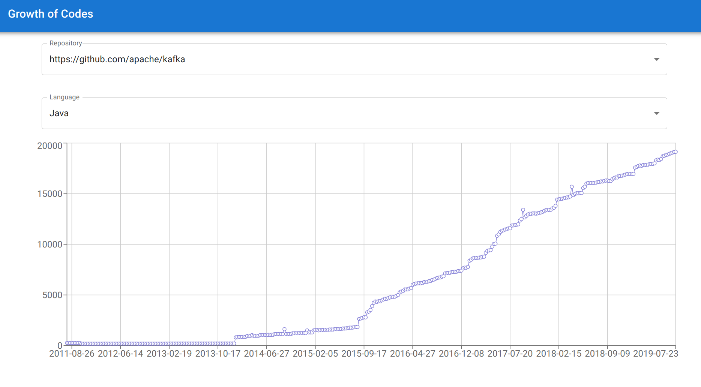
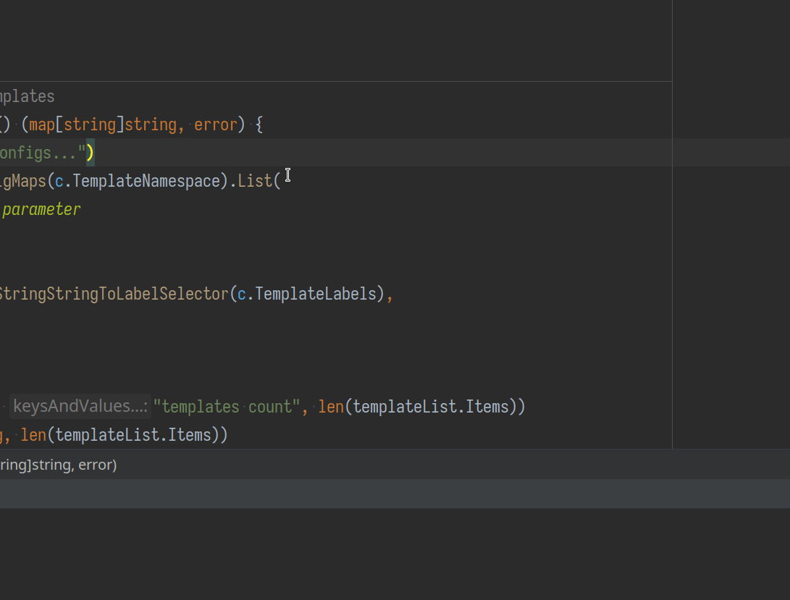

这里又是一份周报, 时间范围是`2022-02-27`到`2022-03-05`, 会记录一些工作及生活上有意思的事情.

## 代码/计算机相关

### NAND2Tetris

很惭愧, 到目前为止还没有看完机器语言部分的课程.

> 希望今明两天看完并完成作业吧.  

> Zhiqiang 啊 Zhiqiang! 你怎么能如此堕落!

> 更新于 2022-03-05 15:29:20, 诶嘿, Week 4 作业做完了.

### growth-of.codes

这周基本上每晚都会写一点这个项目 [growth-of-codes](https://github.com/strrl/growth-of-codes). 最后我选择了部署在 Vercel 上, 数据使用免费的 TiDB Cloud Dev Tier. 地址在 [growth-of.codes](https://growth-of.codes)

目前有了一个简单的页面:

目前是找了一份 (2018) 年的 TOP 100 项目列表, 白嫖了 GitHub Action 的算力分析出来的.

下一步的计划是想办法如何能够对任意的 GitHub repo 在"合适"的时间内分析出它的复杂度增长数据.

### dnf update 后, Goland 出现了一堆莫名其妙的动画效果

### Chaos Mesh 有 Contributor 提出想要实现 Chaos on Windows

Chaos Mesh 一直专注在 Linux 容器上, 对于其他操作系统几乎不提供支持.

> 印象中之前俺[在 stack overflow 回复 Chaos Mesh 不支持 Windows](https://stackoverflow.com/questions/64652375/chaos-mesh-on-aks) 的回答被无情 -1 了.

但是这周我们收到了一个振奋人心的 issue:

Chaos Mesh support for windows nodepool [#2956](https://github.com/chaos-mesh/chaos-mesh/issues/2956)

有社区同学表达了对 Windows 支持的兴趣! 而且在 Slack 的沟通中得知, 有同属同一团队的两位同学将会着手实现.

真的是太棒了啦!

### CNCF 的计算资源

在之前的[内容](https://strrl.dev/post/weekly-report/2022/07-%E5%85%B4%E5%A5%8B%E4%B8%8E%E5%BF%99%E7%A2%8C%E7%9A%84%E4%B8%80%E5%91%A8/#chaos-mesh-%E6%88%90%E4%B8%BA%E4%BA%86-cncf-incubating-%E7%BA%A7%E5%88%AB%E9%A1%B9%E7%9B%AE)里提到过, CNCF 将会对毕业以及孵化项目提供计算资源.

这周发现了 [cncf/cluster](https://github.com/cncf/cluster) 这个项目, 发现条件似乎更为宽松. 这几周忙过以后, 可以去尝试一下, 能不能申请一些机器来做 Self Hosted GitHub Action Runner 了.

> 另外社区的同事翁老师也询问了 CNCF, 被回复 [Ihor](https://strrl.dev/post/weekly-report/2022/08-%E5%8F%AA%E6%98%AF%E5%BF%99%E7%A2%8C%E7%9A%84%E4%B8%80%E5%91%A8/#%E5%85%B6%E4%BB%96) 同时也负责申请计算资源这件事, 体现出 CNCF 貌似存在较为严重的人员单点问题.

## 生活相关

### 忘记在 logseq 里记日记了

之前在 logseq 的 journal 中都会每天多多少少记录一点, 但是这周的周三,周四,周五都没有记录.

周三是一早起来就去上班了, 没有打开家里用来工作的电脑.

周四往后就是忘记了这个事情.

看来在养成习惯之前还是需要有地方提醒自己一下的.

> 另外 logseq 依旧没有推出太好用的多端同步方案, 我正在考虑要不要成为 obsidian 的付费用户.

### 准备使用纸质材料记录生活 checklist

上周买了打印机, 其实到目前为止都还没有产生作用.

准备今天整理一下, 打印出 checklist/cheat sheet, 例如:

- 每天早上起来需要做什么
- 周末的 GTD 整理需要做什么
- ...

以及一些需要"播种"(重要不紧急)的事情, 比如:

- 想写好看的英文手写体
- 想学双拼
- 想看掉屯的某些书
- ...

### 游戏: Death Squared

这周女朋友发现了一个好玩的解密游戏, 叫做 [Death Squared](https://store.steampowered.com/app/471810/Death_Squared/), 目前(截至到 March 8th) Steam 上正在绝赞打折中(90% off). 

> 三块五你买不了吃亏, 三块五你买不了上当.

玩家将操控两个 Square 对象进行解密, 目的是移动方块到目标位置. 但是场景中的很多元素会随着方块的移动来作出反应, 例如:

- 踩下按钮地上冒出尖刺, 碰到会失败
- 激光会锁定攻击方块, 需要使用地图元素, 或者操纵的另外一个方块挡住
- 可以踩到另外一个玩家的方块上进行叠高高

它的背景也非常有意思, 讲述的是一位"大厂员工"在"监督" AI(也就是玩家) 解密. 同时也有另外一个监督型 AI (NPC, 名叫 IRIS) 来和大厂员工同时监督.

配音做得非常好, 女朋友第一次进行游戏时, 只听声音我还以为她在看美剧.

总是还是一款不错的游戏!

> 然后发现 Xbox 手柄接收器可以同时连接多个手柄. 好耶!

## 总结

怎么许多事情掉了链子呢!? NAND2Tetris 没做完, 日记也没写!

> 周末也有好多事情要做, 晚上 20:00 - 22:00 有一个宣讲, 还需要把 slides 改成中文.

气愤啊气愤.
