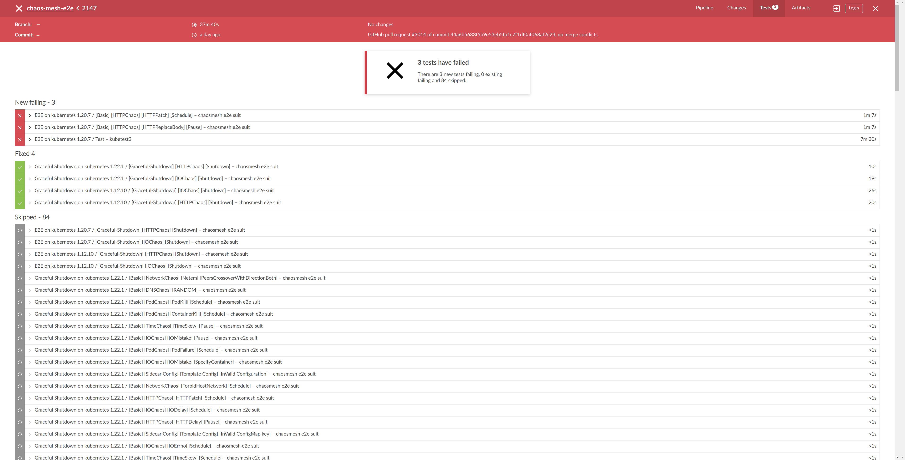
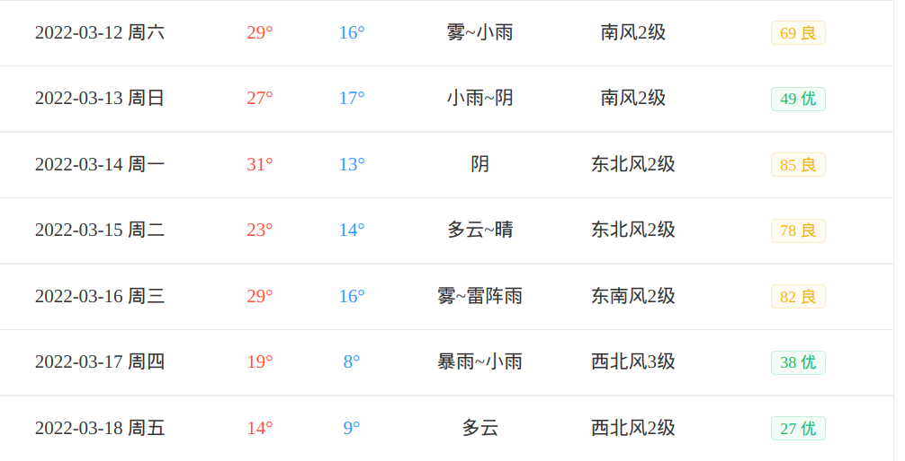

这里又是一份周报, 时间范围是`2022-03-13`到`2022-03-19`, 会记录一些工作及生活上有意思的事情.

## 代码/计算机相关

### NAND2Tetris

很是丢人, 上一周的作业现在也还没有完成.

希望明天能补上上一周的进度.

### GitHub Action Junit Test Report

最近正在做将 Chaos Mesh e2e 迁移到 GitHub Action 上, 发现了一个问题: 我还没有找到一个好的方法来展示这个测试报告.

目前 Chaos Mesh 的 e2e 测试使用 ginkgo 输出 junit-xml 类型的测试报告, 然后喂给 Jenkins, Jenkins 会给一个比较好看的页面出来, 例如:

我想在 GitHub Action 里也有类似的报告出来, 告诉我哪些 testcase 挂了, 并且把相关的日志展示出来.

> ginkgo e2e test 的日志实在是有点难找....

目前已经试过的是 [dorny/test-reporter](https://github.com/dorny/test-reporter) 这个 Action, 但是它目前有一个比较棘手的 [issue](https://github.com/dorny/test-reporter/issues/67). 简而言之就是它新生成的 Check 没有出现在"正确"的位置. 而且由于 GitHub Checks API 的限制, 无法直接将某个 Check 直接"塞"到特定的 CheckSuite 里.

关于这个问题, 可以通过一个 [workaround](https://github.community/t/github-actions-status-checks-created-on-incorrect-check-suite-id/16685/8) 实现, 而且俺试着实现了一下, 貌似不是很难. 如果没有其他方法的话, 这个算是一个下策.

另外有一个叫做 [Check Run Reporter](https://www.check-run-reporter.com/) 的服务看上去也不错, 在未来也是一个备选的方案.

大家有什么好方法也希望推荐给俺!

### Grafana Dashboard for Controller Runtime

最近在梳理 Chaos Mesh 本身的监控项, 发现 controller-runtime 本身有一些有意义的性能相关的监控项, 俺就顺手画了两个 Grafana Dashboard 传上去了.

在[这里](https://grafana.com/grafana/dashboards/?search=controller-runtime), 顺便安利一下.

## 生活相关

### 春天它没来

最近气温变化幅度还是挺大的, 最高 30 度, 最低 10 度不到. 上周六还只穿短袖外套, 今天又穿上了长袖锁子甲.

### 长颈鹭

这周又去散步! 再次看到了长颈鹭, 并幸运地拍下了宝贵的照片.

### 买了本英文字帖

如题, 买了个衡水体考研英语字帖, 希望自己的手写体写得好看一些.

### 暗黑 3 新赛季 PTR

惭愧, 其实 PTR 上周就开了. 新赛季目前带来的感兴趣:

- 职业装备改动只有豆角和蛮子, 但是强度并不乐观;
- 武僧狠狠砍了一刀, 伤害只有上赛季的 20%;
- 豆角的平 A 套还是很带感的!
- 带来了一个新模式, 类似于最初始阶段的大米钥匙, 不停刷怪, 然后死亡或者怪多到一定程度结束, 最终定级, 给予奖励;
- 新模式的特点是海量经验. (PTR 里 70 级以后的第一次新模式刷完(5 mins)直接到 580 巅峰)
- 所以这个赛季的套路是拿巅峰和打卡莽过 150?

> 拳僧什么时候站起来啊?

### 午饭偶遇前前同事

在午饭时突然认出了最开始公司的 PM, 了解到他最近跳到了蚂蚁, 同时也聊到另一位同事(算是我实习时的 mentor)也在同一项目组工作.

> 在那时的工作环境里, 这位 PM 的乐观心态给了俺很多鼓励, 俺也非常敬佩他!

非常开心, 约了下周一起恰个饭!

### Journal 迁移到了 Notion

上次评论区里 xuanwogege 稍微提醒一下后, 意识到 Journal 还是放到 Notion 里比较好. 而且 Notion 有模板的功能, 很多起床后的 checklist 也顺便放进去了.

> 但是最近记得比较匮乏, 周报里少有乐子. 还是说其实就是客观上就是没有遇到乐子.
