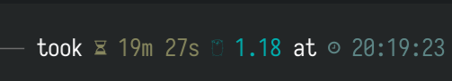

这里又是一份周报, 时间范围是`2022-03-20`到`2022-03-26`, 会记录一些工作及生活上有意思的事情.

## 代码/计算机相关

### NAND2Tetris

很是丢人, 上上一周的作业现在也还没有完成.

希望今天能补上上上一周的进度.

### 最近使用 Fedora 遇到的一个问题, 准备换发行版了

这个问题遇到了有几周了, 现象是执行 `dnf update` 非常的慢, 将近 20 分钟, cli 告诉我它卡在 `Verifying` 这句话上:

趁机 profile 一下, 发现 IO 挺活跃的:

再仔细看一下, 发现是 dnf 在大力读写 `history.sqlite` 等文件:

到此 profile 戛然而止, 以 dnf stuck history.sqlite 为关键词没有搜索到看似可行的解决方案.

> 其实上面这段 profile 过程是几周前的; 当时也看到把 history.sqlite 直接删掉是安全的, 我也试着删掉了. 但是效果不理想, 一段时间后再次遇到了 stuck 的问题.

最终, 我决定换到 Arch Linux 去.

估计下周找个时候开工.

### 匿名论坛开工了

之前提到过一个[绝妙的点子](https://strrl.dev/post/weekly-report/2022/06-%E5%BC%80%E5%B7%A5%E7%AC%AC%E4%B8%80%E5%91%A8/#%E5%8F%88%E4%B8%80%E4%B8%AA%E7%BB%9D%E5%A6%99%E7%9A%84%E7%82%B9%E5%AD%90---dodo-rooster), 是一个关于构建匿名论坛的方式.

偶然看到 disksing 也有[类似的想法](https://disksing.com/anonymous-forum/), 俺感到十分的激动!

已经牵线搭桥了准备做了, 估计大几个月就可以和大家 PoC 了吧.

### JetBrains / VS Code 中 Kubernetes 插件的动态 schema 支持猜想

VS Code 和 JetBrains 中 Kubernetes 都是支持从当前的 kubectx 中去拿 Resource 的 schema 来给予代码提示的:

我对它的实现感到好奇.

(虽然没看代码,) 直觉告诉我这和 `kubectl explain` 有关, 结果仔细看了下还真是;  执行 `kubectl -v7 explain <resource>` 时, 会发现它用了这个 API `/openapi/v2`.

手动访问一下, 就会发现响应中有所有的 Resource 的 Schema, 包括 CRD.  

### 记一次尴尬的 profile/debug 经历

这个故事起源于这个 issue: [chaos-mesh/chaos-mesh#2927](https://github.com/chaos-mesh/chaos-mesh/issues/2927)

在 IOChaos 的注入中, 在尝试 mount fuse 到一个挂载点时, 出现了挂载点非空的情况.

我一开始的思路是, 我们的 ptrace 漏掉了什么东西, 导致进程可能做了一些文件的操作.

然后就开始折腾: 

- 又是 debug, 又是 strace, 又是 bcc opensnoop 的;
- 甚至看了下 zookeeper 的持久化相关代码; 当然, 结论是 zk 根本没做什么文件相关的操作;
- 甚至开始想除了 open 和 mmap 之外还有啥读写文件系统上文件的操作;

结果情况是挂载点本来就不是空的, `-o nonempty` 是期望中的.

> image 是 `k8s.gcr.io/kubernetes-zookeeper:1.0-3.4.10`, 目录是 `/var/lib/zookeeper`.

> 当然对于"除了 open 和 mmap 之外还有啥读写文件系统上文件的操作", 大家有啥了解的也可以告诉俺.

### 家里再次断电, 再次修集群

周五上班后, 得知家里再次出现了一次电力问题. 导致 homelab 中一台 master 节点再次挂掉了:

鸽了较久的 UPS 紧迫程度 ++

### Chaos Mesh 在申请 CNCF 的计算资源

接[上文](https://strrl.dev/post/weekly-report/2022/09-%E6%87%88%E6%80%A0%E7%9A%84%E4%B8%80%E5%91%A8/#cncf-%E7%9A%84%E8%AE%A1%E7%AE%97%E8%B5%84%E6%BA%90), 不得不说 CNCF 是真的大方, 看上去已经同意了: [cncf/cluster#203](https://github.com/cncf/cluster/issues/203).

> 顺便提到另外一件事, 在社区老师和 CNCF 联系后, GitHub chaos-mesh 组织已经进入了 CNCF Enterprise 套餐, 我们也不会受到 GitHub Action Shared Runner 并行的限制了!

接下来我们将会拥有充足的计算资源给 CI 使用, 同组的 keao 同学看上去已经开始玩 kubevirt 了, 使用了基于虚拟机化的容器后, 我们将有能力对 kernel 相关的 Chaos 进行更好的测试覆盖.

## 生活相关

### HZLUG Hacking Saturday

再一次举办了 HZLUG 的 Hacking Saturday, 活动日志在这: [2022/03/26 Hacking Saturday Afternoon 活动照片](https://hzlug.org/0326-h6-photo/).

现场装虚拟机, 玩了 Bedrock Linux; 把 Alpine, Arch, Fedora 装到了一台机器上.

> 就不重复放图了, 截图在活动日志里.

另外接触了 `sudo` 的替代品 `doas`.

很感谢 you06, Minung, LiFePO4 参与这次活动!

另外有一位参与者带了一款很有意思的设备, 是 [Unihertz Titan](https://www.unihertz.com/products/titan). 是一款三防安卓机, 外形硬朗, 很酷.

其他俺感兴趣的是 netboot, ipxe 相关的事情, 可能后续活动中再去细聊吧.

另外交流后也是下决定用 Arch Linux 了, 再见 Fedora.

> tmgg 真捧场! 赞美 tmgg!

### 在 PingCAP, 自己的胆子变大了

最近发现自己敢在一些场合发表自己的看法了, 例如说公司内, 组内, 等等.

在之前的公司内, 氛围都比较压抑, 上级对下级的压力都比较中, 技术上设计上有问题都不太敢"反驳", 更不要说文化上了.

在 PingCAP 后, 我发现自己甚至有表达自己对某些事情的冲动, 我认为这是一种好事, 这和企业内的文化是相关的.

> 想继续维护这种氛围, 也是我想做匿名论坛的原因之一.

### 一些职业发展的小烦恼

目前我做的事情在 [Chaos Mesh](https://github.com/chaos-mesh/chaos-mesh) 这个项目上. 它是开源的混沌工程平台, 涉及到 Linux Kernel, 网络, 文件系统, Kubernetes, Kubernetes Operator, 前端等等等.

它真的非常酷!

目前项目取得了一些小进展吧, 比如说:

- 进入了 CNCF 孵化器
- 有一些 Adopter, 比如说字节, 网易, 腾讯, 小鹏汽车
- 微软 Azure 的 Azure Chaos Studio 也集成了 Chaos Mesh

但是最近在项目未来的发展上, 有一些迷茫/牵制:

- 我个人希望依然投入最多的精力在开源项目本身和社区的建设上
- 产研的大目标希望能够在 Cloud 方面有一些落地
- 商业期望在国内拉到更多的 2B 客户
- 小组内暂时还没有明确未来的目标

但是我发现我:

- 不知道如何构建社区
- 无法量化投入到社区内的成本
- 无法量化社区的价值
- 不知道如何吸引更多的(而不是长久的)贡献
- 不知道如何和其他社区去做合作 (比如说和各种中间件社区合作, 如果能成, 那真的太 OP 了)

我(们)可能会在下一个财年内丢失掉一些话语权, 最坏的打算是工作重心从开源项目/社区转移到内部落地.

> 个人看法, 在 PingCAP 玩落地, 可能真不如去字节里去玩落地.

我希望获取这方便的帮助, 但是不清楚去找谁. 出身 Apache 社区的老师, 例如 tison 老师, jvzhiyuan 老师可能是合适的请教方向.

这个事情需要去做了.

> 组内有太多优秀的同学了, 我很不想把他们的精力浪费到工程中枯燥的部分.

### 财年末

很快三月要结束了, 2022 财年要结束了, 京东, 有赞都裁了很多人, 不知道他们的年终奖怎么办.

上午还在干活, 下午就要交接真的很恐怖.

我们都是弱势群体, 需要想办法保护好自己.
