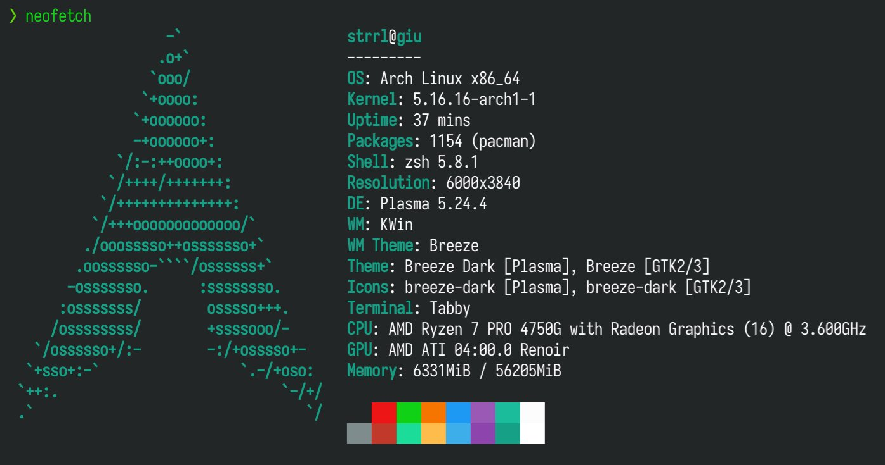

这里又是一份周报, 时间范围是`2022-03-27`到`2022-04-04`, 会记录一些工作及生活上有意思的事情.

> 这周周六补了一天班, 昨天玩了一天, 周报也顺势顺延啦!

## 代码/计算机相关

### NAND2Tetris

Week 5 视频看完了, 作业还在做.

> ¯\\_(ツ)_/¯

### 用上 Arch Linux 啦

因为之前是使用 btrfs 装的 fedora, 这次只需要新建一个 subvolume 作为根装上 arch, 不需要动 home 就活了.

之前的很多东西都还在, 心情比较舒畅.

目前还有各种各样的缩放问题没有调整好, 其余暂时没有什么问题.

用 `yay` 装包实在是太方便了.

### 匿名论坛 what-does-dodo-say

接[上文](https://strrl.dev/post/weekly-report/2022/12-%E8%B4%A2%E5%B9%B4%E6%9C%AB/#%E5%8C%BF%E5%90%8D%E8%AE%BA%E5%9D%9B%E5%BC%80%E5%B7%A5%E4%BA%86), 开坑了开坑了, 开了两个坑:

- 主仓在 [dodo-says/what-does-dodo-say](https://github.com/dodo-says/what-does-dodo-say)
- PoC 仓在 [dodo-says/dodo](https://github.com/dodo-says/dodo)

昨天今天已经在在 PoC 仓库里写一些代码了, 希望明天能够写完 committee 相关的行为, 然后把加密引进来.

### Flux CD on homelab

之前一直直接使用 yaml manifest 作为 homelab kubernetes 集群的描述文件, 但是随着 homelab 中使用 helm 安装的东西越来越多, 只放一个 helm chart `values.yaml` 逐渐不太变得不太合适了.

受 Kubernetes Pattern 的影响, 对 Watch/Reconcile 有一些偏好, 比较喜欢使用 Flux 作为 Homelab 的 CD 工具.

不过迁移过程还是有些痛的, 需要把老的 helm release 删掉然后重新使用 Flux CD 装一遍.

目前已经完成了 Cilium, Cert Manager 和 traefik 的迁移, 还有剩下一部分令人头疼的部分, 比如说:

- Rook Ceph
- Prometheus Operator

剩下的问题后面再慢慢考虑吧.

### 使用 Cloudflare Access 暴露部分服务

自己在 homelab 上部署了一些好玩的服务, 比如说 calibre, jellyfin 以及一些搜刮器什么的, 然后在家里的网络里做了域名劫持, 直接指向 kubernetes 的 worker node.

在看了 Nova Kwok 的一片博文: [使用 Cloudflare Argo Tunnel(cloudflared) 来加速和保护你的网站](https://nova.moe/accelerate-and-secure-with-cloudflared/) 后, 我萌生了将我的服务网暴露到公网的想法.

简单试了一下, 效果很差. 链接质量非常差劲, 只能带的动简单的 API 以及文字较多的网页. 像 homer 这种服务也都需要很久才能加载出来.

估计后面要去详细了解一下 Cloudflare 的各种机制才能去定向优化了.

> 看到 Cloudflare Zero Trust 的控制面板里非常多的功能, tuna 群里也有同学提到了可以使用 Cloudflare 在网页中进行内网的 SSH 与 VNC, 看上去也是非常的香! 有希望在未来把通过 zerotier 回家这个方案替换掉.

### 从 CNCF 申请的计算资源拿到了

大约等了一段时间后, 同组的同学收到了来自 CNCF 的 Equnix Metal 的激活邮件.

> 但是俺还没有收到, 不知道是漏发了还是什么其他的原因. 🥲

同组的同学立刻开了一台 32C128G 的 ARM 机器出来, 非常的痛快!

## 生活相关

### 星际 2 CG 剪辑

发现了一个将近一个半小时的星际争霸 2 CG 剪辑, 4K 升采样过的.

1.5 倍速过了一遍, 啊好怀念.

[视频地址](https://www.youtube.com/watch?v=Bu0B4busV5c)

个人依旧觉得最令人舒服的镜头是, 星灵重新夺回自己的母星艾尔后, 一段重新建设的"延迟摄影"([1:10:15](https://youtu.be/Bu0B4busV5c?t=4215) 开始). 配合着大主教旁白 "gather the survivors, rebuild our cities", 多少还算是个 happy ending.

> 星际争霸啥时候出电影啊?

### 想买 acgmiku.com

Vocaloid 同好协会/acgmiku.com 是俺在高中以及大学早期长混的一个社区, 俺曾经也是一位论坛管理员; 但是后期由于 V 圈的没落和管理人员内部的分裂, 这个站现在已经被挂了巨量广告然后也无人维护了.

> 甚至联系到早期成员, 都没人知道这个站域名在谁那里, 后面的机器在谁那里.

在 whois 信息中中到了 networksolutions 的这个信息, 只能挂一个 backorder 去慢慢捞了.

如果能捞到, 坐一个静态页放点历史也是蛮有趣的.
