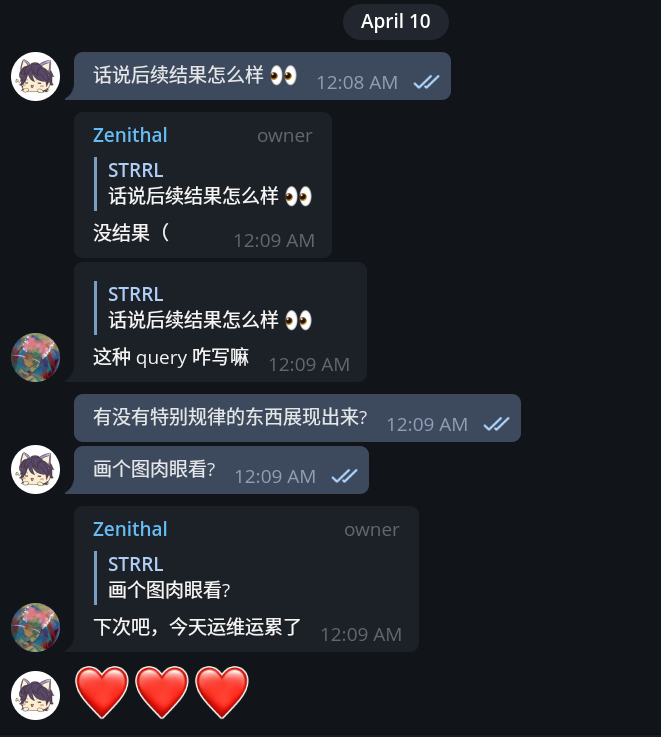

这里又是一份周报, 时间范围是`2022-04-05`到`2022-04-09`, 会记录一些工作及生活上有意思的事情.

## 代码/计算机相关

### NAND2Tetris

花了俩小时, 把 week 5 的实验写完啦!

很感叹那怕是 HACK 这样看似简单的计算机, 内部的设计已经非常精巧/巧妙了.

对于我来说, 我只能处在一个"能看懂"的水平上了, 让我去设计不知道再花多少时间才能学会.

对手上的计算设备有了更多的敬畏. 计算机不愧是人类智慧的结晶(之一).

### dodo-says/dodo PoC 完成

接[上文](https://strrl.dev/post/weekly-report/2022/13-%E6%B8%85%E6%98%8E%E5%81%87/#%E5%8C%BF%E5%90%8D%E8%AE%BA%E5%9D%9B-what-does-dodo-say), 这个周末完成了最初的 PoC, 实现了最基础的功能:

- 只有一定数量的委员会成员同意后, 才能解密原文;
- 通过使用其私钥解密某特定内容, 表示委员会成员同意;

稍微记录了一下使用方式, 欢迎来试试 [dodo](https://github.com/dodo-says/dodo#basic-usage--demo)!

预计后面会写一篇文章以故事的形式来描述 dodo 想要做什么事情.

### 学习些前端知识

很惭愧, 自己对前端知识一直"半瓶子不满", 长期处在一个"能用框架, 不懂原理"的情况上.

最近学习了一下 babel, webpack, css 布局, 感觉有了新鲜的认知, 又捅破了一丢丢窗户纸. 😜

愈来发现我需要去整体过一下 ES2015 的 spec / reference 了.

> 回想起来, 自己真正看完的第一个系统性的文档是 Spring Boot Reference, 从那以后, 我意识到碎片化的知识的质量不如系统性的知识, 前者一定需要自己整理后才会产生作用.

### 好用的工具: Health Sync

最近再想, 怎么把自己的健康信息通过 API 拿出来, 做个统计什么的. 由于我目前还是用的三星的一系列设备, 而三星并没有做的像 Apple 的 HealthKit 那样好用的 API; 尝试导出 CSV 然后在导入, 无奈数据量太多又没有 schema, 靠猜意思去解析是行不通的;

虽然三星没有 API 但是谷歌有哇, 只要把健康数据同步到 Google Fit 就可以了. 自己建立一个 APP 然后使用 OAuth 就可以调 Google Fit 的 API 拿自己想要的东西了.

然后发现了这个工具: [Health Sync](https://play.google.com/store/apps/details?id=nl.appyhapps.healthsync&hl=en&gl=US), 目前我的使用方式是每 15 min 就把三星健康中的数据同步到 Google Fit 中.

> 有了 API 可以做什么呢? 还没想好, 估计是替代我日记中的每日健康统计吧.

### 新点子: 弹幕玩星际

之前在 B 站的时候, 发现了一位有趣的 up 主 [_pdz](https://space.bilibili.com/34239), ta 的直播间一般是常开的, 内容是[弹幕玩红警 3](https://live.bilibili.com/704155). (印象中 ta 把源码放到 GitHub 了, 只是我一时找不到链接了.)

作为星际的老粉, 我觉得这个有趣的形式应该也可以用到 SC2 里去. 而且之前曾经有一波 AI 玩 SC2 的风潮, 我觉得 SC2 的 API 应该会更加完备一些.

> 都是 08 年的 dead game, RA3 可以 SC2 也行!

大略搜了下, 可供参考的内容有:

- SC2 API
  - Offical C++ API: [Blizzard/s2client-api](https://github.com/Blizzard/s2client-api)
  - Community Python API: [BurnySc2/python-sc2](https://github.com/BurnySc2/python-sc2)
- [SC2 AI Arena](https://aiarena.net/), 是 AI 玩星际的排行榜, 大家上传自己的模型, 这个站点不停地举行对战, 进行线上 Streaming, 记录对战记录并更新积分榜.
  - 这个平台有一个功能, 允许任何人贡献自己的机器作为算力作为 worker 跑对战, 只需要启动一个 docker 容器就可了; 我觉得里面可能会有一个 headless 的星际客户端;
  - 这个站点有 24/7 的 [live streaming](https://aiarena.net/stream/) 功能, 点进去看了看, 镜头切的也比较合理, 也不会长时间盯着一个地方看而变得无聊. (点进去就看到了托马斯溜枪兵(卡射程拉扯消耗, 极限微操)这种有趣的画面)

放张截图, 这是另一局 ZvZ, 蓝色方直接三矿开到对面然后爆狗推了:

等心情好的时候可以考虑梭一把了!

### 新想法: 监控数据的频域分析

起因, 经过:

只能说有点好奇吧, 但是相关的事情肯定有人做过了.

> 所谓的大数据不就是拿着我的行为时序数据, 然后对我做预测吗.

## 生活相关

### 好喝的柠檬撞奶

在书亦烧仙草发现了一个好喝的"柠檬撞奶", 去冰少糖, 有姜和柠檬的味道.(一周内好像喝了三次了, 好喝的.)

女朋友试过的另一款饮品叫"橙漫山茶花", 也非常不错.

我发现这两款饮品都有一个共同点, 前期是强烈的味觉刺激, 后期是持久的嗅觉刺激:

- 柠檬撞奶, 前面是姜和椰奶的味道, 后续是柠檬的清香;
- 橙漫山茶花, 前面是橙子的酸甜, 后续是乌龙茶的清香;

前期刺激猛烈, 后期感觉持久, 二者加在一起, 有点像是"猛烈的刺激持续"很久的感觉;

这种东西太神奇了, 通过欺骗自己的感官, 让自己获得了持久的快乐.

### 京东快递资源紧张

因为上海疫情的原因, 可能各大家物流公司都去参与统筹了吧. 在京东自营上买的东西, 有一周了还木有发货.

不太好.

### 杭州的目前囤菜冲动还比较克制

近一周去了永辉和盒马, 发现蔬菜水果的库存还是蛮多的, 大家也没有出现很强的囤货冲动.

挺好的.

### 瞎想: 卡比是怎么飞起来的

最近新游戏 *星之卡比探索发现* 上线啦! 虽然俺还没有买和玩, 但是看了一些视频内容. 让我产生了新的瞎想: 卡比是咋飞的?

卡比在飞的时候处于这个状态:

像是含了一大口气, 体积变大, 然后飘起来了.

这让我们能联想到什么? 对, 就是**潜水艇**.

但是如果需要在空气中漂浮/飞行的话, 填充物的密度必须比空气低才行.

然后我提出了大胆的猜想:

**在飞行时, 卡比的内部空间为真空.**

然后我们再思考, 卡比能够无限制吸入空气, 甚至可以能够作为攻击手段

所以我再大胆的猜测:

**卡比内部有一个可控的隧道, 另一端连接着真空环境.**

> 或者再激进点, 卡比里面有个黑洞?

这样, 为什么卡比能够吸入, 卡比为什么能漂浮, 就都能解释得通了, 感觉非常的合理! 🤩👍

### 国产 WeMod "一修大师"

最近发现了游侠网发布了一个类似 WeMod 的修改器集合产品 "一修大师".

除了关闭修改后, 会给你打开浏览器到游侠网官网外, 还没有其他明显流氓行径.

## 其他

### 开源只是手段, 不是目的

我还没有办法完全理解这句话.

我就是个喜欢写代码的人, 能让我开心的写代码我就没有其他的烦恼了. 开源能够使我和世界上其他优秀的工程师共事, 合作, 分享, 这件事情实在是太美妙和激动了.

但是最近和 dalao 们的聊天中发现, 在商业公司中写代码, 工程师需要自己去掌握主导权和话语权. 否则就会被其他人抢走主导权. 而这个其他人可能是产品, 可能是商业, 可能是其他任何没有软件工程知识的人(或者组织).

所有人的认知都是片面的, 工程师擅长工程, 市场部门擅长商业, (其他部门负责其他), 任何一方获得过多的主导权都可能会导致"大事"(比如说创业成功, 项目获得业界广泛认可并采用等)的方向或者执行出现问题.

所以我为了开心写代码, 不得不去考虑更多的问题, 要花时间和其他人探索方向, 做 trade-off.

[warp.dev](https://warp.dev) 是最近的一个热门项目, 虽然它目前还没有开源, 但是它有开源的计划, 而且对于个人用户也是免费的. 他的商业计划在这里[Open sourcing Warp and business model](https://github.com/warpdotdev/Warp/discussions/400) (俺自己还没看, 哭哭)

据说这是一种被称为 Product-Led Growth 的方式, 类似是以产品为中心的发展策略. 我需要更多的时间来理解它.

"Chaos Mesh 的目的是什么呢" 将会是我未来一段时间要解决的问题.

### 开源项目的代码质量

开源协作意味着各种经验的人会提交 PR 到仓库, 而合 PR 的"标准"是"只要这个 PR 有积极意义"就会被合并.

这就意味着开源项目的 maintainer 需要花费时间去单独在代码质量上作出改进才行.

而改进代码质量这个东西是很难去量化的, 因为他不会带来直接的"效益".

代码质量问题就像是空气污染问题, 我知道我需要洁净的空气, 但是我对于空气质量"优", "良", "轻度污染", "重度污染"缺少直接/线性的认知, 也有相当一部分人群长久生活在"重度污染"中.

我的生存本能觉得, 空气质量改进一下是好事, 但是说服不了自己, 因为这件事带来不了什么明显的生活质量改变.

我的工程师经验觉得, 代码质量改进一下是好事, 但是说服不了上级, 因为这件事带来不了什么明显的效益.

> 以上均是个人观点, 不代表其他任何组织和自然人的立场;
