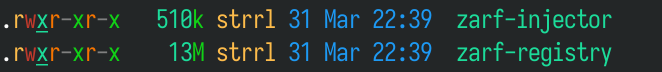
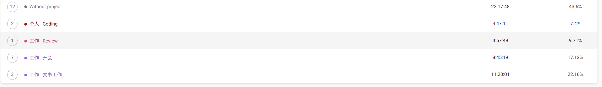

这里又是一份周报, 时间范围是`2022-04-10`到`2022-04-16`, 会记录一些工作及生活上有意思的事情.

## 工作/代码/计算机相关

### NAND2Tetris

这周还没有学习 NAND2Tetris 哦;

上周把 HACK Computer 做完了, 估计下半段的学习要主要到软件方面了.

### 气隙服务器 DevSecOps: zarf

在 twitter 无意中刷到了一个很酷的软件: [defenseunicorns/zarf](https://github.com/defenseunicorns/zarf), 它可以在气隙(没有或有限的外部网络连接)服务器中 delivery 镜像之类的.

这和俺之前的 kubectl-push 想做的事情有些类似; 在设计时, 我遇到了一个 kubectl-push 如何 self-bootstrap 的问题, zarf 比较好地解决了这个问题, 让我们看看它是怎么做的吧:

在 zarf 项目的 README 中的最后一段[Zarf Nerd Notes](https://github.com/defenseunicorns/zarf#zarf-nerd-notes),  简单介绍了 "injector system", 描述了 zarf bootstrap 的过程:

- 把一个 in-memory image registry 的 binary, 名为 `zarf-registry`, 以 512KiB 为大小切片, 放到 ConfigMap 中
- 把一个 rust 写的拼装程序, 名为 `zarf-injector` 也放到 ConfigMap 中
- 随便找一个可用的 image, 创建一个 "injector" Pod, 在 Pod 里挂载上述的 ConfigMap, 启动拼装程序, 让 in-memory image registry 开始 serve. (这个是 short-term 的registry)
- 使用 portforwarding, 将 Zarf Registry 的 image 传上去
- 创建 "zarf-docker-registry" Pod, 通过这个 in-memory registry 拉刚才的镜像并启动. (这个是 long-term 的 registry)
- bootstrap 完毕, 清理 ConfigMap 和 Pod

这个思路非常好! 先通过 ConfigMap delivery 一些小东西, 然后再 Delivery 自己真正的东西.

截至当前, zarf 中这两个 binary 文件大小如下, 需要使用 29 个 ConfigMap, 不清楚对 apiserver 以及 etcd 的负担有多大.



> 想水个改 typo 的 [PR](https://github.com/defenseunicorns/zarf/pull/438), 然后被他们的开发人员在更大的 PR 里给海纳百川了, 没蹭到 contribution.

### pointer receiver 的误导

关联: <https://twitter.com/strrlthedev/status/1514628768492507141>

最近在 review Chaos Mesh 的时候, 发现有相当一部分的 Constructor 返回的是 struct 而不是 pointer, 然后这个 struct 中用了类似于 `sync.Mutex` 等不能 copy value 的东西. 然后有些方法用的是 value receiver 而不是 pointer receiver.

对于第一个问题其实没啥好说的, 修了就好了;

对于第二个问题, 想到了之前和同事发生过的一段对话, "如果用 pointer receiver 会使内存分配到堆上, 而 value receiver 会在栈上, 为了性能考虑, 我要用 value receiver".

> 过早优化是万恶之源.

当然还有一些其他理由, 比如说"默认/推荐用 value receiver" 什么的. 当时我没太在意, 但是我怀疑是不是 go 的官方文档在哪里误导了.

查了一下, 果然, 在 A Tour of GO 中有如下描述:

```text
There are two reasons to use a pointer receiver.
The first is so that the method can modify the value that its receiver points to.
The second is to avoid copying the value on each method call.
```

这种就给人一个"除了这两个情况之外, 请默认使用 value receiver"的意义.

其实工程代码还是更像 [Go Code Review Comments](https://github.com/golang/go/wiki/CodeReviewComments#receiver-type) 中所说的, 用 pointer receiver 更加普遍.

有一个相关的 [issue](https://github.com/golang/go/issues/17524) 以及 [CL](https://go-review.googlesource.com/c/tour/+/31728/) 提及了这个问题, 但是看来后续没有跟进了.

## 生活相关

### 尝试时间追踪类软件

看到推友在使用 toggl tracking, 我觉得非常的好用, 于是这周尝试了下.

比如说这周, 感觉天天都在开会和写材料, 之前是没有什么客观定量分析的, 但是现在就有了:



使用 Project 的方式对记录的时间简单分了下类, 就有了很直观的感受了.

目前使用上来说, 方便是非常方便的, 有 Web 端, 安卓 APP, Linux 和 macOS 也都有 native app.

安卓上还有小组件, 放到首屏提醒自己:


但是个人的记录习惯还没有养成, 需要继续培养~

### 换了个双屏配置

关联: https://twitter.com/strrlthedev/status/1514227327198466052

脖子还在适应中, 感觉副屏使用率比竖屏那种方式高一些.

### 尝试冥想

最近看了一下关于冥想的书, 对冥想有了一些很粗浅的认识.

冥想不是什么都不去想, 因为人的思绪就是会不停的冒出来的. 冥想是在思绪冒出来后, 尽量不让自己的意识被思绪抓走了, 而是 let it go, 或者被抓走后, 意识再回来.

一个比较有趣的想象场景或者比喻就是, 你坐在公路旁边, 公路就是你的脑袋, 你的思绪就像一辆辆开过去的车. 好事情的思绪就像好车开过, 你的注意力就可能被好车吸引了. 坏事情的思绪就像破车开过, 你可能就想阻止破车开在你的公路上.

冥想做的事情是, 尽量不要管这些车, 就随他去, 无论是好车还是破车, 不去尝试去控制他们.

感觉这像一中 meta thinking(Metacognition?), 让自己对自己的想法有一个客观的认识. 有了想法以后, 总是有冲动去行动, 而冥想是尝试在行动前, 有更多的客观认识.

自己简单尝试了下, 在早上起床后, 是比较容易进入这种状态的. 而在下午或者晚上, 就会比较难, 脑子的冒出的思绪就经常更加"重要"或"具有吸引力", 会更加难以"回到公路旁".

### 暗黑 3 第 26 赛季

这周五新赛季开了! 这次的赛季特点是梦魇回响, 收益是给的经验非常多, 类似于很早前的大米打票评定等级.

我和女朋友双双选择了猎魔人开荒, 在大约四个小时候达到了 70 级, 六个小时后做完赛季旅程.

第二天上午掠夺者箭塔 BD 就齐了, 下午冰吞转转也齐了.

这次开荒无论是运气还是效率来说是最高的一次, 中间木有太多被卡住的时候.

不过克己守心对戒好像暗改了, 扫射出的追踪箭不能触发克己的效果了.

准备后面去玩一个野蛮人去试试新 BD 雷蔻抛石.

## 其他

这周好像有些敷衍, 不说了, 我要刷暗黑去了.
