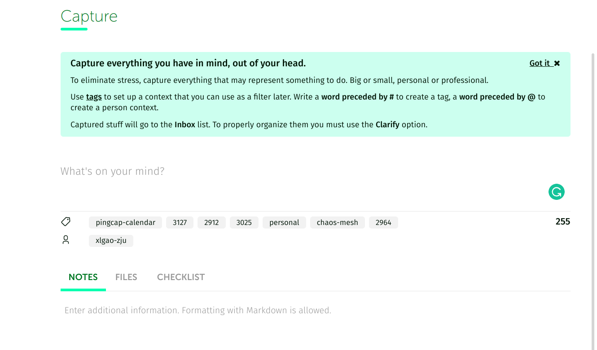
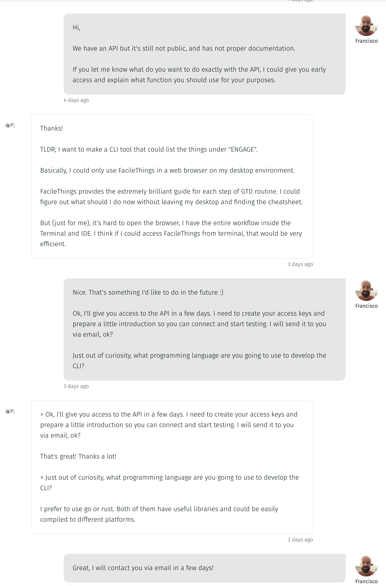
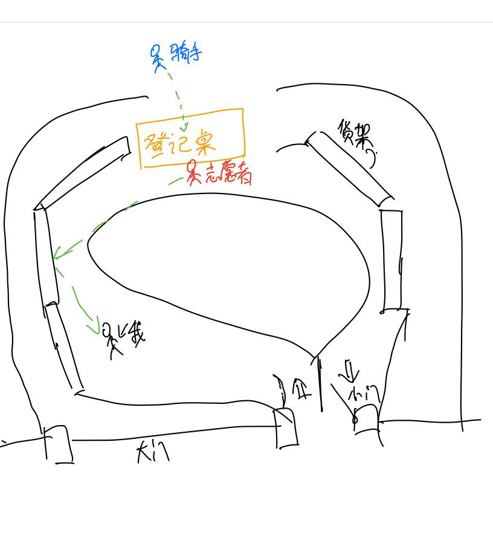

这里又是一份周报, 时间范围是`2022-04-17`到`2022-04-23`, 会记录一些工作及生活上有意思的事情.

## 工作/代码/计算机相关

### NAND2Tetris

本周没有进行 NAND2Tetris 的学习;

### 将 TiDB Cloud 添加到了 free-for.dev

我之前在做 growth-of.codes, 尝试 serverless 的时候, 状态必须使用一个 SaaS, 调研了一些服务, 包括 Cloudflare KV, MongoDB 的 free-tier, 还有某个 Redis 的 free-tier 等. 但是各家的用量限制, 或者是调用 quota 都不是很高. 最终我选择了 TiDB Cloud, 因为提供了一年的 10 GiB 存储, 和不限量的调用 quota.

后来 TiDB Cloud 结束了内部 dog-food 试用, 1-year free dev tier 开始对所有人开放, 这么好的东西肯定要分享出去, 因此我提了个 PR:

[Add TiDB Cloud Dev Tier. #2408](https://github.com/ripienaar/free-for-dev/pull/2408)

大家可以试试, 和 serverless 真的是绝配了. (疯狂白嫖!)

## 生活相关

### 有趣的 GTD 工具 FacileThings

较久之前, 我在看完 GTD 后开始构建自己的外部大脑; 使用的工具是 Notion, 得益于它强大的 database, 和页面内 block, 我构建出了一套灵活的工具流.

Notion 工作得很好, 从过年附近到现在, 它已经帮我追踪并管理 406 件"事情"了.

但是一件事情的实施并不是有了好用的工具就完事了, 很多时候我依然会忘记去做事情, 然后有时会懈怠, 有时会忘记怎么做; 后来我在 Notion 中建立了一个名为 GTD CheatSheet 的 Page, 手动整理以及记录自己需要做什么.

在自己"摸石头过河"的途中我突然发现了这个工具: [FacileThings](https://app.facilethings.com/).

对我来说, 它的亮点在于:

- 丰富的"文档"
- 在应用内时时刻刻提醒你, 你应该怎么做

例如, [如何做 Daily Review](https://facilethings.com/learning/en/tutorial/reviewing-your-lists), [如何做 Weekly Review](https://facilethings.com/learning/en/tutorial/the-weekly-review), [Purpose/Vision/Goal 级别的目标应该怎么定](https://facilethings.com/learning/en/tutorial/getting-perspective) 等等;

在 UI 交互上, 也时刻提醒我, 你在做 XXX 的时候, 应该注意 XXXX:

> 我是永远也不会点掉右上角的 "Got it" 了, 我就要他一直提醒我.
> 就像之前和某位产品经理朋友聊天, 他告诉我, 产品经理的作用并不只是规划一个宏伟且可行的蓝图, 而也要时刻提醒你, 你的东西用户用上去烂透了, 防止开发人员沉浸在自己的意淫中.

它的这些亮点可以完美的覆盖我的 GTD CheatSheet, 所以我挑了一个晚上, 将我的工具流从 Notion 搬到了 FacileThings 上. 整个迁移过程十分流畅且无痛, 体验非常好.

再稍微说下缺点, FacileThings 是一款比较古老的应用, 貌似 2010 年就出现了; 因此它的 Web App 和安卓 App 都称不上是"非常好用", 但是也绝对够用. 但是它只有 Web App 一个接入方式, 也不算太方便.

我想在当下, 一个工具如果好用, 是一定要提供 API 的. 但是 FacileThings 没有文档说明他们有暴露 API, 然后尝试工单问了下, 没想到 CEO 亲自回答了:

真好, 非常期待! 而且印象分 ++ ❤️❤️❤️

### 自动化记账

由于下周就要放五一假期了, 所以这周 TMD 要调休.

真的很烦调休诶, 你说我本来周末一天 Review 自己, 一天休息多好. 结果周天要上班, 没时间反思自己了. (包括这个周报也是赶出来的)

Weekly Review 目前最繁琐的事情就是 beancount 记账这件事, 我没有每天记录的习惯, 但是如果超出一周再去记, 那负反馈就直接打满, 以后就更不想记了.

自动化记账的需求迫在眉睫!

> 五一尝试去解决这个问题, 找一些自动化的轮子, 哪怕是 WebUI 用一下也好.

### 小区静态管理

我们小区它自己封了.

上段时间据说我们小区某幢出现了病人, 但是无论是从微信杭州发布公众号上, 还是从 TG 的频道上, 都没有看到这个病例, 也没有看到我们这个地区(余杭区)的管控通知. 反倒是拱墅区的病例一直在更新, 也官宣了进行静态管制.

我们小区就很迷惑, 有一部分离那幢楼近的人被拉去酒店 14 + 7 了, 其他人员不准出小区, 但是快递和外卖正常工作. (像是街道级别的措施) 🤔🤔🤔

为了让大家取外卖和类似于盒马生鲜, 叮咚买菜的包裹, 在西门搭建了类似一个这样的区域:

> 因为有喇叭在喊"快拿快取, 请勿逗留, 请勿折回, 请勿拍照", 我就没拍~~把照片放出来~~, 大家自行想象一下.

让我联想到了肺泡, 氧气(食物)从这个区域里进来, 被红细胞(我)带回家里, 来维持生命.

> 有照片的官方报道: [链接](https://mp.weixin.qq.com/s/kIxVnjRmx-t453REg4wX6w)

### 中耳炎它自己好了

我的左耳它自己好了, 也不痛了, 也不痒了, 也不流脓了, 开心!
