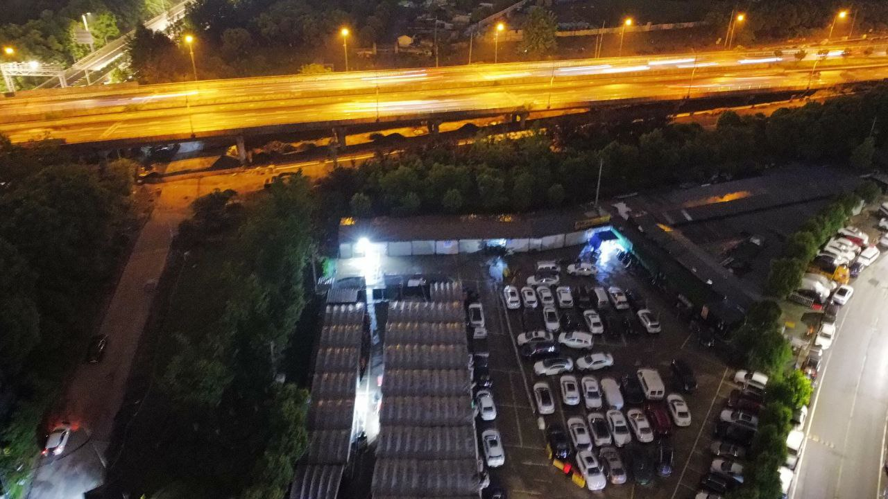

这里又是一份周报, 时间范围是`2022-04-24`到`2022-05-01`, 会记录一些工作及生活上有意思的事情.

## 工作/代码/计算机相关

### NAND2Tetris

本周没有进行 NAND2Tetris 的学习;

### 给学校的镜像站扩容

大约一段时间之前(一个月前), mirrorz 的红人同学提醒 YNU MIRROR 已经停止更新了; 而直到上周我才去看;

发现是分的 15T 空间已经不够用了:

然后顺手将它扩到了 25 TiB, 不得不说, ext4 的 online-resize 还是挺快的, 大约不到半小时就完成了 resize, 现在在正常工作了;

但是追上游的更新还是要更久的时间 =.=

### Chaos Mesh v2.2.0 Released

Chaos Mesh v2.2.0 总算憋出来了, 憋了五个月, 笑死: https://github.com/chaos-mesh/chaos-mesh/releases/tag/v2.2.0

关于这种及其痛苦的发版模式, 亟待改善, 需要一个健康而且无压力的发版流程: https://github.com/chaos-mesh/chaos-mesh/issues/3172

应该最近 1 - 2 内就会完成 draft proposal, 并在下一个 minor version 中得到初次的实践;

### 绝妙的点子(From Keao): 理论 SLA 计算器

最近在 Chaos Mesh 的头脑风暴中, keao 同学提出了一个非常 amazing 的点子: 理论 SLA 计算器.

(在我的理解中,) SLA 计算器想做的事情是, 假设程序自身没有会导致可用性下降的前提下, 告诉 SLA 计算器该应用所依赖的各个服务(其他应用, 云服务, 基础设施, 中间件等), 以及依赖关系(强依赖? 带降级的弱依赖? 重试?), SLA 计算器能够得出当前的设计能达到的最大理论 SLA;

例如, 我写了一个简单的 Web 程序, 它只有一个 `/ping` 接口, response body 固定为 `pong`. 然后我将它部署到单个 AWS EC2 上, 假设任何的网络都木有问题, 那么我的程序的 SLA 受限于 EC2, 是 `99.5%`;

后面我再优化一下, 我部署 3 个副本到 3 个不同的 EC2 上, 并在前面使用一个 ELB 做负载均衡, 那我的程序的 SLA 应该是 `(1 - (1-0.995)^3)*0.9999 = 0.999899875`, 大约是 `99.9899875%` 了, 年度不可用时间大约为 52.6257 min;

> EC2 的单实例 SLA 不赔钱写的是 `99.5%`; https://aws.amazon.com/compute/sla/
> ELB 的 SLA 不赔钱写的是 `99.99%`; https://aws.amazon.com/elasticloadbalancing/sla/

如果这个时候, 我声明我的 SLA 在 `99.9%`, 即年度不可用时间为 525.6 min, 留得故障预算好像过于多了;

而如果我声明我的 SLA 在 `99.99%`, 即年度不可用时间为 52.55999999999421 min, 和理论最大 SLA 相差约 4 秒, 看上去也是一个不错的选择; (拿 AWS 赔我的钱再赔给客户, 再倒贴点钱, 我就是赌狗)

精彩的还在后面, 有了理论的 SLA 后, Chaos Mesh 能够向不同的组件和依赖注入故障, 来验证声明的依赖关系, 依赖方式等是否真的符合预期;

例如刚才的例子上, 我声明了 ELB 会接到 3 个 EC2 上, 但是我实际运维的时候只接了 1 个; 错误注入到那个节点上时, 整个服务就瘫了;

这个点子太有意思了, 有意思到甚至不想把它产品的 ROADMAP 里, 而是我们自己维护以及实现, 让它野蛮生长.

### codesee.io

在公司群的聊天里发现了这么一个较为厉害的工具: [codesee.io](https://app.codesee.io/); 它能够将代码的依赖绘制出图, 甚至 golang 能够做到文件级别的依赖分析, 而不只是包级别哦!

例如从这个图上看, 有两个很显眼的问题:

- controllers 包里有东西依赖了 cmd 包
- pkg 包里有东西依赖了 controllers 包

让我们仔细点开一下:

果然发现 `podnetworkchaos` 和 `util` 下面的一部分测试代码引用了 cmd 的内容. (铲掉铲掉!)

再看看另外一边:

在 pkg 下, 也有 `ctrl`, `selector`, `dashboard`, `status`, `workflow` 中的不同内内容依赖了 `controllers` 包内的内容. 这也是需要整理的.

> 如果出度入度/依赖被依赖能用不同的颜色表示那就更好了, 有时候箭头找不到啊..

另外它还有一个 tour 的功能, 看上去可以以动画的方式去过代码, 这对新人/社区贡献者熟悉代码可太有帮助了! 后面去研究一下;

- 另外的遗憾是语言上还不支持 Kotlin;
- 另外如果也能通过 openapi/graphql/其他 RPC schema 的方式, 把不同语言的依赖通过 openapi 联系在一起, 那也会非常的酷!

### american fuzzy lop

这周接触了 [AFL](https://github.com/google/AFL), 看上去它可以以一个引导试的方式来进行 fuzz test; 而且也有 golang 上的 port: https://github.com/dvyukov/go-fuzz;

对 fuzzing 我还不是太熟悉, 等有了一些知识后再来分享下吧~

## 生活相关

### 无人机航拍

买的 DJI MINI 2 到了! 拍了很多令我舒服的照片!

### Taichi Voxel Challenge

最近看到了彦青姐的朋友圈, 发现了 taichi 社区的 Voxel Challenge 这么一个活动; 差不多就是用 99 行代码, 去画一写有意思的 3D 像素风作品;

目前已经有很多有趣的作品已经提交到[这里](https://github.com/taichi-dev/voxel-challenge/issues/11)了, 瞻仰瞻仰;

俺自己手撸了一个 nyaacat, 奈何太菜, 撸完就已经将近 300 了, 苦于找办法 compact 中.

