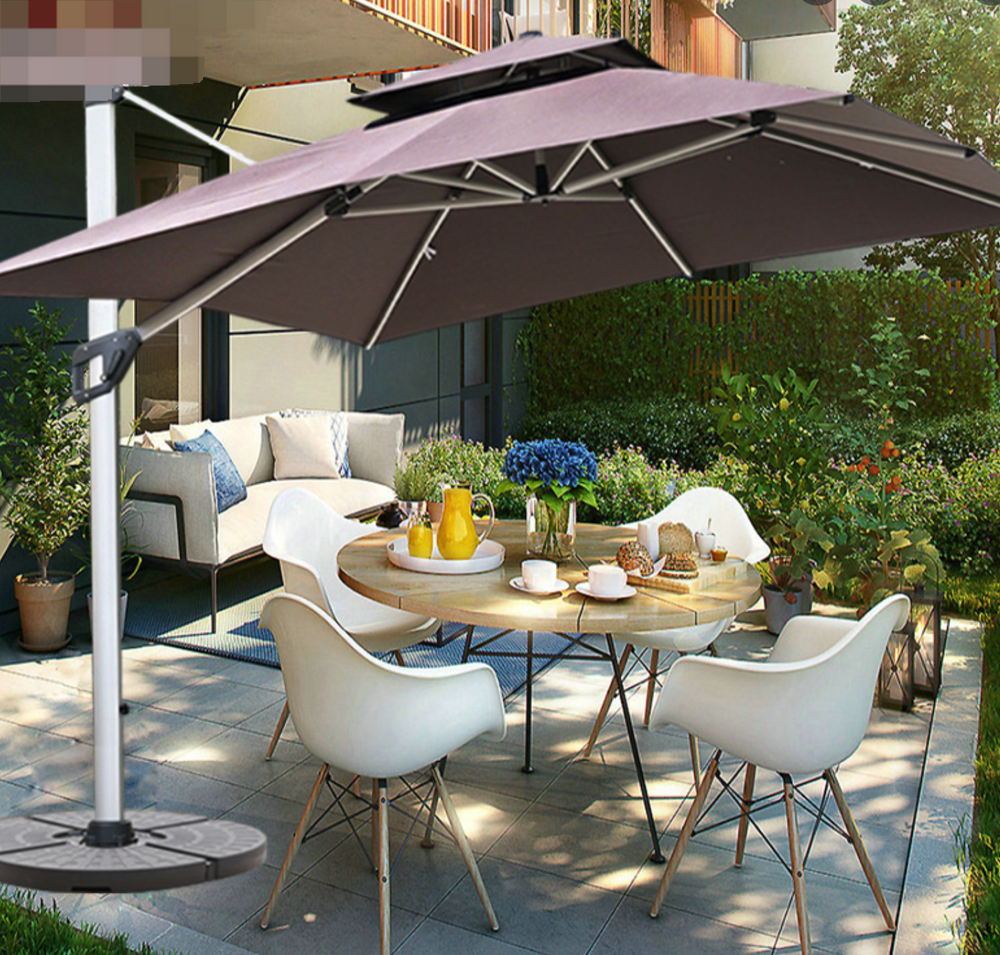

这里又是一份周报, 时间范围是`2022-05-08`到`2022-05-17`, 会记录一些工作及生活上有意思的事情.

## 工作/代码/计算机相关

### NAND2Tetris

这周我自己没有新的进度.

但是成功拉了女朋友一起入坑, 正在做 Project 1. 🌚

### VTB 出道

使用 m1 mbp 而又急迫需要 linux 环境的同学一定听说过 Asahi Linux 这个发型版. 它自称 “A vanilla Arch Linux ARM environment”, m1 的性能续航再来跑 linux, 真的是香爆了.

然后重点来了, Asahi Linux 有一个开发者 vtuber 出道了! 朝日リナ: https://www.youtube.com/c/AsahiLina

感觉挺有意思的;

是时候在 Chaos Mesh 里推进一波了!

稍微搜了下, 美少女皮淘宝上几百块就能买得到定制的, 等这个 Q 忙完了交差, 然后整个美少女皮来活跃社区气氛!

> 尝试让这个项目保持有趣! (但是在奇怪的方向上)

### bugbash 活动

这次 bugbash 活动又开始了, 在这次, 有些问题终于积累得过久, 显现出来了:

- 没有 assign 机制, 多个 contributor 同时修一个 bug
- PR 没 Issue; 很难意识到这个 PR 做了什么事情, liftbot 的扫描结果和 GitHub 依旧有些脱节; 或者, PR 里有一个指向问题的 URL 也好呀.

> 有空去 bugbash slack channel 反映一下~

### 绝妙的点子: 使用 Vercel 做类似于 Uptime Robot 的事情

基本思路:

- serverless 不会死, 服务器“可能”遍布世界各地
- datadog 免费 tier 就有够用的 API 来写入时序数据以及进行查询

但是遭到了朋友的“反击”:

### rust the book 竟然还能卖钱

发现了这么一个好玩的玩意: https://item.jd.com/12878638.html

它就是 the book 的翻译版本, 竟然还能卖 CNY 140. 唏嘘.

社区翻译[就在这](https://github.com/rust-lang-cn/book-cn), 而且还在活跃地更新. 这就是卖的信息差吗?

### kubeadm join --control-plane 使用第一个 etcd 的 member 进行健康检查

refer: https://twitter.com/strrlthedev/status/1524789602967379968

> 有空去提个 issue.

### kubecon 来啦

KUBECON EU 终于来了!

俺这次有非常非常多想听的 talk, 主要集中在:

- 可观测性
- 混沌工程
- 社区建设

估计下周能就能看到俺对这次 KUBECON 的碎碎念了

## 生活相关

### 搬家

这是这周周报拖更的原因.

换了一个更加舒服的房子, +1 室, 游戏室和书房分开了. 周末忙着搬家收拾东西所以没时间写了~

新的地方有山有水有鸟有树, 散步不愁, 风景不愁. 太太太舒服了.

而且住在一楼, 能不出家门飞无人机, 也能种种花草.

之前无论和朋友, 还是和女朋友都聊到, 我好想有一个院子, 院子里有一个带大伞的桌子, 伞下的桌子有电有网. 大雨的时候, 我就在伞下办公! 绝了! 现在又近了一步哈哈哈.

示意图:

### 下班路上的趣事

有一次齐电驴下班路上, 看到前面一个小男孩开开心心地骑着自行车在前面.

然后他口袋里掉出来一个亮闪闪的卡片, 像我小时候收集的那种游戏王卡片类似, 但是大一圈.

亮闪闪的卡片飞舞在空中, 提醒了我它估计是某个稀有级别的卡片.

但是俺没有去帮他捡起来.🥲 他也没有意识到自己的宝贝掉了.

回到家一定会哭很久吧.
