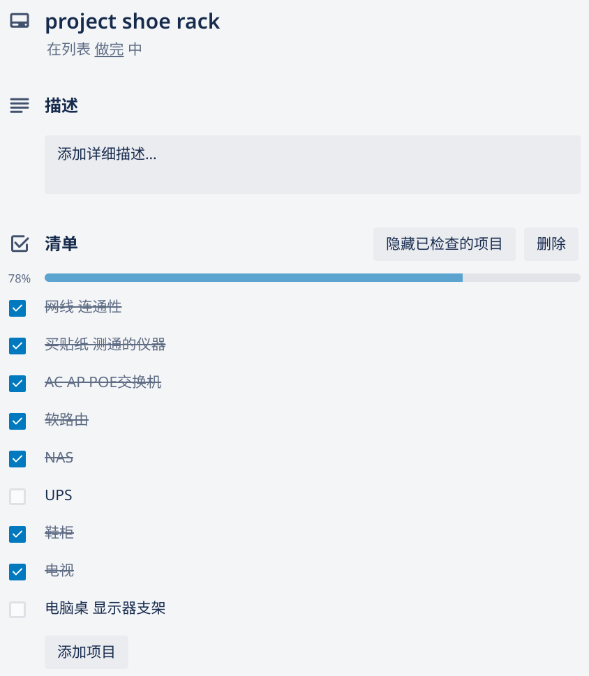

这里又是一份周报, 时间范围是`2022-05-18`到`2022-05-22`, 会记录一些工作及生活上有意思的事情.

## 工作/代码/计算机相关

### NAND2Tetris

本周没有进行 NAND2Tetris 的学习;

### FacileThings CLI 后续

亲爱的 FacileThings CEO 给俺提供了 API 接口, 估计下周可以动工了!

### 使用开源项目组合一个 ChAP Alternative

混沌工程里的老大哥 Netflix 内部有一个项目叫做 ChAP(Chaos Automation Platform), 它可以自动地进行混沌实验, 合理地控制使范围, 自动稳态分析, 最后通知相关人员试验结果.

它是一个庞大的系统, 对于某个企业或者某个组织的服务来说, ChAP 至少能够和 CD , API Gateway/Service Mesh, Observability, ChatOps 组件进行集成, 才能够打到这样的效果.

我们之前也在想, 有没有可能能够使用现有的主流开源组件, 组合一个 ChAP 出来呢? 值得一试!

> 如果 PoC 成功, 这可能是我们组 KUBECON NA 2022 的演讲~

> 另外 KUBECON NA 2022 CFP 截止日期延期到下下周一了~ 好耶! refer: https://twitter.com/lizrice/status/1528310359391608834

### 线上参与 KUBECON EU 2022

🎉 这周 KUBECON EU 2022 召开了!

这次 Chaos Mesh Office Hour 人气没有上次高了, 峰值约有 30 人. 果然线上还是不如线下有激情呀.

这次的 talk 俺感兴趣的也非常多, 俺在开始前做好了记录, 有些时间太晚的或者冲突的就没看直播, 后面再开始慢慢看这些俺感兴趣的 talk;

目前俺感兴趣的演讲中, 已经看了的有:

- Lightning Talk: Locating and Debugging Failures with Linkerd and Telepresence - Alejandro Pedraza, Buoyant & Edidiong Asikpo, Ambassador Labs
- Lightning Talk: Beginner to Maintainer Journey of a Student - Debabrata Panigrahi, National Institute of Technology Rourkela
- Kubernetes is Your Platform: Design Patterns For Extensible Controllers - Rafael Fernández López, SUSE & Fabrizio Pandini, VMware
- The Risks of Single Maintainer Dependencies - John McBride, VMware
- Prow! Leveraging Developer-Centric CI for Your OSS Project! - Nabarun Pal, VMware & Arsh Sharma, Okteto
- OSS Docs and How to Scale Them: Common Themes From the CNCF Ecosystem - Celeste Horgan, CNCF
- Unraveling the Magic Behind Buildpacks - Sambhav Kothari, Bloomberg & Natalie Arellano, VMware
- Cloud Native Chaos Engineering with LitmusChaos - Karthik S, Umasankar Mukkara & Udit Gaurav, ChaosNative; Saiyam Pathak, Civo
- Full Mesh Encryption in Kubernetes with WireGuard and Calico - Peter Kelly, Tigera
- Make Cloud Native Chaos Engineering Easier - Deep Dive into Chaos Mesh - Cwen Yin, PingCAP

还未看的有:

- Effective Disaster Recovery: The Day We Deleted Production - Rick Spencer & Wojciech Kocjan, InfluxData
- Been There, Done That: Tales of Burnout from the Open Source World - Savitha Raghunathan, RedHat & Divya Mohan, SUSE
- Good Governance Practices for CNCF Projects - Dawn Foster, VMware
- Open Policy Agent (OPA) Intro & Deep Dive - Anders Eknert, Styra & Will Beason, Google
- Case Study: Bringing Chaos Engineering to the Cloud Native Developers - Uma Mukkara, ChaosNative & Ramiro Berrelleza, Okteto
- CNCF 101 - Kristi Tan, The Linux Foundation & Charley Mann, Cloud Native Computing Foundation
- Operating Prometheus in a Serverless World - Colin Douch, Cloudflare
- Sharing Knowledge: Writing Good Docs for Quick Approval - Jared Bhatti, Waymo
- What If... Kube-Apiserver Could be Extended Via WebAssembly? - Flavio Castelli, SUSE
- Better Reliability Through Observability and Experimentation - Julie Gunderson, Gremlin & Kerim Satirli, HashiCorp
- Kubernetes Persistent Data Challenges – AZ, Region and Multi-Cloud Patterns - Chris Milsted, Ondat & Patrick McFadin, DataStax
- You're a Community Manager? But What Do You REALLY Do?! - Nanci Lancaster, VMware & Karen Chu, Microsoft
- Cloud Native Mentorship: Tips for Being a Great Mentor to CNCF Students - Lucas Servén Marín, Private
- Implementing Anti-patterns: Kubernetes Cross-namespace Resource Ownership - Tom Coufal, Red Hat
- "My CNI Plugin Did… What?!": Debugging CNI with Style and Aplomb - Douglas Smith & Daniel Mellado Area, Red Hat
- From Monitoring to Observability: Left Shift your SLOs with Chaos - Michael Friedrich, GitLab
- Making Sense of Chaos: Implementing Chaos Engineering in a Fintech Company - Iqbal Farabi & Giovanni Sakti, GoTo Financial
- Metrics as a First-Class Citizen in the E2E Testing Landscape - Matej Gera & Jéssica Lins, Red Hat

作为一个朴素的开发者/软件工程师, 可以在开源社区建设以及文档建设的演讲中获取非常多的经验和知识. 俺希望能够把这些东西良好地运用起来~

如果下周个人时间较为充裕的话, 俺会为它们写观后感! 🤩🤩🤩

## 生活相关

### 食物商品的 bliss point

最近若干次看到了 Bliss point 这个概念, [Wiki](https://en.wikipedia.org/wiki/Bliss_point_(food)).

俺自己的理解, Bliss point 大概指一种配方, 使人对某种味道能够产生"恰到好处"的满足, 最大程度地激起人的正反馈.

对于食品商业公司来说, 找到 Bliss point 是研发新品以及改善现有产品的关键, 它使人产生对产品的好感和依赖.

对于消费者来说, 这使得购买产品后的感受更加深刻, 并且使人对产品的满意度更加明显.

但是对于肥胖的人(比如说我)来说, 这是一个致命的诱惑. 因为 Bliss point 被专业的人员刻意制造出来, 直接打到了人类生理上的敏感点上, 是我摄入更多本不应该摄入的营养.

俺在了解了这一点后, 对于食品的看法更加明确:

- 我喜欢吃某些食物(比如说零食), 是因为它们确实非常好吃, 而不是我贪吃; 我不应该因为喜欢吃零食而产生羞愧与罪恶感;
- 零食本身及其具有诱惑, 在充分了解这一点后, 拒绝不必要的零食将会更加理智和容易;

### 无人机有一个电机阻力稍大

周六飞无人机的时候, 明显听到噪音略大, 在 100m 的高度飞行时就能听到很明显的声音, 这在之前是没有的;

降落以后用手摆弄, 发现 3 号电机的阻力明显较大; 但是电机停机时桨叶停止的时间, 没有肉眼能区别的不同;

先这样飞吧, 出了问题再说;

### Project Shoe Rack v2

在大约两年前的上一次换租时, 俺仔细关注了新房子弱电的位置, 各个房间网线面板的分布以及网线的布局, 做了最初版的家庭 AC+AP 以及有线网络的架设;

在当时俺称它为 Project Shoe Rack:

它是 homelab 的基础; 再在后来添置了几台计算设备后, 成了我现在 homelab 的雏形.

上周换房后, 弱电在一个不会打扰人的位置, 而且附近的空间可以放得下一个 140cm, 26U 的机柜, 新空间大约乘 3. 因此我的 homelab 得以升级.

最近仍在添置设备中, 最近入手的设备有:

- 26U 机柜
- 10 分位 PDU
- 交换机 x2 (一台咸鱼 H3C PoE 交换机, 一台 TP-Link 家用交换机)
- 配线架 x2, 理线架 x2
- UPS (两年后终于把坑填上了)

中间有意思的插曲是 H3C 的交换机内的固件是坏的, 又重新刷了新固件才工作; 而且风扇也太吵了, 买了三个猫扇(还在路上).

等到新设备到了后, 可以开始着手玩玩网络摄像头和家庭监控了~ 激动得搓手手

### 一楼蚊虫好多

说点不开心的, 我们从 11 楼搬到了 1 楼, 蚊虫明显多了;

而且新房子是推窗而且没有纱窗, 这就比较痛苦了. 虽说睡觉时可以使用电蚊香驱蚊, 不会因为蚊子叫影响睡眠, 但是白天依旧会被叮. 尤其是叮到手指上, 又痛又痒.

下周的一个重要的事情就是把纱窗搞好. 🤪
