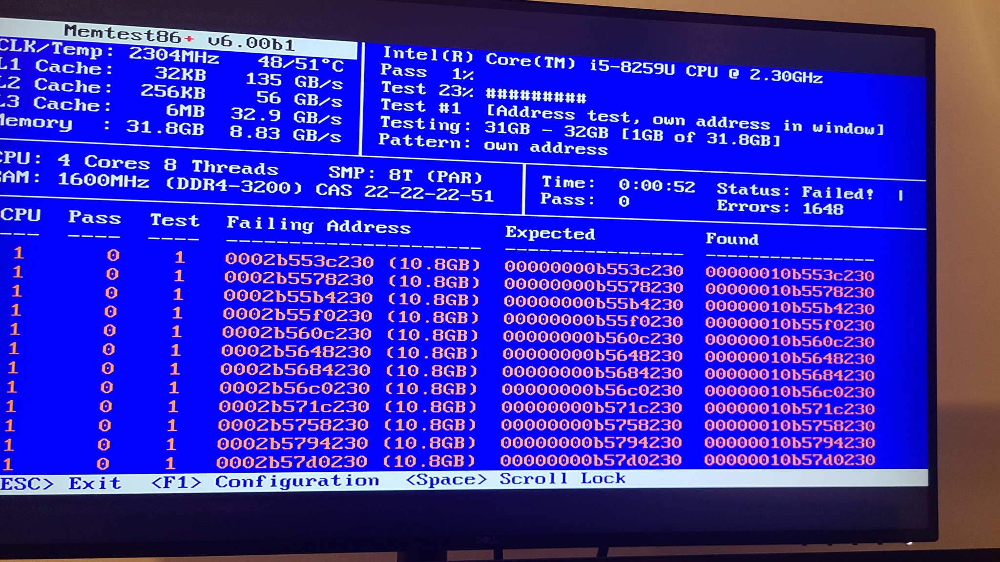
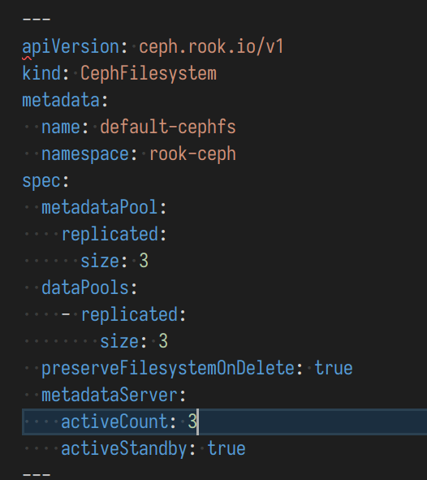

这里又是一份周报, 时间范围是`2022-05-23`到`2022-05-30`, 会记录一些工作及生活上有意思的事情.

## 工作/代码/计算机相关

### NAND2Tetris

本周没有进行 NAND2Tetris 的学习;

> 狂鸽

### 修复 Homelab Kubernetes 集群

这是这期周报鸽久的主要原因吧, homelab 的计算设备"上架"后, kubernetes 集群并没有恢复之前的工作.

在终于修复了问题并恢复了正常服务后, 俺开始整理这期的周报.

#### 硬件损坏: 内存条坏了一个

这是俺第一次遇到这种灵车硬件问题.

这个其实是很多问题的根本原因, 往上可以追溯到:

- https://twitter.com/strrlthedev/status/1454491934110613512
- https://twitter.com/strrlthedev/status/1468114058356281346
- https://twitter.com/strrlthedev/status/1531110913754812417

具体表现的话, 看这个图应该有一些 sense 了:

读写不一致, 某一个 bit 变了.

因为内存有问题... 所以所有的一切诡异现象都得到了合理地解释:

- Kernel Panic
- segfault/sgv
- etcd checksum mismatch
- ceph checksum mismatch
- etc.

目前的手段是把有问题的那条内存拆下来了, 并且缩了上面机器的内存配给, 目前运行平稳.

> 并且问了笔记本维修厮能修吗.

#### 与 etcd, CRI 和 Ceph 搏斗

之前内存的问题自然会带来很多烂摊子, 包括但不限于:

- etcd 启动不起来, 因为 etcd checksum mismatch
- ceph monitor (mon) 和 metadata server(mds) 启动不起来, 因为 .db 文件 rocksdb checksum mismatch
- ceph osd 启动不起来, 因为 sst rocksdb checksum mismatch
- /var/lib/kubelet/pods 下一堆 kubelet 删不掉, root 用户 `rm -rf` 也删不掉, 提示 `Resource Busy` 的资源. (感觉和挂载的卷有关)

俺依次简单提几嘴怎么修:

etcd 启动不起来, etcd checksum mismatch. 俺目前是 3 节点集群, 所以把有问题的那个节点的 members 文件夹直接删掉重启, 就可以解决了. etcd 会自动从别的节点那里把数据同步回来.

> 如果是单节点的话, 俺之前的做法是把有问题的文件删掉, 然后通过 etcdutl 和 etcdctl 重新走一遍备份恢复的流程解决

ceph monitor (mon) 和 metadata server(mds) 启动不起来, 因为 .db 文件 rocksdb checksum mismatch. 俺用的 rook-ceph, 找到 /var/lib/rook 下对应的文件删之即可.

ceph osd 启动不起来, 因为 sst rocksdb checksum mismatch. 这个看上去比较棘手, 因为 osd 是直接用了一个 device mapper 的设备, 没有文件系统. 因为俺的数据都做了 3 副本, 所以铲掉两个 OSD 完全没啥问题. 我就重建了. 重建过程可以参考俺的 [rook ceph cheatsheet](https://whatiknown.strrl.dev/#/page/rook%20ceph%20cheatsheet).

/var/lib/kubelet/pods 下一堆 kubelet 删不掉. disable 掉 kubelet, 重启 node, 然后删掉. 🙈 我太坏了.

最后再次感谢一下 3 副本的 cephfs 给我的数据带来保障. ❤️

### 跨平台的 RSS 阅读器: Fluent Reader

之前在 MacOS 平台上一直使用 Reeder 作为 RSS 阅读器, 更换到 Linux 平台后使用 Feedly. 但是 Feedly 的免费账户有限制:

- 最多 500 个源(俺达不到)
- 最多 3 个分类(俺达到了!)

因此我也在慢慢地注意合适的替代品, 最终在 thunderbird 和 Fluent Reader 中选择了后者.

Fluent Reader 是使用 flutter 编写的开源跨平台 RSS 阅读器, 仓库在: https://github.com/yang991178/fluent-reader

目前使用体验十分舒畅!

### 交换机改散热大失败

接[上文](https://strrl.dev/post/weekly-report/2022/20-%E5%96%9C%E8%BF%8Ekubecon/#project-shoe-rack-v2), 我从咸鱼买了一个二手 H3C 24 口 POE 交换机.

到手后发现其自带了 3 个 8000 转的风扇, 噪音太大, 想接猫扇进行缓解.

于是乎京东下单三个猫扇, 改装时发现主板上是 3pin 接口, 又尝试接线.

结果线接好后, PoE 模组依旧提示散热风扇状态是 Fault, PoE 不供电.

refer: https://twitter.com/strrlthedev/status/1529831160691318785

随后去淘宝下单散热风扇的兄弟低速静音款(6000 转), 效果也不好, 依旧很大.

现在的方向是主动在供电线上串一个电阻(做一条减速线), 进行二次的减速. 过两周再试试吧. 实在不行只能再出手了.

### 微软发布 Project Volterra

伴随着[炫酷地发布视频](https://www.youtube.com/watch?v=yICVNta8jMU), 微软发布了 Project Volterra.

这是一款面向开发者的 ARM 终端设备, 将使用高通的 SoC 作为处理器. 它的亮点是 "stackable", 我强烈怀疑能够通过某种虚拟机/超融合技术将多台设备的资源共享, 性能横向扩展.

但是按照微软的惯例, 新设备出现之前至少还得等个一年以上的时间. 所以目前性能最强的 ARM 计算设备依旧是 Apple M1 系列.

期望即将到来的 WWDC 能够发布一些新硬件吧, 俺也是时候买一波新 Mac 了.

### HZLUG H6 线下聚会

杭州疫情情况趋向于稳定, 于是在 2022-05-28 举行了一次线下聚会.

闲聊了三个小时~

refer: https://hzlug.org/0528-h6-photo/

## 生活相关

没有特别记录好玩的事情, 转几条推特吧:

- 野生大型纸箱: https://twitter.com/strrlthedev/status/1529399466431684611
- 女朋友的 iPhone 物理连点外挂: https://twitter.com/strrlthedev/status/1530528590617620484
- 商场里的暴利共享街机: https://twitter.com/strrlthedev/status/1530504582828552192

## 总结

这周疲于折腾, 没有记录更多好玩的事情. 惭愧.

最后祝大家儿童节快乐. 上海解封快乐.
