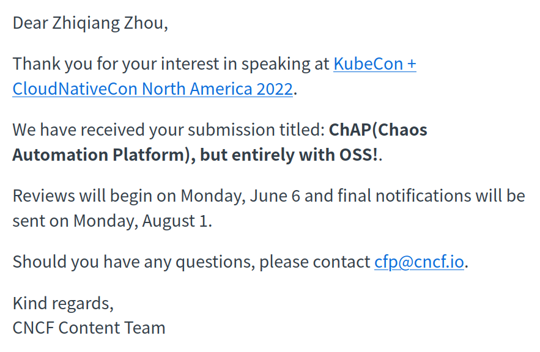
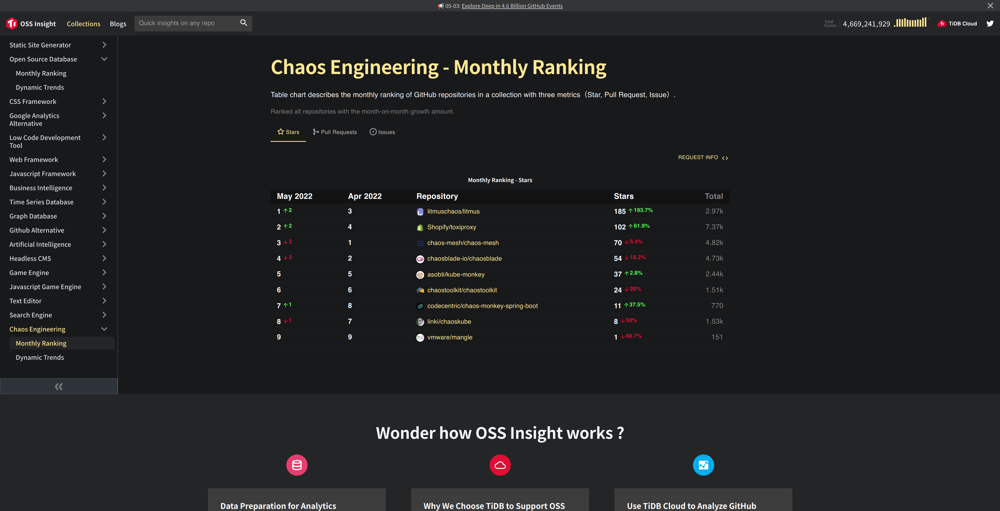
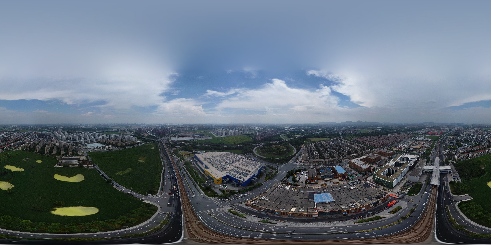

这里又是一份周报, 时间范围是`2022-05-31`到`2022-06-05`, 会记录一些工作及生活上有意思的事情.

## 工作/代码/计算机相关

### NAND2Tetris

本周没有进行 NAND2Tetris 的学习;

> 继续狂鸽

### 投稿 KUBECON NA

接[上文](https://strrl.dev/post/weekly-report/2022/20-%E5%96%9C%E8%BF%8Ekubecon/#%E4%BD%BF%E7%94%A8%E5%BC%80%E6%BA%90%E9%A1%B9%E7%9B%AE%E7%BB%84%E5%90%88%E4%B8%80%E4%B8%AA-chap-alternative), 俺试着投了一篇!

### Chaos Engineering Collection on ossinsight.io

这周四和贵司社区的同学们分享了 Chaos Mesh 项目的现状, 社区的老师们立刻提议在 OSSInsight 中加入 Chaos Engineering 这个集合. 两天后就加上了:

[Chaos Engineering - Monthly Ranking](https://ossinsight.io/collections/chaos-engineering)

> Litmus Chaos 在最近一段时间进行了较强力度的宣发, 增长势头很快! ❤️

## 生活相关

### 初步接入智能家居

之前一直想监控家里的用电情况, 后来发现小米的智能插座就可以简单的做到这一点.

于是购入了小米智能插座 x 5 和温湿度计 x 5.

使用以后还是发现了一些了不得的事情:

- 机柜的整体功耗保持在 180W 左右;
- 我的工作台功耗保持在 60W 左右;
- 下雨时室外湿度约在 96% - 98%, 室内在 80%-90%, 考虑买抽湿机了;

俺也跟风使用 Home Assistent 做了和 HomeKit 的关联, 能够用 Siri 做一些简单的事情了.

此外 Home Assistent 有 prometheus 的集成, 可以和俺现有的 Prometheus Stack 集成. 不过 Grafana Dashboards 里貌似没有对应 prometheus 的数据源, 需要自己撸一个.

### 逛宜家

> 貌似俺还不知道有什么工具可以方便的分享全景图.

## 其它

端午快乐! 儿童节快乐!
