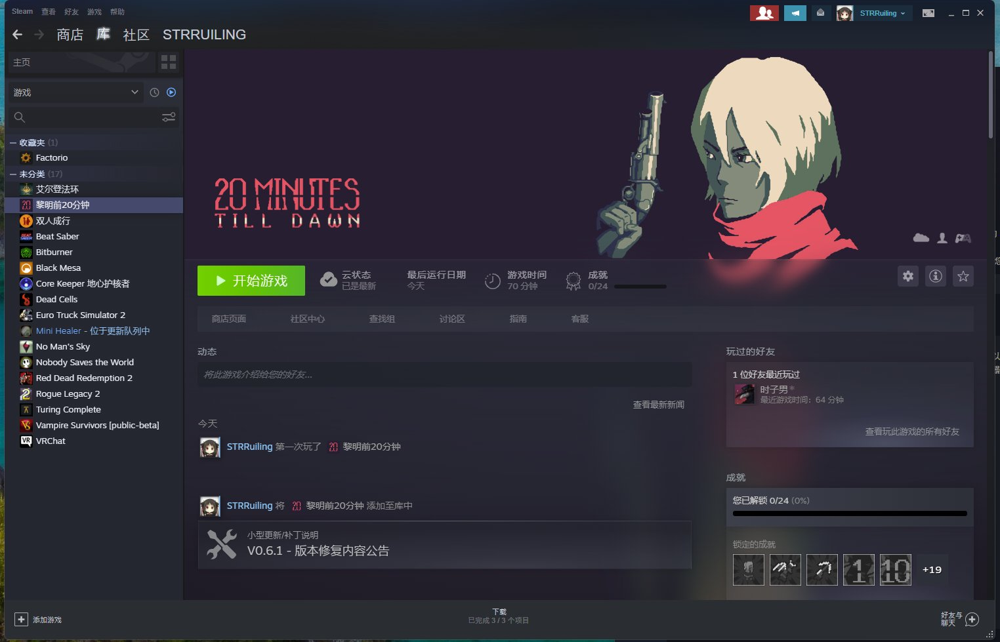
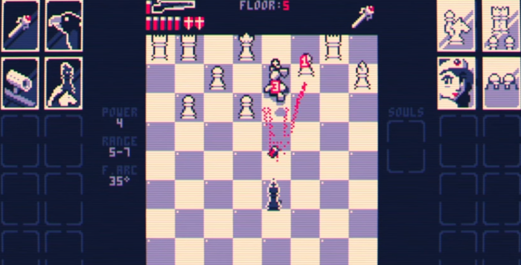

这里又是一份周报, 时间范围是`2022-06-06`到`2022-06-12`, 会记录一些工作及生活上有意思的事情.

## 工作/代码/计算机相关

### NAND2Tetris

本周没有进行 NAND2Tetris 的学习;

> 继续狂鸽

### 在 M2 发布后买了 M1 MacBook Air

2022 年 6 月 7 日, 苹果在 WWDC 2022 上发布了搭载 M2 芯片的新设备. 最开始我对新一代 MacBook Air 的期待是"粉色 + 32G 内存". 结果大失所望, 都没有.

迫于手上的 18 年 mbp 急需更换, 我选择购买了 2020 年的 M1 MacBook Air.

预计下下周到手. :)

> 当年 2w5 买的 mbp, 现在折价只能折 5000 不到. 用了差不多四年, 平均每天 18 块.

### 脆弱的开源社区

起源于这篇 twitter: https://twitter.com/strrlthedev/status/1534824698365612033

后来联系到了一位 dalao, 聊了聊 Chaos Mesh 社区的问题.

目前 Chaos Mesh 实质上仍是 PingCAP 主导的项目, 项目的绝大部分活跃开发者都是 PingCAP 的雇员.

目标, 决策, 参与都不透明. 社区贡献很难参与, 只能做一些简单的事情.

一旦活跃成员不再活跃, 这个项目也就凉了.

## 生活相关

### 推荐游戏: 无人深空 VR 模式

很早之前就注意了无人深空是有 VR 模式的, 直到最近才去尝试.

坐在椅子上使用原地模式游玩还是非常有趣的, 手动驾驶飞船和机架的感觉非常棒.

满足了小时候的梦想.

refer: https://twitter.com/strrlthedev/status/1534930351214063616

### 推荐游戏: 黎明前 20 分钟

逛 Steam 队列时发现了这款游戏, 因为只需要 18 港币, 所以干脆直接买了下来.

这款游戏和 vampire survivor 非常类似, 不知道谁借鉴了谁.

今天一天玩了 8 个小时.

> 喷子配闪电太猛了.

### 比较有意思的游戏: Shotgun King: The Final Checkmate

这是个佷搞的游戏, 讲的是黑棋国王昏庸残暴, 导致所有的其他臣民都去了白棋那里.

黑棋国王只剩下了一把王室霰弹枪, 然后向白棋发起了战争.

总体来说就是玩家扮演黑棋国王, 拥有一把(射程 5, 威力 3, 弹药 6 的)霰弹枪. 每个回合内可以移动一次并开枪一次. 白方就是正常的棋子, 会用正常的国际象棋规则进行移动和吃子. 

把对方的王干碎游戏就胜利了.

> 我太菜了, demo 版第一关都打不过去, 所以没有买.

## 其他

最近发生了一些事情, 工作上没有以前那么快乐了.

为公司打工, 做了再多成果, 项目效果再出众, 绩效再好也是别人赋予的价值.

多投资自己吧, 希望自己能认可自己.
