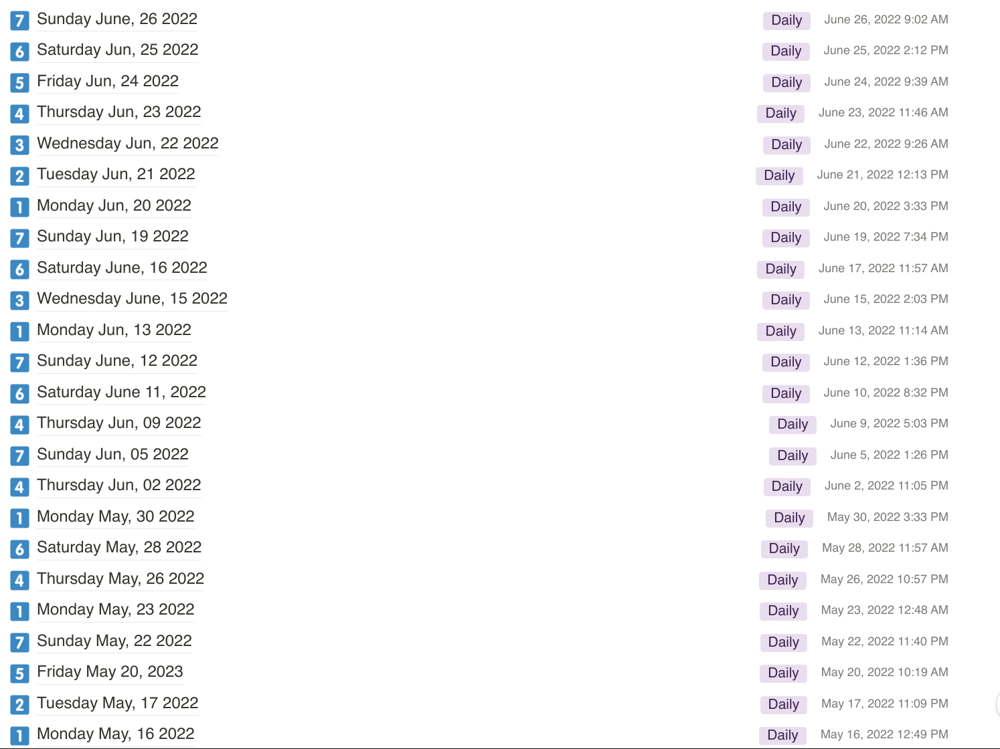

这里又是一份周报, 时间范围是`2022-06-20`到`2022-06-26`, 会记录一些工作及生活上有意思的事情.

## 工作/代码/计算机相关

### NAND2Tetris

这周听完了 Nand2Tetris Part 1 的最后一周的课, 课程内容是写一个 assembler. 实验还没有开始做, 准备拿 go 去梭一把.

> 有趣的是视频课程是在跑步机上做有氧运动的时候看完的. 😜

### 忙故障演练

从上周周三开始, 公司内准备在 RDG 团队范围内进行实战演练. 而且这么大规模的故障演练只给了一周半的时间来准备, 实在是太急了.

Chaos Mesh 小组自然就作为提供故障注入的小组参与进来了.

我的角色不仅是 Chaos Mesh 的用户, 而且还要作为接口人, 整理所有的故障场景. 这使得我加入贵司以来再次回忆到当年作为 SRE 的恐惧. 漫天的会, 不停地找各种人, 不停地扯皮. 非常忙, 体验非常不好.

过去的 8 个工作日里, 开了 18 个会. 其中 4 个是周期性会议, 2 个是部门分享, 其余都是沟通, 沟通, 沟通. 体会到了上面给压力, 下面也给压力, 手上也没有什么权利, 作为一个接口人夹在中间无依无靠还要硬着肉皮搬砖的感受.

经过这次的经历, 意识到了目前内一些能力与角色的缺失, 而且这个问题短时间内恐怕无法改变. 另外整个团队这么多人, 也没有调一个 PM 来主导这件事, 整个事情的组织实在是差劲.

希望未来故障演练由我们团队来主导, 而不是由其他团队来主导.

准备演练以后请几天假报复性休息一下.

## 生活相关

### Notion 日记频率开始逐渐恢复

大家可能已经发现了, 自从第 19 周的周报开始一直到现在为止, 内容一直比较水.

其实是我一直用作为生活记录的 Notion Journal 的更新频率出现了问题:

可以看到过去有段时间, Notion Journal 的更新频率是每周只有 2 - 3 次. 有很多有意思的想法都遗失了.

最近一周算是恢复了, 庆祝庆祝. 🎉

### 开始去健身房健身了

经过缜密的思考后, 我去小区附近的健身房里办了季卡和私教, 准备开始健身和减肥了.

健身的目的很简单, 期望自己能在白天能够有足够的精力工作, 晚上有好的睡眠质量.

从周三当天晚上开始的, 每周 1234 锻炼, 567 休息.

我倒不期望有什么非常快速的转变, 期望一个季度后, 能够晚上有 2 小时的深度睡眠, 然后白天不需要咖啡就可以精神充沛就可以了. :D

### 细粒度地规划时间

最近在做规划时, 发现自己在安排行程时, 已经开始不由自觉的用 半个小时 作为最小粒度了.

这非常不好!

我期望自己对时间的安排在下一步至少做到 15 min 级别的粒度, 这样可以安排得更紧凑一些.
