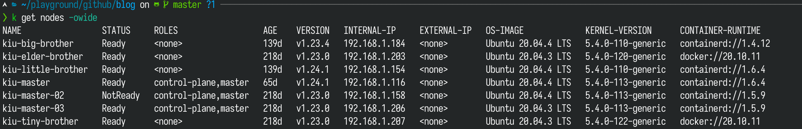
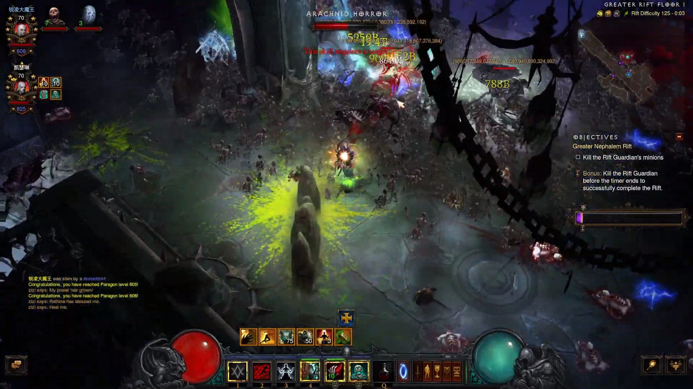
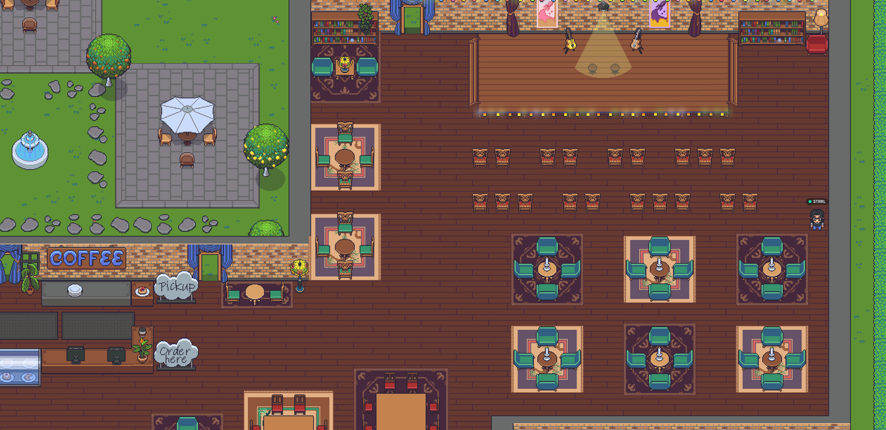

这里又是一份周报, 时间范围是`2022-07-12`到`2022-07-17`, 会记录一些工作及生活上有意思和没那么有意思的事情.

## 工作/代码/计算机相关

### Nand2Tetris

看完了 Compiler 部分的课程, 实验还没有开始做.

> 已经,积攒了两个 unit 的实验了喂! 得做实验啊!

### 有趣的笔记软件: dendron

Dendron: https://www.dendron.so/

我将使用 dendron 来替代 logseq 来构建我的 knowledge base.

早在前段时间, 由于 logseq 的官方 sync 迟迟不肯出来, [我准备使用 obsidian 来代替 logseq](https://strrl.dev/post/weekly-report/2022/10-%E6%98%A5%E5%A4%A9%E6%9D%A5%E4%BA%86/#%E6%8A%98%E8%85%BE-logseq-%E5%90%8C%E6%AD%A5). 而在使用 Notion 记录 Journal 后, 发现体验非常的好! 于是我也没有入 obsidian.

其实 logseq 的发布也是比较一言难尽, 它会将所有的资源打包成一个硕大的 json, 然后这一坨需要加载进去以后, 你的正文才会显示出来.

体验不好.

我在 happy xiao 的播客: [快乐三十分 074 为什么要学编程](https://happyxiao.com/happy30pod-074/) 这一期中得知了 Dendron 这个工具.

Dendron 是一个 VSCode 的插件, 同样拥有双向链接与 graph view (但是 publish 时没有 graph view)的功能. 而且它的目录结构以 `layer-1.layer-2.layer-3`这种形式来决定. 也就是说, 文件名中以 dot 的分割的不同部分就是目录结构.

另外 dendron-cli 中的 publish 命令, 可以将你的知识后花园非常方便的发布为一个基于 Next.js 的静态站点, 自带目录结构与搜索功能. 比如 [Dendron 的 Wiki](https://wiki.dendron.so/) 就是用 dendron 自己发布的.

> 不过这个工具处于早期嘛, 有 bug 是难免的事情. 比如说 [Dendron 的 Blog](https://blog.dendron.so/) 因为 Next.js 的某些问题(不知道是缺陷还是始终姿势不正确), 在浏览器中不能正常显示.

其实我本身比较喜欢 VSCode 编辑 RAW Markdown + 右侧 Preview 的形式来写东西, 不太喜欢 Notion/logseq 这种立即式的编辑方式. 认识 Dendron 以后, 觉得深陷其中无法自拔. 🤩

我决定在接下来的 2 - 3 周内慢慢将我的 kb 从 logseq 迁移到 dendron, 发布, 然后替换 https://whatiknown.strrl.dev.

### 更新 Homelab 硬件

最近杭州迎来了连续几天 40+ 摄氏度的炎热天气, 我的 homelab 散热自然开始慢慢顶不住了, 噪音开始从间歇性聒噪变为了持续性聒噪.

终于我在这周下架了一台主要的噪音源: 运行 Jellyfin 的索泰 zbox. 下架以后, 立刻清净了许多.

这个设备是我在咸鱼上 1500 淘的准系统, 把我大三时的主力笔记本的值钱元件都迁了上去:

- i7-7700K
- MXM 接口的 GTX 1070
- 2 x 16G 内存
- 若干 SSD 与 HDD

当时它的[散热模块就是被我爆改了](https://twitter.com/strrlthedev/status/1449825559471480836), 当时就感觉心虚的一批, 果然到了夏天开始, 散热出现了大问题.

这也是我 Homelab 中 唯一有独显, 方便做显卡直通的机器. 因此它的主要负载之一是作为 Jellyfin 的机器, 看流媒体时进行硬件解码.

另外它也是我的 homelab 中 Kubernetes Cluster 的 Control Plane 的节点之一, 所以下架以后我的 Kubernetes Cluster 一直是 2 master 节点跑着, 目前也没啥问题! 👍

后续我准备为 Homelab 新增两台机器,

- 一台 ATX 塔式的静音机箱, 弄点噪音小一些的水冷.
- 一台/若干 ARM 设备, 被动散热.

> 看了下 Turing Pi, 咸鱼上有卖, 价格 1400 左右. 但是 Pi Computing Module 是真的贵啊, 一块要 1000 左右.

### Controller Runtime 的 PR 终于有人看了

在较早之前, 为 Controller Runtime 提了一个修复 `logr.Logger.WithValue()` 方法时, 不能正确将 Kubernetes `runtime.Object` 使用 `kubeAwareEncoder` 进行解码的 PR:

- Issue: https://github.com/kubernetes-sigs/controller-runtime/issues/1290
- PR: https://github.com/kubernetes-sigs/controller-runtime/pull/1883

在两个月后终于有人 Review 了! (狗头)

希望它能顺利合进去.

### 寻找新的机会

正如大家所知的, 最近的就业形式不是很好. 但我也在尽自己的努力, 希望找到自己感兴趣和值得付出方向, 以及聊得来/合作愉快的新合作伙伴. 🥰

## 生活相关

### 暗黑 3 2.7.4 PTR 开服啦

> 太开心了! 这次终于吃上了热乎的 BUG!

暗黑 3 2.7.4 PTR 在这周四开服了! 这是暴雪被微软收购以后, 迎来的第一个赛季! 改动可谓是诚意满满!

关于更新的具体细节内容俺这里就不提了, 大家可以去哔哩哔哩搜索 "秋仲琉璃子不语" 这位 up, 或者通过官方帖子和凯恩之角的帖子来了解好玩的细节.

为什么要玩 PTR 呢?

首先, PTR 的游戏模式中有一个特殊的商人, 可以特殊商人处使用 50 血岩直接购买:

- 职业套装物品
- 传奇宝石
- 其他散件传奇物品: 主副手武器, 防具等
- 随从装备
- 大量五章材料, 黄蓝白材料, 硫磺
- 皇家宝石, 打孔器等等

也就是说, 一旦在 PTR 中开荒到了 70, 你将会立刻毕业. 而且转型的难度非常低.

> 对于我们(我和我女朋友)来说, 0 - 70 开荒反而是 D3 现在最有意思的环节, 是我们每个赛季必定参与的保留节目! 🤩

而且众所周知, 设计师会在每个赛季开始时, 设计许多有趣的新机制, 以及对旧的装备带来词缀的更新.

所以难免就会发生 OverPower 的情况出现:

- 增伤系数文字描述是加法, 代码实现是乘法(出现过 N 次了), 强度太高
- 被玩家开发出了出格的 Build, 强度太高
- 装备之间的联动出现预期外的情况, 强度太高

这次死灵法师就出现了第 3 种情况的 "BUG", 50 码内的敌人会不停地受到"亡者大军 - 异界大军"的效果, 而且配合某件装备(大军头)后, 伤害会发生质的变化!

> 这才叫真正的亡者大军嘛! 逛街躺过 150 大秘境.

俺终于有幸蹭上热乎的了! [录了视频进行留念!](https://youtu.be/L8HoiwKVvlQ?t=312)

不过这个 BUG 在第 2 天就被[热修复](https://us.forums.blizzard.com/en/d3/t/diablo-iii-ptr-274-714-hotfix-update/52951)了. 😭

> 活出 PTR. ❌  
> 活了 1 天. ✔️

当然这个赛季除了死灵法师之外, 其他的职业也都有不同程度的加强/整活:

- 猎魔人的集束箭变为激光!
- 猎魔人扫射时自动释放能量消耗技!(玩过风暴英雄的同学脑补维拉的 R1 会自动释放 W, 玩过英雄联盟的同学脑补萨米拉 R 自动释放寒冰 W.)
- 武僧的七相拳留下一个灵体持续释放七相拳!(这是替身攻击!)
- 法师的奥术飞弹将释放 20 个飞弹, 并自带自瞄符文!(真正的火多重!)
- ...

非常期待这一次的 PTR 了!

不过这次的赛季改动也让我十分的担心, 因为它和星际争霸 2 最后出现的合作模式威望系统太像了:

- 每个指挥官/职业都有 3 种不同的变体
- 不同的变体将会较大得改变打法
- 想要完全体验所有的变体, 需要特别耗肝

上次威望系统更新以后不久, 星际争霸 2 就宣布不会有新内容更新了, 只是平衡性调整. 估计暗黑 3 后面也是类似的: 有爱的游戏设计师/工程师, 在游戏生命周期的最后, 把自己的所有对这个游戏的想法与爱, 灌注到这个游戏中.

> JOJO, 这是我最后的波纹了, 收下吧!  

> 唉, 别又玩死一个游戏. 😭

### 与 Xuanwo 哥哥尝试在 Gather.town 上进行元宇宙 social

上次在[这个推文](https://twitter.com/strrlthedev/status/1546689590899093504)中, 英俊潇洒才华横溢的 [Xuanwo](https://twitter.com/OnlyXuanwo) 哥哥愿意分享一下他作为开源项目团队中 "工具人" 的角色, 进行上传下达(向上管理之类的?)的经历. 同时也有许多推友表示, 自己也比较感兴趣.

因此俺试着想了个办法, 在 gather.town 这个线上元宇宙 Workspace 中找了一个合适的场景, 来作为下次分享时的"场地".

> 俺和 Xuanwo gege 试着用了这个场景闲聊了一会, 感觉体验还不错!

估计到时候我们就在这个线上咖啡馆见面吧!

细节会在后续一段时间内告诉大家的, 请保持期待! 🥰

### 健身与做饭

参与健身后, 健身教练要求/建议自己做饭吃. 有一个明显的变化是, 记账变轻松了: 之前是每天若干顿外卖, 现在是一次超市购物, 能吃好几天. 而且现在我也很喜欢周末和女朋友一起去附近的商场, 先下馆子改善下伙食, 然后买一堆食物为接下来的几天作储备.

我们(主要是俺女朋友)也做了很多好吃的菜:

- 红烧排骨
- 香菜牛肉
- 酸辣土豆丝/白菜/豆芽
- 虾仁滑蛋
- 辣炒鸡胸肉
- ...

第一次感觉到生活可以这样美好!

> 补充一张照片

> 女朋友实在是太强了! 俺何德何能...
