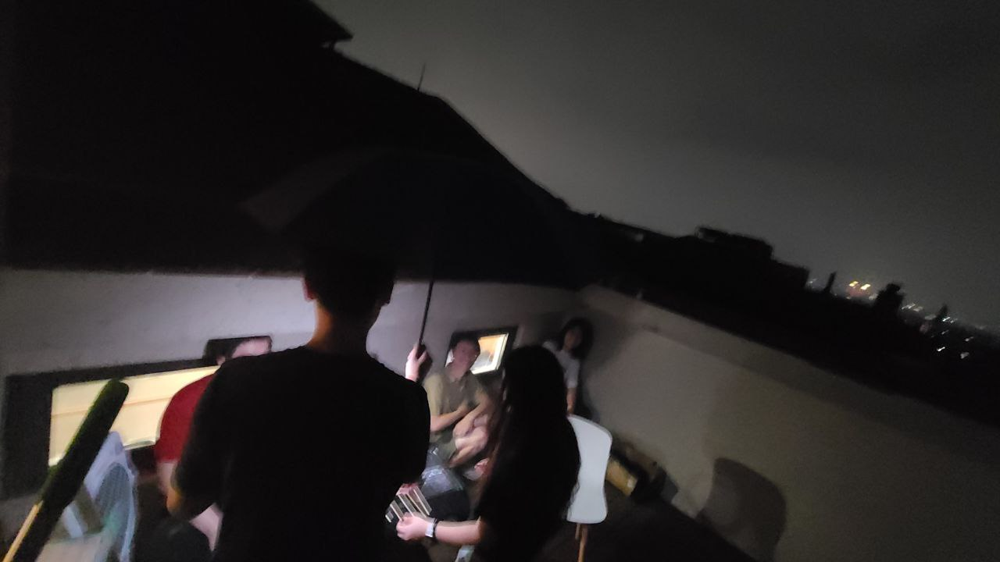

这里又是一份周报, 时间范围是`2022-07-18`到`2022-07-24`, 会记录一些工作及生活上有意思和没那么有意思的事情.

## 工作/代码/计算机相关

### Nand2Tetris

本周没有进行 Nand2Tetris 的学习. 🤣

> 这周跑步的时候把上段时间积攒的没听的播客听了一遍~

### Google UX

之前一段时间提到过, Google UX 课程中的很多方法论是可以应用到别的领域的.

最近一段时间正在准备进行一些客户访谈, 了解下社区用户对 Chaos Mesh 的使用现状以及预期.

### 好玩的点子: GitHub Profile Badges

之前俺在自己的 [GitHub Profile Page](https://github.com/STRRL) 里一直使用 [puf17640/git-badges](https://github.com/puf17640/git-badges) 这个项目中的 Visits Count Badges 这个功能.

而大约在几周前, 这个服务后面的托管服务器出现了问题, 导致这个 badges 不可用了.

而正好我最近对 Serverless 很感兴趣, 就尝试着使用 Cloudflare Workers + Cloudflare Workers KV 做了一个[类似的实现](https://github.com/STRRL/serverless-github-badges).

> 因为是 Serverless, 所以不需要运维! 也不怎么需要担心它出故障下线! 太爽了!

目前已经写~~抄~~完前者的功能了.

另外俺有个朋友也在做类似的事情: 把一些自己的状态, 同步展示到一个地方, 比如说: Steam 正在玩什么游戏, Spotify 正在听什么歌.

俺也有类似的想法, 想把自己的健康数据也同步上去: 昨天睡了多少觉, 过去若干小时心跳区间是多少, 走了多少步等等.

> 不知道有木有机会揉成一个东西.

### 博客从 GtiHub Pages + Cloudflare Proxy 迁移到 Cloudflare Pages

俺的博客域名是 [strrl.dev](https://strrl.dev) 嘛, 它其实是个 hugo 项目, 然后用了 GitHub Pages + Custom domain.

后来(忘记出于什么原因)为这个域名配置了 Cloudflare 的 Proxy.

最近遇到的问题是, strrl.dev 的解析就不再是 GitHub Pages 的 IP, 而是 Cloudflare 的 IP. 因此 GitHub Pages 的证书签不下来了.

之前的解决方式是, 先把 Cloudflare 的 Proxy 关掉, 等 Github Pages 证书更新以后, 再打开.

但是太折腾了, 每 3 个月就来这么一次也顶不住嘛.

> 而且这次在操作过程中, 明显影响到了使用体验. 有几个小伙伴私信俺说博客挂了.

于是俺干脆直接迁到 Cloudflare Pages 上了.

迁移过程非常顺滑, 在 Cloudflare Pages 上点击 Connect GitHub, 安装一个 GitHub App, 选择框架, 俺这里是 Hugo, 然后就完事了.

以后不用在来手动改解析惹! 开心!

### 尝试使用 Chrome OS Flex

偶然间看到了"可以使老设备重新焕发生机的 Chrome OS Flex" 发布了正式版!

对于我来说, Chrome OS Flex 最大的特点在于, 它可以真正的使用 Linux 和 创建 VM. 香香!

> 参考 [Differences between Chrome OS Flex and Chrome OS](https://support.google.com/chromeosflex/answer/11542901)

我把我的闲置 mbp 2018 拿出来准备试一试, 看看到底能不能"重新焕发生机".

> 有朋友要问了, 你的 mbp 不是拿去置换了嘛? 很惭愧... 没有, 本来是选了置换的. 结果下单后发现键盘布局选错了, 又重新下了一单, 第二单忘记选置换了. 结果就吃灰了.

跟着 [Chrome OS Flex installation guide](https://support.google.com/chromeosflex/answer/11552529) 走便可以安装 Chrome OS Flex 了.

引导以后, 发现 mbp 自带的触摸板和键盘木有反应, 于是拿 Hub 来接上了 USB 键鼠.

选择试用 Chrome OS Flex 后, 进行了一系列的正常的配置, 时区啊, 语言啊什么的. 然后到了配置 Google Assistant, 让我说 "OK, Google", 说了好几次都没有反应, 意识到麦克风应该没有适配. 于是选择了跳过.

然后配置网络, wifi 是用不了的.. 我接了根网线到 Hub 上, 继续配置.

配置好 Google 帐号后, 进入了桌面环境.

然后不知道从哪里把我的 Chrome Tab 同步过来了, 打开了一堆网页. 其中有一个是 Youtube 视频, 播放时倒是不卡, 但是木有声音. 🥲

最后想尝试一下 Linux development environment, 结果告诉俺需要 3GB 以上空间才能安装, Live USB 模式下装不上.

好, 那我装!

重启电脑这次不选择试用而是直接点了安装, 结果告诉我安装失败.

(而且错误日志是 js... 我看不懂了..)

于是乎果断放弃, 选择再等等.

> 咱也看不懂 Apple 产品的型号, 应该确实没有在 Chrome OS Flex [Certified models list](https://support.google.com/chromeosflex/answer/11513094) 里. 再等等吧.

## 生活相关

### 和朋友们烤肉!

和朋友们住的挺近的, 于是乎我们进行了一次聚众烤肉!

从六点多烤到九点, 而且中途还在下了几阵子雨, 我们打着伞烤. 🤣

可以说是非常的开心了!

挑一张~~拍太糊~~不会暴露隐私的图片放上来:

### 好玩的游戏: Nova Drift

这是一款 rogue-lite 的飞行射击游戏!

### 最近精神状态不是很好

最近在尝试 23:00 - 7:00 的睡觉时间, 但是总是变成 23:00 躺到床上, 然后入睡还要一段时间.

所以精神状态不太好, 到下午就哈欠连天, 女朋友也反映我下午晚上最常说的话就是 "困死了困死了, 不行了不行了".

甚至有一次去做力量训练, 中途被教练叫停了, 说看我面色不好, 算了让我回去休息, 而且叮嘱我如果前一天没睡好就不要来做力量训练了.

后面睡觉还是要再早点上床躺着, 才能把睡眠时间拉够一些.

### 俺的博客上线了友链

诶嘿! 俺终于把[友链](https://strrl.dev/links/)加上了!

想加友链直接评论, 或者在其他任意渠道私信俺都可以~

只不过现在样式有些土, 大家如果有什么花里胡哨的样式可以尽情推荐给俺!
