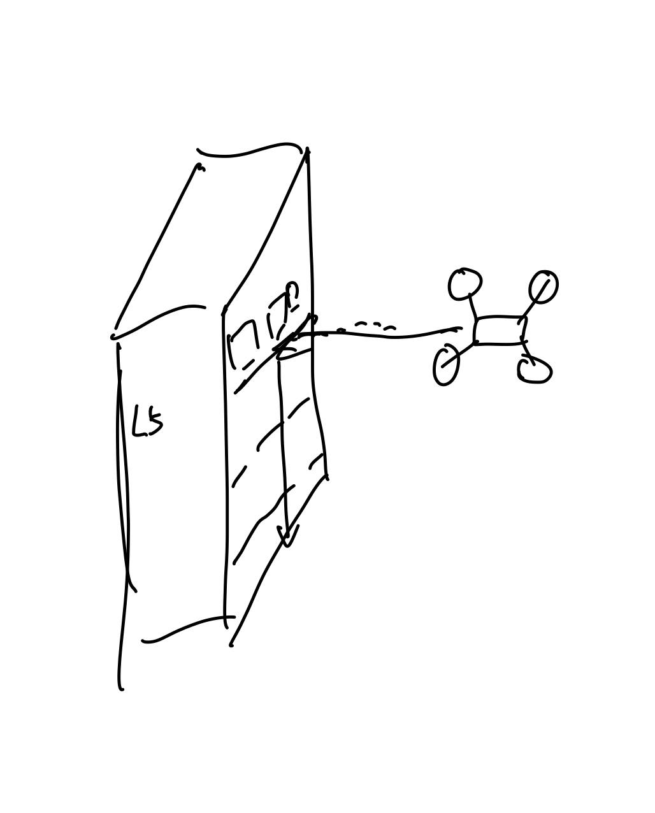
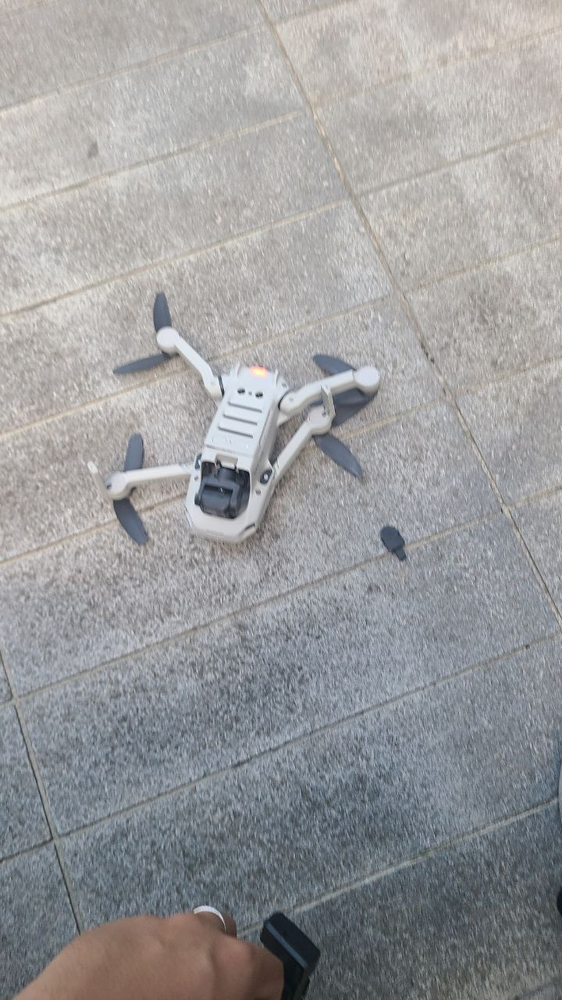
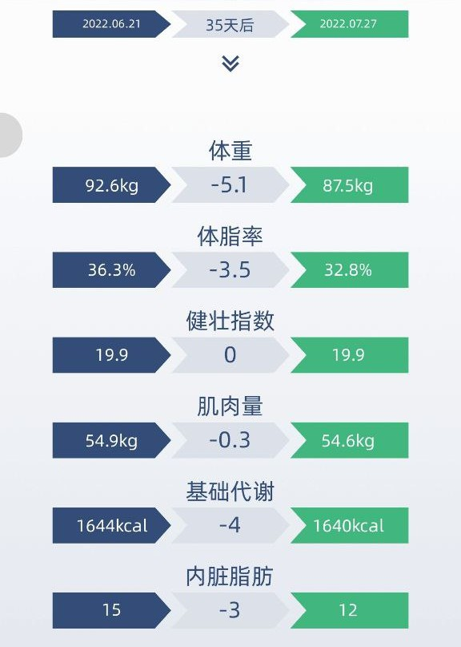

这里又是一份周报, 时间范围是`2022-07-25`到`2022-08-01`, 会记录一些工作及生活上有意思和没那么有意思的事情.

## 工作/代码/计算机相关

### Nand2Tetris

本周又没有进行 Nand2Tetris 的学习.

### Google UX

最近依旧是着重学习方法论相关的东西.

看了太多资料和视频发现记不太住, 需要用的时候还是需要再回顾一下. 需要好好的理一下笔记了.

### 有趣的项目: Kubebrain

Kubernetes 堪称是云时代的 OS 了, 众多的应用运行在 Kubernetes 上, 大家即使不是运维相关领域的同学, 也大概听过这个项目的大名.

然而这个项目有一个比较重的问题, 它目前强依赖了 [etcd](https://github.com/etcd-io/etcd). 而 etcd 的维护状态也[不是很乐观](https://groups.google.com/a/kubernetes.io/g/steering/c/e-O-tVSCJOk).

社区中有项目做出过尝试, 比如说:

- Consul 的方案: <https://github.com/kubernetes/kubernetes/pull/31622>
- DynamoDB 的方案: <https://github.com/kubernetes/kubernetes/issues/53162>
- CRDB 的方案: <https://docs.google.com/document/d/1ziZ7Tye7xYeZ1v7_RH181vmA5EWaAOZtK7shtpQCER4/edit#heading=h.gf21pnrv3do1>
- 一些其他相关的讨论: <https://groups.google.com/g/kubernetes-sig-api-machinery/c/-FhpiVTX7YE/m/FhjwUeaXFQAJ>

总之目前的状态是, kubernetes 还无法原生使用除 etcd 之外的组件管理状态.

> TiKV 作为 CNCF 毕业级别项目, 如果能作为 etcd alternative 支持 Kubernetes, 听上去"名正言顺".

不过看上去数据库的开发者和 Kubernetes 的开发者明显不是同一波人, 这个事情始终没有没有人来正儿八经做.

直到 [kubewharf/kubebrain](https://github.com/kubewharf/kubebrain) 的出现!

> 其实去年在杭州某场线下的分享里, 字节的同学已经提及过 [kubewharf/kubegateway](https://github.com/kubewharf/kubegateway) 还有其他相关的项目了.

Kubebrain 目前支持将 TiKV 作为存储后端, 并且在没有调优的情况下, 吞吐量能够达到 etcd 的 2 - 2.5 倍. 可喜可贺!

> Reference: <https://github.com/kubewharf/kubebrain/blob/main/docs/benchmark.md>

目前俺对这个项目兴趣挺大的, 在 issue 中提了些问题, 也顺便蹭了两个 PR:

> 毕竟上次 Hackathon 想做没做出来...

- [chore: remove the dependency with k8s.io/kubernetes](https://github.com/kubewharf/kubebrain/pull/5)
- [fix: the link for performance result screenshots](https://github.com/kubewharf/kubebrain/pull/7)
- [Question: A little confusion about the stateless, availability and scalability.](https://github.com/kubewharf/kubebrain/issues/8)
- [Question: more other backends support, and native watch support](https://github.com/kubewharf/kubebrain/issues/11)

### Chaos Mesh 发布了 2.3.0

总之是发布了!

<https://github.com/chaos-mesh/chaos-mesh/releases/tag/v2.3.0>

自 Release Cycle 定下以来第一次还算是按时的发布.

期待 2 个月后的 2.4.0!

### 云时代的开发者效率服务

最近有越来越多的人知道俺在看机会了, 也有越来越多的人咨询我对 "XXXX" 是否感兴趣.

还真别说, 我还真发现了一个挺有意思的领域: 云时代的开发者效率服务.

联系俺的是一位字节跳动的大佬, 向俺解释了他们目前阶段做的事情和未来要做的事情:

- 目前做的是 Cloud IDE 相关的事, 效果比较不错;
- 未来会考虑在云的架构下, 作为公司雇员, 如何最大化开发的效率. 做的方便包括但不限于: 开发工具, CI/CD 服务, 服务架构设计, 业务/服务框架, 语言等

提到了一些类似的服务/工具:

- https://tilt.dev/
- https://nocalhost.dev/
- https://heighliner.dev/
- https://www.pulumi.com/product/

最后想了想还是婉拒了. 虽然字节很大, 如果能做出好的工具而且能够在公司内推行, 效率的提升一定是显著的. 但是我还是不喜欢将自己做的事情和一个公司紧紧绑在一起, 我一旦离开这家公司, 那我做的事情就也跟着无了.

## 生活相关

### 和 Xuanwo 哥哥还有推友们线上聊天

前文: https://strrl.dev/post/weekly-report/2022/28-%E7%83%AD%E4%B9%8E%E7%9A%84%E6%9A%97%E9%BB%913ptr/#%E4%B8%8E-xuanwo-%E5%93%A5%E5%93%A5%E5%B0%9D%E8%AF%95%E5%9C%A8-gathertown-%E4%B8%8A%E8%BF%9B%E8%A1%8C%E5%85%83%E5%AE%87%E5%AE%99-social

Ref: https://twitter.com/strrlthedev/status/1553657804329607169

成功地在 gather.town 上进行了一波元宇宙 social! 不过免费版确实在串流的音质和时延上做的不太好, 中间大家发现了延迟高, 容易掉线等情况.

聊了一些商业公司中的开源项目, 个人职业发展相关的一些话题!

我对 "不要把个人的人生目标和商业公司绑定"这个事情有了更深一步的认识. 作为打工人, 工作中尽职尽责, 公司与个人各取所需, 向着自己的理想努力迈进才是正确的方向.

这次活动人数最多时有同时 12 人在线, 抓拍了一张照片:

### 散步路上, 看到了一些儿童用袋子捉知了, san 掉没了

周六本来开开心心去西溪那边散步, 然后遇到了让我 san 值清零的事情:

有一些孩子们用网袋抓了好多知了, 知了还在袋子里叫得非常大声..

差不多是这个效果:

SAN 瞬间清零了. 😇

### 航拍, 炸机及维修置换

周五想着去公司的机会应该不会太多了, 想着去飞飞无人机, 拍一拍附近的写字楼和风景.

当然也确实拍了一些写字楼和黄龙体育场的照片:

但是在回家下降过程中炸机了.

> 终于迎来了首炸.

撞上了 G 幢的写字楼然一直贴墙滑/摔了下来. 差不多是这个样子:

> 好像是支付宝的办公区, 不知道有没有人受到惊吓.

然后就坏了!

> 分享了这件事情以后, 也有盆友门分享了他们的炸机照, 有晚上炸鸡的, 还有掉水里的...

因为买了 DJI Care, 所以维修/置换还是挺方便的, 周五预约了周日来取件, 取件的同时也发出了新件. 周一就收到了新机器! 好耶!

Ref: https://twitter.com/strrlthedev/status/1553911614952181762?s=20&t=qlVLvSoReshDripzFOQlcA

### 健身 / 减肥一个月左右的效果

效果还是比较明显的! :)

### 我想玩打拳僧哇哇哇

现在的时间是 22:30, 估计今天又是没有时间玩暗黑三测试服了.

武僧在这个赛季有一项有趣的天使坩埚特效: 百烈拳只会触发第二段. 而这正是一段攻击频率特别高的特效.

在翔龙的 100% 额外攻速的加持下, 理论上能够到很高的攻速.

> 暗黑 3 攻速还要算档位, 目前还没算过. 总之就是很快.

> 疾风骤雨!!!

另外高攻速就有可能能带重击宝石(银河织星者之泪)来冲层!

> 怀念圣套死灵逛街流了.

这周四 PTR 就要关服了, 一定得抽时间去试一试!
