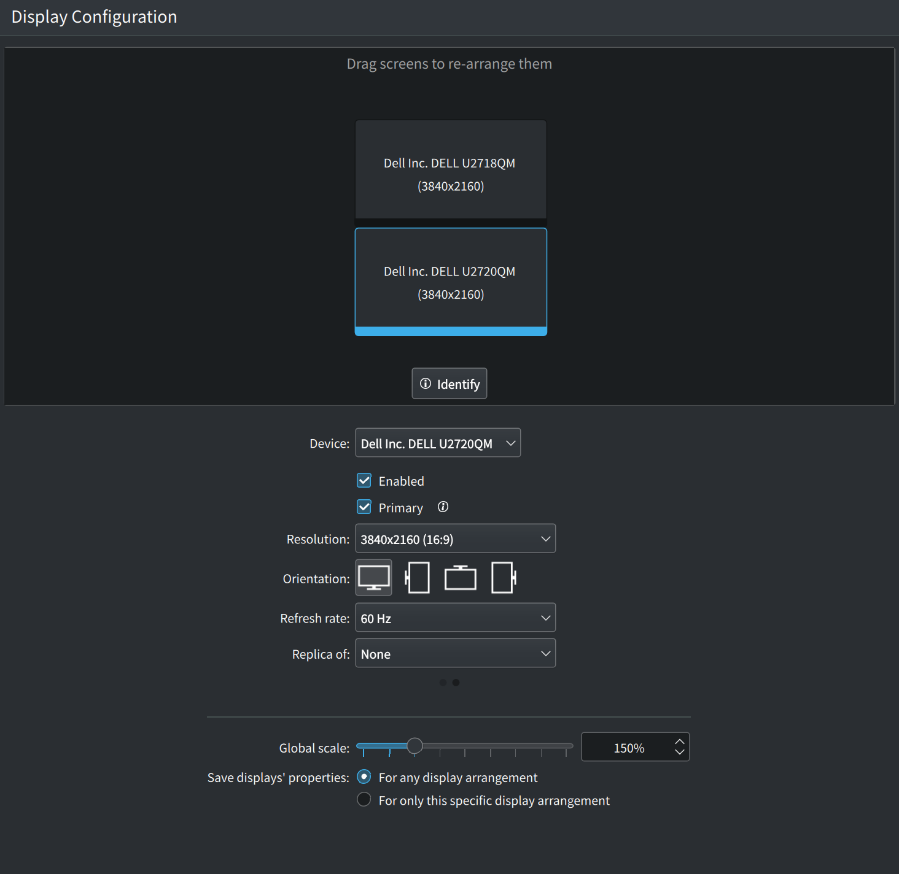
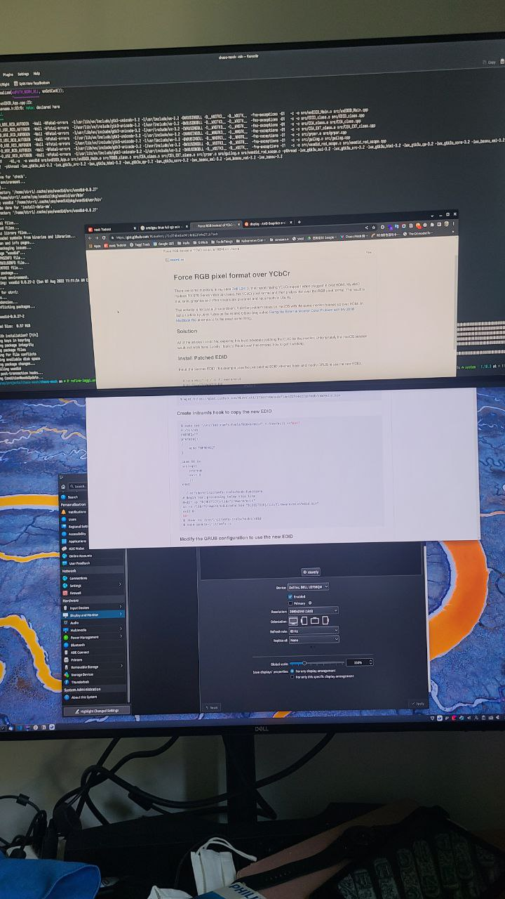
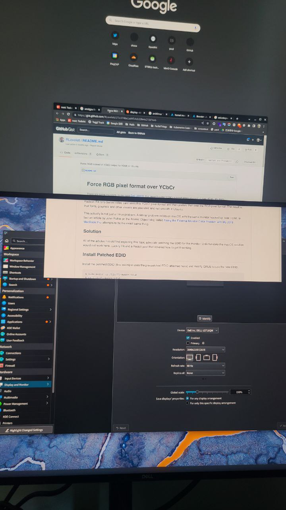
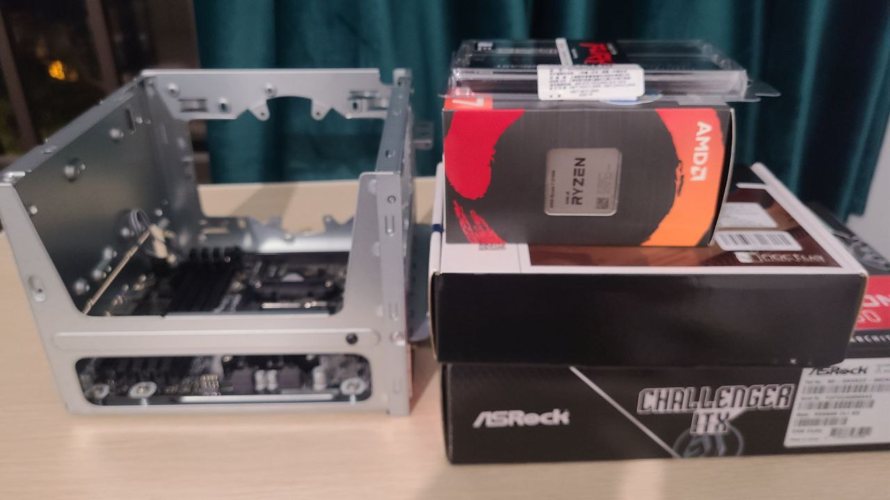

这里又是一份周报, 时间范围是`2022-08-02`到`2022-08-07`, 会记录一些工作及生活上有意思和没那么有意思的事情.

## 工作/代码/计算机相关

### Nand2Tetris

本周没有进行 Nand2Tetris 的学习.

### Google UX

本周没有进行 Google UX 的学习.

### whatiknown.strrl.dev 从 logseq 迁移到 dendron

前文:

- <https://strrl.dev/post/weekly-report/2022/28-热乎的暗黑3ptr/#有趣的笔记软件-dendron>
- <https://strrl.dev/post/weekly-report/2022/29-困困困/#博客从-gtihub-pages--cloudflare-proxy-迁移到-cloudflare-pages>

相对于 dendron, typora 这种所见即所得的 Markdown 编辑器, 我更喜欢编辑 "Raw Markdown" + 预览的方式进行记录.

> 但是折腾的时候也注意到了, dendron 真的还在比较早期. 生成的 static 站优化也不是很好, lighthouse performance 分数比较低. 而且文档说得其实也云里雾里的.

Cloudflare Pages 自带 CI/CD, 只需要配置下:

- 命令 `npm install @dendronhq/dendron-cli@latest && npx dendron publish export`
- 输出目录 `.next/out`

就配置好了!

> 不需要写 GitHub Action Workflow YAML, 好耶!

目前这个站 <https://whatiknown.strrl.dev> 也还在迁移中, 后续内容会再慢慢搬运(并重新排版)上去的.

### 叠! 巨大喷流! 单线多拨叠上行

之前和同事传大文件, 再次被家里的 30Mbps 上传恶心到了.

上网搜了下, 貌似电信曾经有一个 50 元每月的上行提速包可以提到 200Mbps, 但是现在也办理不了了.

而且电话咨询了 10000, 目前也没有其他方式可以提高上行.

那就只能试着单线多拨了.

单线多拨的原理比较简单:

- 光猫改桥接
- 路由器使用 macvlan 将一个 wan 虚拟成多个 wan
- 使用 mwan3 做 load balancing

> 学好计网是真的有用啊, 在此之前 macvlan 只在学校机房(做虚拟机)和上家公司 IDC 机房(docker network)里见过.  

简单介绍下 mwan3, 其实就是一堆 iptables mangle 表的规则 + ip routing table policy + 多张路由表:

```text
Chain mwan3_policy_load_balance (1 references)
target     prot opt source               destination         
MARK       all  --  0.0.0.0/0            0.0.0.0/0            mark match 0x0/0x3f00 statistic mode random probability 0.25000000000 /* pppoe4 1 4 */ MARK xset 0x400/0x3f00
MARK       all  --  0.0.0.0/0            0.0.0.0/0            mark match 0x0/0x3f00 statistic mode random probability 0.33300000010 /* pppoe3 1 3 */ MARK xset 0x300/0x3f00
MARK       all  --  0.0.0.0/0            0.0.0.0/0            mark match 0x0/0x3f00 statistic mode random probability 0.50000000000 /* pppoe2 1 2 */ MARK xset 0x200/0x3f00
MARK       all  --  0.0.0.0/0            0.0.0.0/0            mark match 0x0/0x3f00 /* pppoe1 1 1 */ MARK xset 0x100/0x3f00
```

```text
root@OpenWrt:~# ip rule list
0:      from all lookup local
1001:   from all iif pppoe-pppoe1 lookup 1
1002:   from all iif pppoe-pppoe2 lookup 2
1003:   from all iif pppoe-pppoe3 lookup 3
1004:   from all iif pppoe-pppoe4 lookup 4
2001:   from all fwmark 0x100/0x3f00 lookup 1
2002:   from all fwmark 0x200/0x3f00 lookup 2
2003:   from all fwmark 0x300/0x3f00 lookup 3
2004:   from all fwmark 0x400/0x3f00 lookup 4
```

```text
root@OpenWrt:~# ip route list table 1
default via x.x.x.x dev pppoe-pppoe1 proto static metric 10 
10.80.0.0/12 via 192.168.1.203 dev br-lan proto static 
x.x.x.x dev pppoe-pppoe1 proto kernel scope link src x.x.x.x
192.168.1.0/24 dev br-lan proto kernel scope link src 192.168.1.1
root@OpenWrt:~# ip route list table 2
default via x.x.x.x dev pppoe-pppoe2 proto static metric 20 
10.80.0.0/12 via 192.168.1.203 dev br-lan proto static 
x.x.x.x dev pppoe-pppoe2 proto kernel scope link src x.x.x.x
192.168.1.0/24 dev br-lan proto kernel scope link src 192.168.1.1 
```

四拨以后将上行差不多叠到了 100Mbps, 先这么用吧.


### 绝妙的主意: OurCloud

上下文:

- <https://twitter.com/strrlthedev/status/1555495072103206912>
- <https://twitter.com/strrlthedev/status/1555480588026388480>

期望是能够将自己的设备贡献出来, 让大家使用, 类似于 P2P 的精神. 和 BONIC Network 的区别是, 任何人都可以将自己想执行的 workload 跑在这个池子里.

参考 BT/PT 的设计, 现在目前想到的问题是:

- 如何度量 CPU 时间
- 如何防止作弊

相信第一个问题已经有成熟的方案了, 比如说 AWS 的按量付费.

但是第二个问题比较难顶, 暂时还没有什么高效的思路.

### 双显示器调教

俺现在是两台显示器上下配置:

- DELL U2718 HDMI 在上面
- DELL U2720 DP 在下面



有好久时间了, 感觉两块屏幕的颜色也差太多了. 而且上面那块屏幕明显太亮了, 饱和度堪忧:



仔细 profile 下, 发现 HDMI 走的是 YPbPr, 这显然不太对劲. 搜索了下, 这好似是 amdgpu 驱动的问题:

- 使用 HDMI 连接显示器, 当 amdgpu 驱动识别到显示器支持 YPbPr 时, 优先使用 YPbPr 而不是 RGB.

Windows 下的 amdgpu 驱动有 UI 可以进行配置, 但是 linux 下就没有这么好用的东西了.

采取的解决方案是参考[这个 gist](https://gist.github.com/RLovelett/171c374be1ad4f14eb22fe4e271b7eeb), patch 了 edid 来骗过 amdgpu 驱动, 说"咱不支持 YPbPr".

在调整(并开启 Smart HDR)后, 显示明显变柔和了, 但是颜色依旧统一:



### 使用 Cloudflare 暴露一些服务并配置

> 起因是看到了这么一个推, 推荐了一个视频, 非常有意思: <https://twitter.com/yurusan_p/status/1555232890023182338>.

YouTube 接着推荐了一个这场大会的另外一个视频, 也非常有意思: <https://www.youtube.com/watch?v=hMtu7vV_HmY>.

讲的是一些暴露在公网的, 没有认证/加密的 VNC / RDP 服务里到底暴露了什么, 挖掘的成果十分有趣:

- 炼钢的系统
- 太阳能系统
- 自来水供水系统
- 空调系统
- 煤矿系统
- ...

"What could possibly go wrong!"


总之, 抱着"我反正没有将这个 IP / 域名告诉过其他人, 没有人会发现的, 能出啥问题"这种思路是非常危险的.

所以我将我上两天暴露的 <https://prow.strrl.cloud> 使用 Cloudflare Zero Trust 配置了下, 需要 Auth 才能访问.

我使用 GitHub 作为 "Identity Provider"(借用一下这个概念), 并且用 GitHub Organization + Teams 实现了类似 RBAC 的效果:

- GitHub Account 是 User
- Teams 是 Role
- 使用加入了特定 Teams 的 GitHub Account 登陆后才能访问这个服务

体验非常好, 只是 GitHub OAuth2 App 的 ICON 还没有画, 后面再改吧.

还有一个插曲, 期间 Cloudflare 提示来自 bot 的流量增加了 60%, 并推荐我把 "Bot Fight Mode" 打开.

我尝试打开了, 结果我自己上不去了:


然后又弱弱的给他关了. 🤣

## 生活相关

### 跑步机上看视频

最近发现在跑步机上学东西效果还是差劲了点, 很多时候想记录东西都没有办法记下来.

所以现在 fallback 到了另一个方案: 看各种大会视频的录播. 比如说最近在看 KUBECON EU 2022!

而且一般一个 talk 的时间在 40 - 50 分钟左右, 1.5 倍速的话, 半小时有氧可以看 1 个, 一个小时有氧可以看 2 个. 非常舒服了!

而且一般来说能听得懂的 talk 中遇到有趣的点子, 不会过于离开自己的知识范围, 用手机迅速的记录下来, 也还行.

### 饵丝: 吃过都说好

最近在两个地方都很巧地听到/聊到了饵丝:

- Podcast 世界莫名其妙物语, EP96 莫名其妙酒店大赏, 在 25:40 左右, 见师提到了饵丝口感十分滴好, 浇头也很丰富, 给出了极高的评价!
- HZLUG, 大家在讨论旅游和昆明的时候, 一位朋友提到了饵丝的肉臊子非常的好吃!

> 《世界莫名其妙物语》终于上 Spotify 了! 小宇宙再见了您嘞!

之前在云南大学上学的时候也经常和女朋友一起吃 2.2 一碗的饵丝做早饭, 好吃的一批.

上段时间, 女朋友也在网上买了一些饵丝自己煮着吃, 味道虽说比较还原, 但是臊子还是没啥料.

> 应该过不了多久, 俺们就会有机会去昆明玩耍了, 到时候去吃饵丝和米线! 希望疫情不要再变严重.

### 推荐几款类似的, 好玩的 Route Lite 游戏

在挺久之前, 俺就推荐了 "Vampire Survivors" 这款游戏, 后来还有一款较为类似的游戏: "黎明前 20 分钟"

- <https://strrl.dev/post/weekly-report/2022/08-只是忙碌的一周/#游戏-vampire-survivors>
- <https://strrl.dev/post/weekly-report/2022/23-不解忙碌反思/#推荐游戏-黎明前-20-分钟>

他们的主要特征是, 不需要太多操作进行攻击, 或者几乎不需要操作, 技能/攻击自动释放, 玩家更多关注的是走位和朝向.

而这周打开 Steam 推荐队列, 感觉一下子出现了好多类似的游戏:

- [SoulStone Survivors](https://store.steampowered.com/app/2066020/Soulstone_Survivors/)
- [Just King](https://store.steampowered.com/app/1059980/Just_King/)
- [Nomad Survival](https://store.steampowered.com/app/1929870/Nomad_Survival/)

都比较有趣!!!

周六晚上玩了挺长一段时间 SoulStone Survivors, 在好玩的同时, 给我的感觉在就是: 我们也能做, 跟女朋友大学毕设水平差不多, 我上我也行!

> 啊! 好想做游戏啊啊啊!

### 七夕喔

在七夕, 我们作为老夫老妻在中午自己烤了披萨庆祝, 互相送了礼物. 🥰

新晋算力:



烧:


