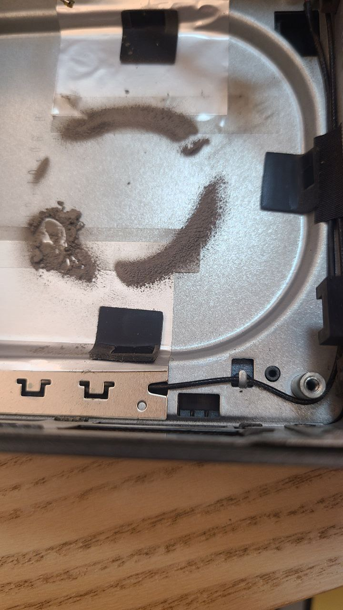

这里又是一份周报, 时间范围是`2022-08-08`到`2022-08-15`, 会记录一些工作及生活上有意思和没那么有意思的事情.

这周周报很敷衍.

## 工作/代码/计算机相关

### Nand2Tetris

本周没有进行 Nand2Tetris 的学习.

### Google UX

本周没有进行 Google UX 的学习.

### 清灰

上次把机柜里声音最大的那台机器(索泰 zbox)暂时下掉了, 于是 NUC 就成为了声音最大的那台机器.

进行了灰的清:

效果显著! 现在机柜里几乎听不见什么风扇声音了.

## 生活相关

### 摸了

上周的话, 各家聊得都到谈 offer 了. 总之是在各种纠结吧, 心情也不是很好, 也没记录啥.

然后这里面唯一的正文是:

反正现在是想不起来了. 🤣

### 出去玩

从明天开始就开始请年假了. 准备出去旅游. 从疫情以后, 还没出去旅游过. 很是期待.
