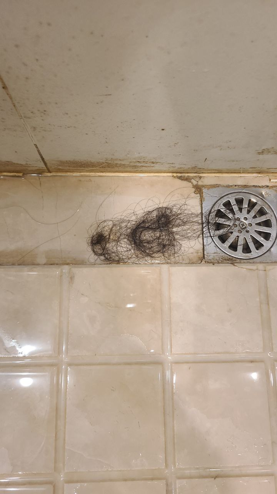
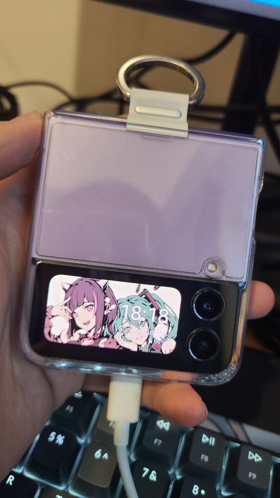
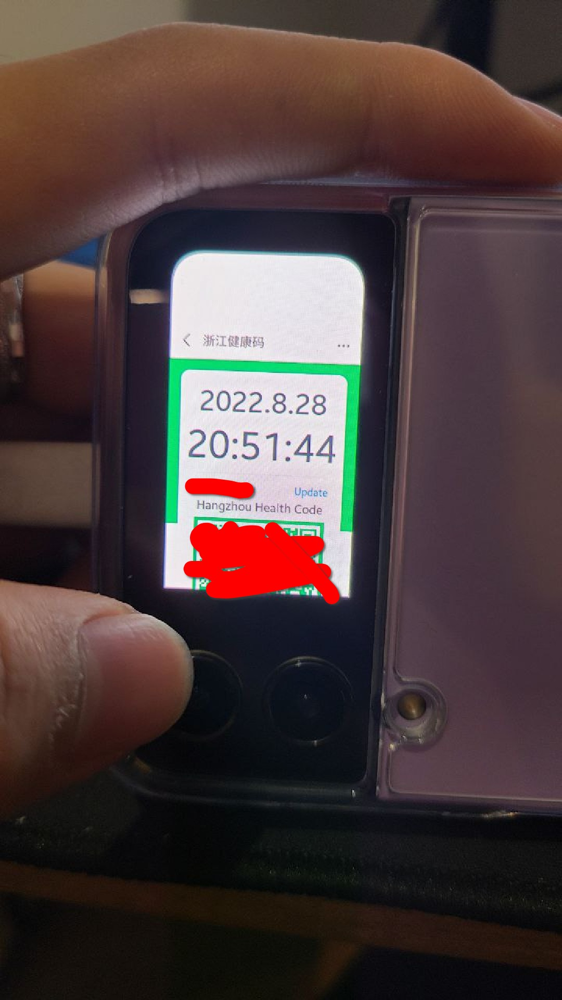
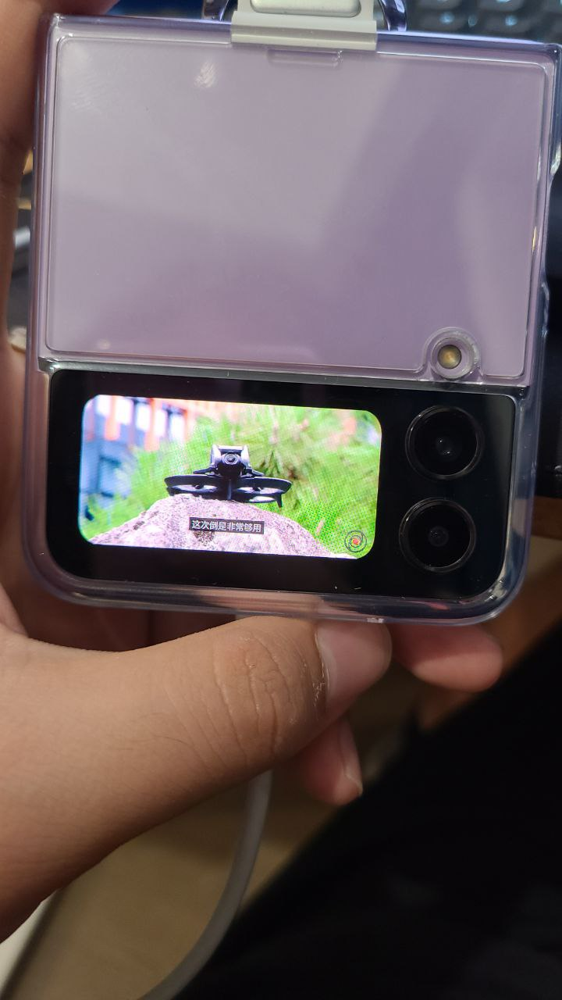
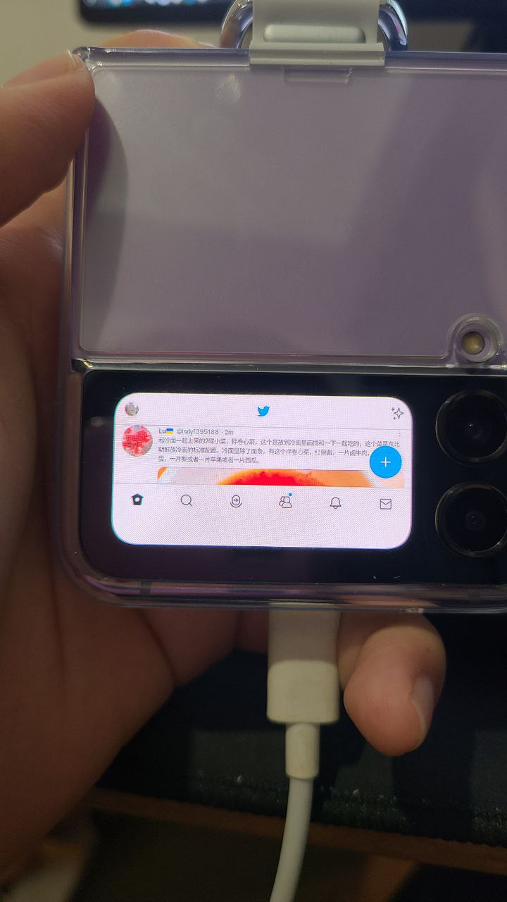
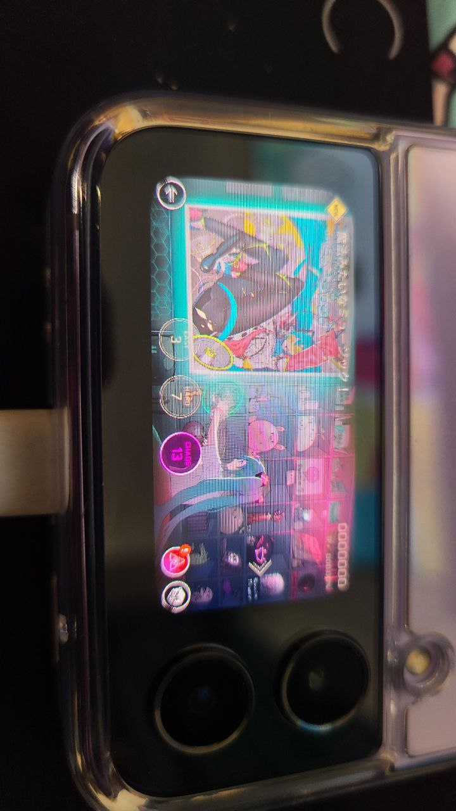
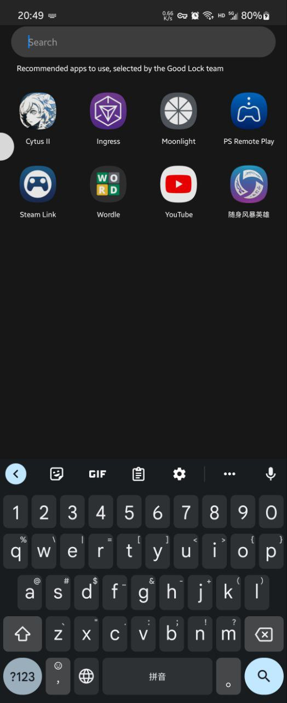
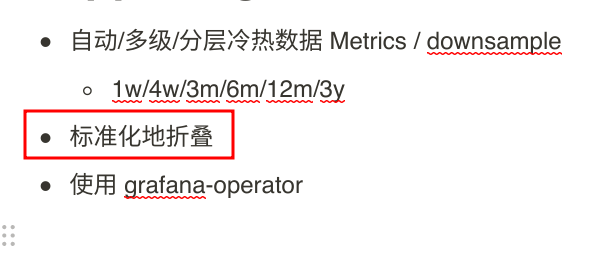
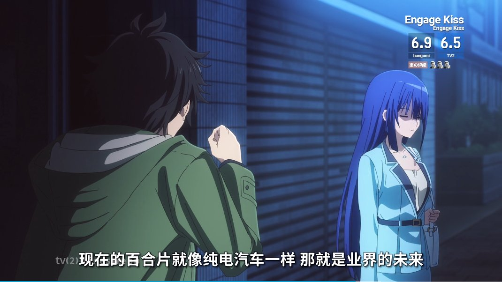

这里又是一份周报, 时间范围是`2022-08-22`到`2022-08-28`, 会记录一些工作及生活上有意思的事情.

## 工作/代码/计算机相关

> 这周整周都在请假(继续摆), 所以计算机相关的比较少. 有些有趣的点子俺还在整理, 估计下 2 - 3 周, 想得差不多了再和大家分享.

### Nand2Tetris

本周没有进行 Nand2Tetris 的学习.

### Google UX

本周没有进行 Google UX 的学习.

### 试用 Grafana Operator

在用了 Home Assistant 以后, 想做的 Grafana Dashboard 逐渐变得多了起来. 在经历过若干次没有持久化到 ConfigMap, 结果 Grafana Pod 重建以后, 梭到一半 Dashboard 丢失的事情后, 俺开始寻找方便的方法去管理 Grafana Dashboard.

> 为啥俺不直接用 ConfigMap + JSON, 因为俺是有一些 Dashboard 是从线上下载下来的. 这涉及到一个 Grafana 的[陈年老 issue](https://github.com/grafana/grafana/issues/10786), 导致很多导入的 JSON 都需要 [patch 一下](https://github.com/grafana/grafana/issues/10786#issuecomment-568788499)才能流畅使用 provisioning, 每次手工 patch 太累了.

Grafana Operator 支持做这件事情, 效果类似于[这个 example](https://github.com/grafana-operator/grafana-operator/blob/master/deploy/examples/dashboards/DashboardFromGrafana.yaml).

也支持已经画好的 Dashboard 通过 ConfigMap 方式导入, [example](https://github.com/grafana-operator/grafana-operator/blob/master/deploy/examples/dashboards/DashboardFromConfigMap.yaml).

现在我可以比较愉快的同时使用线上导入的 Dashboard 和我自己编辑的 Dashboard 了!

如果大家有什么办法管理 Grafana Dashboard, 也请告诉俺! 提前感谢.

> 实在不行再挂 PV.

## 生活相关

### 肝暗黑 3 第 27 赛季

上一次 26 赛季还是在[上一次](https://strrl.dev/post/weekly-report/2022/15-%E5%96%9C%E8%BF%8E%E6%9A%97%E9%BB%91-3-%E7%AC%AC-26-%E8%B5%9B%E5%AD%A3/).

这次 PTR 我也[兴致勃勃得参加了](https://strrl.dev/post/weekly-report/2022/28-%E7%83%AD%E4%B9%8E%E7%9A%84%E6%9A%97%E9%BB%913ptr/), 而且试过了/爽到了[新鲜的 BUG](https://www.youtube.com/watch?t=312&v=L8HoiwKVvlQ&feature=youtu.be), 然后这个 bug 在第二天就被热修复了.

这次俺也和女朋友一起开荒, 并在赛季第二天晚上打过了 120 层! 开心!.

这次也是用的拉斯玛套打亡灵大军, 断手操作. 这才是 ARPG!

> 拉斯玛就是暗黑 4 CG 里, 复活莉莉丝的那个人. ref: <https://youtu.be/0SSYzl9fXOQ?t=518>

> 纪念视频占位符

由于这几天玩得太肝了, 洗澡的时候发现掉了不少头发.

### 买了新手机 Z Flip 4

因为 Z Flip 4 太可爱了所以买了.

到手之后发现并没有想象中的那么小巧, 还是挺重的. 并且这一代铰链很重, 我一个手打不开. (算是个好事, 不要老解锁玩手机.)

只能放一张 SIM 卡, 而且国行还不支持 eSIM.

> 我就是冤大头.

今天出去吃饭带了两个手机, 发现续航和 S20 也差不多.

总之除了好看之外, 好像确实没别的太大优势了.

另外 cover screen 可以启动任意 APP, 比如说...

我可以在这里看健康码:

我可以在这里看 youtube:

我可以在这里刷 twitter:

我可以在这里打音游:

> 还有视频版本的: https://mobile.twitter.com/strrlthedev/status/1563880450204266496

Cytus 2 (还有 Steam Link, PS Remote Play)竟然还在 GoodLocks 这个应用的 Cover Screen Suggested Application 里.. 开发团队你认真的吗.

这一小块屏幕, 拿来养宠物非常合适. API 是开放的, 简单搜了下貌似有人已经在 cover screen 上做其他事情了, 感觉可以玩玩! <https://github.com/CarudiBu/SubUI-browser/>

### 发现自己日记里的记录完全想不起来了

发现记录事情的时候, 还是得记录得详细一些. 比如说这一条, 我就完全不记得自己要做什么了.

### Lycoris Recoil 是真的好看

> 图源: https://mobile.twitter.com/sticnarf/status/1551606274529574913/photo/1

啊,我好了, 好得不能再好了. 贴贴突突太强了.

meme: <https://twitter.com/ArmandoValores/status/1560852344304173057>
