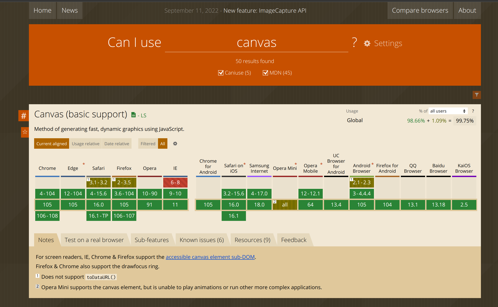
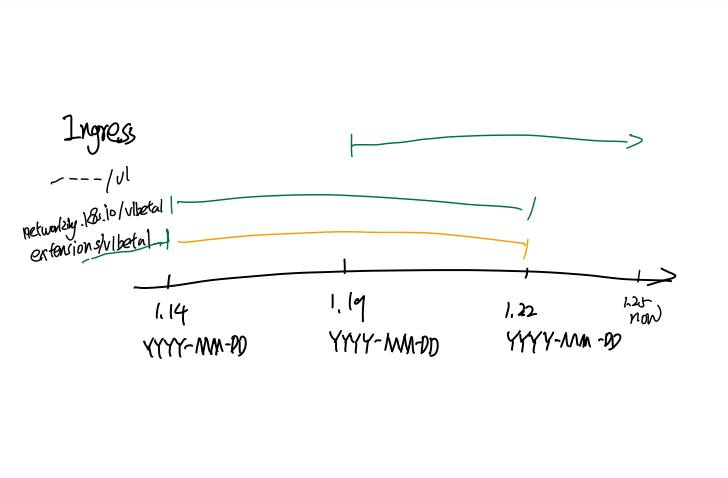
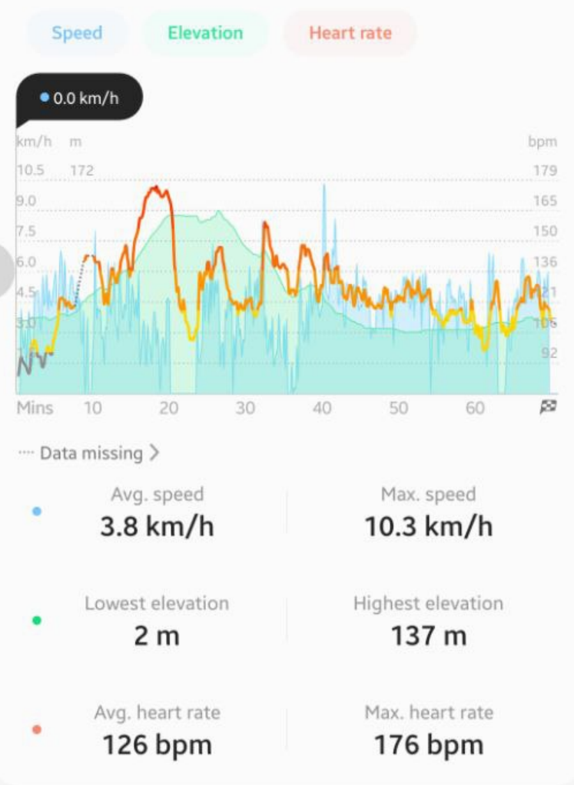

这里又是一份周报, 时间范围是`2022-09-19`到`2022-09-26`, 会记录一些工作及生活上有意思的事情.

## 工作/代码/计算机相关

### Nand2Tetris

开始填坑了, 这周写了 hack assembler: <https://github.com/STRRL/nand2tetris-projects/tree/master/06/hack-assembler>.

### Google UX

课程转旁听了, 不继续交钱了. 断断续续重新看了一些东西.

主要意识到的东西是, 产品是给用户用的, 而不是工程师和设计师意淫出来的, 永远都要去追用户的需求, 而不是只考虑自己的想法. 在迭代的各个阶段都要时刻记住以用户的需求为导向, 而且通过产出原型 -> 测试 -> 改进的方式, 不断地去验证自己的想法是否符合用户的需求.

> 那我是领域专家, 用户是领域小白怎么办? 不知道, 还没找到答案.

那谁是用户呢?

2C 产品意味着任何人都有可能是你的用户, 但是 2B 产品就不一定了, 我不知道如何确定用户是谁.

> 比如说 TiDB 和 Chaos Mesh 的用户显然应该多少都和计算机沾点边的.

### 试着做 rustlings

找了个下午 + 晚上肝完了 rustlings, 感觉对 Rust 并没有更多新的认识, 但是增长了些信心.

还是得找个合适的项目练练手.

### 想优化一下博客的样式和内容

我的赛博花园好丑啊!

打开了之前的一篇文章, 密密麻麻的全是字, 完全不想看.

一方面样式使得字太密集了, 另一方面确实文字描述太多.

> 两手都要抓! 两手都要硬!

所以自己胡乱改了下样式, 主要是增大了字体和行间距.

> 并不是各位的设备缩放变了.

下一步想做的事: 卡片式的连接貌似非常不错, 可以试着整整!

### 绝妙的点子: kaniuse.com

前端的朋友应该都熟悉 caniuse.com, 大家可以在这里找到某个特性在不同浏览器的不同版本的支持情况.

最近在 Kubernetes 的使用过程中, 我遇到了类似的问题: 我想知道某个不同特性在不同版本的 Kubernetes 中的支持情况.

比如说 Ingress 这个 API, 有三个不同的 GroupVersion:

- `extensions/v1beta1`, 于 `1.14` 被标记为废弃, 与 `1.22` 移除
- `networking.k8s.io/v1beta1`, 于 `1.14` 引入, 于 `1.22` 移除
- `networking.k8s.io/v1`, 于 `1.19` 引入, 目前(`1.25`)正在使用

要搜集这些信息, 目前只能靠手动的人力搜索, 还没有一个工具在索引这些信息.

如果能有一个工具, 以这种形式展示, 那我就非常开心了:

如果能再多告诉我一点信息, 比如, 我提供我当前用的 API 版本是 `X`, Kubernetes 版本是 `Y`, 这个工具推荐我在哪个日期前应该做哪些 migration 工作.

这只是 Kubernetes API 相关的, 如果也能自动化有办收集一些 API 无关的 feature lifecycle, 也在这里展示, 那就更好了.

## 生活相关

### 事情是难的

最近因为事情比较杂, 胡思乱想的时间也多了起来. 上段时间其实精神状态都不是很好, 没有固定的工作内容后, 感觉坐在电脑前也失去了像以前那样敲代码的动力.

于是乎给自己定了一些每日目标完成:

- 上一节 MOOC
- 读任意一本书的一个章节
- 翻译一篇英文文章
- 完成 LeetCode 上的一道题

而后发现这些目标过于琐碎, 而且做了以后也没有什么正反馈, 于是最近几天又改了: 每天 4 选 2 完成即可.

离开学校以后, 自学的特点就是有大量碎片化的知识和概念, 而大量摄入这些所谓碎片化的"干货"以后, 对学习的认知都发生了一定的改变: 预期投入太低, 预期收获太高.

需要投入大片连续的时间来去集中制作或学习某事, 而不是碎片化的时间, 琐碎的输入/输出.

假期难得, 不要把自己绷太紧了.

另外还了解到的一个观点是, 在工程做疲倦了以后, 休息的方式是专心的做一些艺术性的事情, 比如音乐, 画画... 准备后续试一下.

> 这就是传说中的, 做完数学做英语, 做完英语做物理, 做完物理做语文...

### 买了 iPhone 13 mini

和女朋友在逛商场的时候, 她去把玩了 iPhone 14 Pro, 我顺手把玩了旁边的 iPhone 13 mini, 突然感到一阵震惊, 这个太舒服了.

我对 iPhone 5 那个模具一直很喜欢, 小巧, 有棱有角.

经过反复思考, 女朋友的劝说, 还有推友的劝说后, 这台很多方面都很舒服, 只有刘海 + 没高刷这两个缺点的手机, 还是买下来了.

> 女朋友原话: 自从 Note 9 换了以后, 就几乎没见过你中意别的手机. 只有俩缺点的手机很难得的, 现在错过了后面更难有了, 买了得了.

贴一张合照:

### 跑步机 -> 爬山

最近天气凉快了, 在教练的建议下早上可以去爬山, 而不是跑步机.

跑步机上也太无聊了, 哪怕有点东西看和听, 固定的景色总会让我走神, 而且走神也没有很开心. 不如爬山一路看风景.

不过教练也提醒了, 爬山不像跑步机那样可以定时定量, 要多靠自己注意.

比如说最近这几次, 其实心率都不够快, 要 140 - 150 效果才好.

> 不过教练说中午就别去了, 天气暖了以后, 会有蛇出没. 😐

### 分享一些好玩的娱乐内容

最近保持心情愉悦听和看的一些内容:

- [凑近点看](https://open.spotify.com/show/4bW9I6PXtNz7485FiVnsft), 群口相声
- [世界莫名其妙物语](https://open.spotify.com/show/4KspyMLIvHhrLzyQBvagW9), 群口相声
