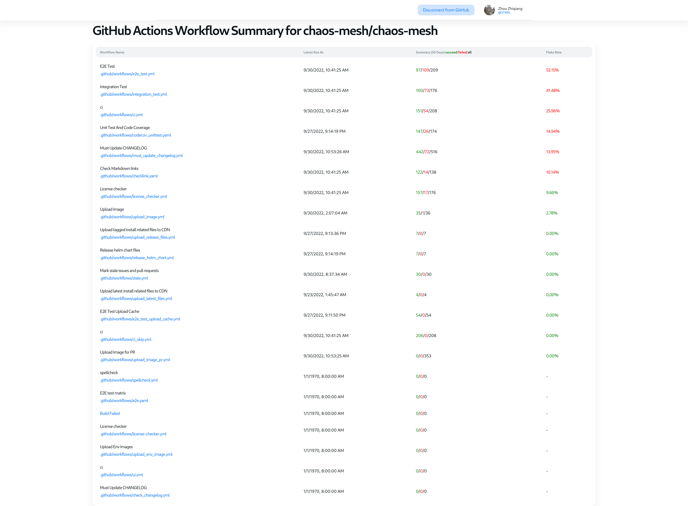
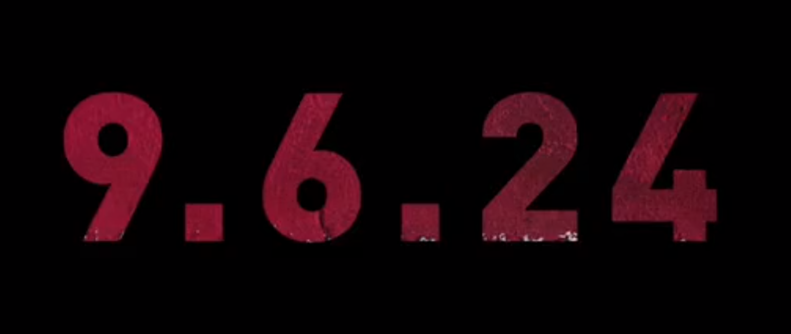

这里又是一份周报, 时间范围是`2022-09-26`到`2022-10-04`, 会记录一些工作及生活上有意思的事情.

## 工作/代码/计算机相关

### Nand2Tetris

这周写了 VM Translator Part 1: <https://github.com/STRRL/nand2tetris-projects/tree/master/07/vm-translator>.

用 rust 梭的, 到目前为止感觉都还不错, 目前的体验是:

- 创建同时包含字面 string 和需要 render 的 string 的数组时, 不是很好用, 都得转 `&str`/`String`, 然后再用 iterator map 成需要的类型;
- 应 `clone` 尽 `clone`;
- enum 真好用;

### Google UX

没看. `¯\_(ツ)_/¯`

### 翻译了一些文章

翻译了 [Documentation System](https://whatiknown.strrl.dev/notes/g2xw1fmq6l7g1yvxjwof41k/), 这个系列的文章.

这几篇文章的实用性很强, 如果对于如何构建一个好的文档心里没谱的话, 可以尝试参考着来.

### kaniuse 后续

目前已经糊了一个非常简单的放在这里了: <https://kaniuse.vercel.app/>

功能的话可谓是相当简陋, 就是抄了一小部分的 <https://github.com/stackrox/k8s-i-use>.

这次尝试不用 UI 库, 而是用 CSS 框架来画 UI, 有点难. 还在摸索.

> 配置 nuxt 的过程中还遇到了一些 ts 类型体操相关的问题, 被朋友推荐看一遍 ts 的 Release Notes. 🤣🤣🤣

### 新坑: GHA CI Grid

重所周知, CI 是会失败的. 但是如果 CI 中执行的是 flaky test, 也会给开发者带来不好的体验.

Chaos Mesh 正在受这种情况折磨, 而且挺久了, 但是一直没有具体/量化地去分析下现状. Chaos Mesh 使用 CNCF 的 GiHub Enterprise 套餐, 有无上限的 GitHub Action 资源, 所以 Chaos Mesh 大部分的 CI 都是在 GitHub Action 上进行的.

> 感谢 CNCF. OwO

但是 GitHub Action 与一些 self hosted CI (比如说 Drone, Jenkins), 或者一些 CI 服务(Circle CI, Travis CI)相比, 在执行历史的统计, 还有 testcase report/junit report 的支持上做的不好.

> 话说最近无意间发现 Spring 的 CI 好漂亮啊: <https://ci.spring.io/>. 是这个工具: <https://concourse-ci.org/>

一个例子: 我想知道哪些 testcase 是 flaky 的, flake rate 是多少. 目前 GitHub Action 没有直接一个 Dashboard 可以看, 需要自己调 API 去算一算.

于是想要类似于 <https://testgrid.k8s.io> 那样的东西, 于是俺就又梭了一个: <https://gha-ci-grid.strrl.dev/>.

比如要看 Chaos Mesh 的 CI 统计, 就访问 <https://gha-ci-grid.strrl.dev/gha/chaos-mesh/chaos-mesh>.

> 如果发现请求失败, 出现限流或者 `HTTP 403` 了, 记得点 "Connect with GitHub", 拿一个 Token, 避免限流.

顺便也体验到了有钱公司 Vercel 的开发者的响应速度:

<https://twitter.com/strrlthedev/status/1575772493641457666>

结果比较惨:

> 人的这个脑子啊, 对抽象感觉真是不敏感. 每个 PR 都要 rerun 几次 test 好像也没啥, 统计出数字, 50% 的 flake rate 来能立刻感觉出不一样了.

当然, 昨天晚上 Chaos Mesh 双周会上也提到这个事情了, 大家准备下阶段把 testcases 搞一搞, 让开发者们开心.

## 生活

### 守望 2 开服了

约着之前的朋友打了几把, 又回到了紧张刺激的游戏体验中. 但是我觉得我太老了, 注意力和反应速度都不行了, 只能玩玩不需要瞄准的莫姨划划水这样.

### 到秋天了

这两天气温抖得很厉害, 经历了一个昨天 36 度今天 17 度体验, 出门人就给冷麻了.

### 刷到了死侍新电影的预告

看上去要和狼叔一起整活了! 开心!

<https://twitter.com/RealHughJackman/status/1574866641623588876?s=20&t=yMRpEX0s0uDAfzrIgFibHg>

<https://twitter.com/RealHughJackman/status/1575102901919576065?s=20&t=yMRpEX0s0uDAfzrIgFibHg>
