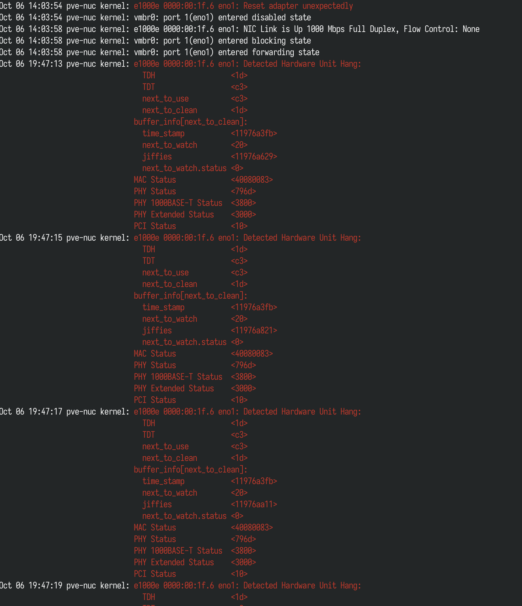
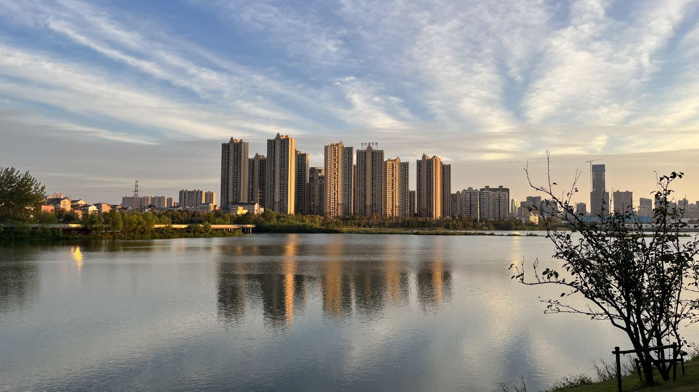
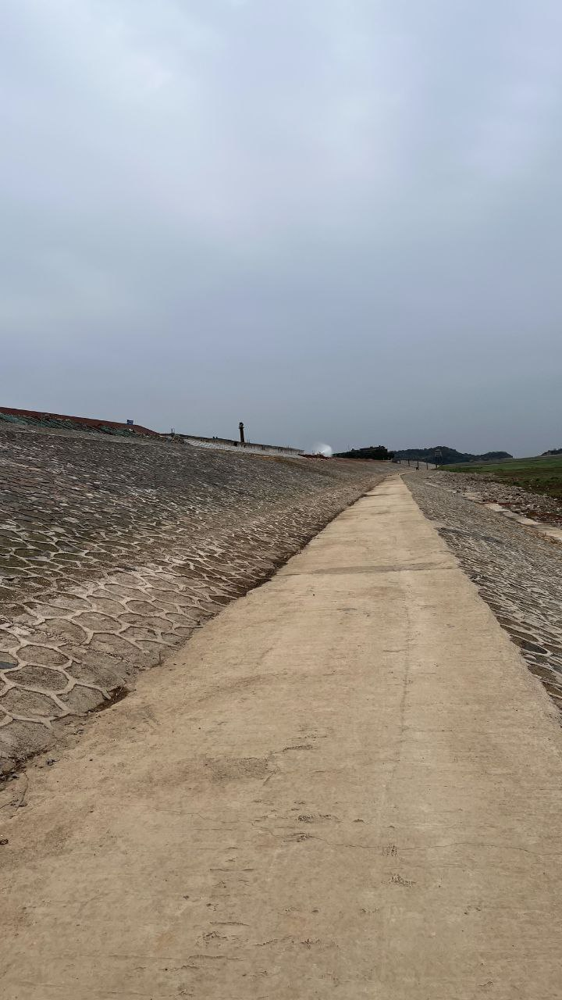
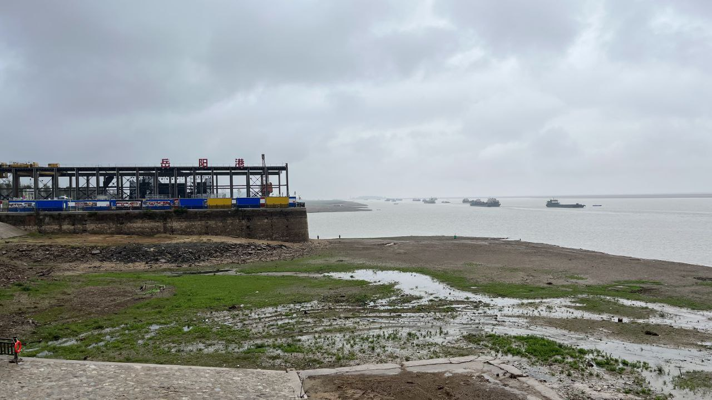

这里又是一份周报, 时间范围是`2022-10-05`到`2022-10-12`, 会记录一些工作及生活上有意思的事情.

## 工作/代码/计算机相关

### Nand2Tetris

没做. `¯\_(ツ)_/¯`

### Google UX

没看. `¯\_(ツ)_/¯`

### Refactoring UI

这是一个挺出名的书籍吧, 从 zlibrary 上找到某个版本大致看了下.

大致的内容是对于设计 UI 一些常见的 Pattern, 包括布局, 颜色, 图标等等.

给我留下几个较深印象的是:

- 先设计 feature, 而不是 layout
- 使用 HSL 颜色模型来进行颜色的设计
- 背景与主体需要有足够的对比度([contrast ratio](https://contrast-ratio.com/)), 大于 4.5:1 才好.

### 家里的跳板又寄了

目前俺还是主要使用 zerotier 作为回家的方案, 但是很不巧的是, 家里只有一台 zerotier 的节点.

而且很不巧的是, 在我出家门的第二天, 这台机器所在的物理机整个都挂掉了.

<https://twitter.com/strrlthedev/status/1578350876241973248>

回家以后发现机器灯还亮着, 于是强制重启以后看了下机器 kernel 日志:

发现还是之前网卡的那个问题.

根据 PVE 帖子上的方法, 把 TCP checksum offloading 关了就可以了.

> 上次出问题的时候也是这个预兆, 然后后来发现是内存问题. 这次希望内存不要再出问题了, 毕竟一条 32 GiB 的内存要小一千快钱呢.

经过这次后, 引发了写一个 zerotier operator 的想法:

- 使用 CRD 加入 Network, 配置 forwarding
- 多节点加入 Network
- 主备的方式进行高可用
- 自动 routing 和 iptables forwarding

先挖个坑! 以后再填!

## 生活相关

### 黄码转绿码

2022.10.11, 买了到杭州西站的高铁票. 到站后我变成了黄码, 然后同行的女朋友依旧是绿码.

再进行了单管核酸后, 把我安置在了一个名为 "黄码转码区", 让我在支付宝健康码里进行申诉, 等待变成绿码后才能离开.

我人傻了. 又不让走, 也不让隔离, 就让这提交申请以后等着. 我问这个区域里其他的人, 被告知出去的时间从 30 min - 6 hr 不等.

填完了申诉, 等了半小时后, 我尝试着向良渚社区这边打了个电话. 说明了我的情况后, 被告知我有一个电话号码 156xxxx6711, 经过了中风险区, 所以给了黄码.

其实这个号码 2 - 3 年前就没有在用了, 但是刚来杭州的时候还是用这个登记了.

说明这个号码我没有再使用的情况后, 社区工作人员说会给我安排一个三天三检的套餐, 并修改我的状态为绿码.

几分钟后, 我的健康码变成了绿码, 于是我准备离开了. 这时其他人都围过来问我是怎么弄的, 我说找对应社区打电话咨询情况, 并且我也建议他们不要干等, 也打电话问一下.

转码区后, 再次排队更新自己的报备情况, 又作了一个混检, 终于顺利出站了.

整个过程经历一个半小时左右.

> 另外有一个细节, 杭州西站 P2 停车场貌似不好上运溪高架, 而 P4 比较方便上运溪高架. 以后打车要去 P4.

### 身份证续期

我想大家应该都是在高考之前办的身份证吧, 而且第一个身份证的有效期是 10 年的.

我的身份证在 11 月中旬过期, 所以最近我去附近有户籍科的公安局尝试办新的身份证.

一开始我在电话上问了, 说可以外省是可以异地办理的.

然后我到了现场, 照片也拍了(丑的一批), 录入的时候发现, 我的户口所在地, 老家的派出所名字改了:

- 之前是 "AA县BB街道CC派出所"
- 现在是 "CC派出所"

这个派出所的注册编号也变了, 然后被告知要回老家办理. :(

心情复杂.

最近又要回山东了:(

### 去岳阳玩

又去岳阳玩了, 各处缺水, 洞庭湖也是, 水位非常低.

在洞庭湖附近飞了飞机, 风真的大, 飞机耗电很严重, 抖得也很厉害, 而且总是提醒风大危险.

最后, 分享些自己拍的照片吧!

