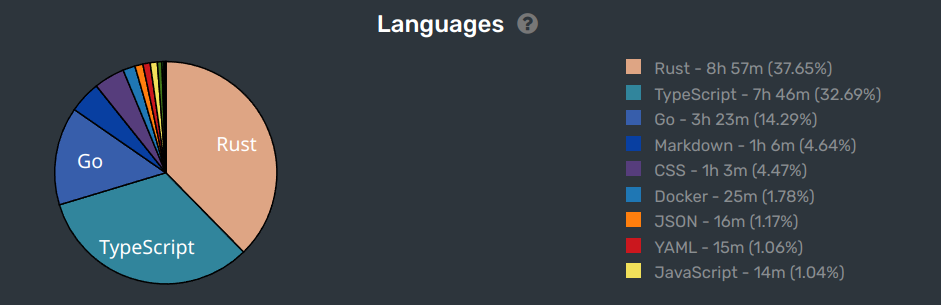

这里又是一份周报, 时间范围是`2022-10-13`到`2022-10-19`, 会记录一些工作及生活上有意思的事情.

## 工作/代码/计算机相关

### Nand2Tetris

没做. `¯\_(ツ)_/¯`

> 几次想尝试开始但是都去做别的玩具了.

### Google UX

没看. `¯\_(ツ)_/¯`

### 最近 rust 上手了

好!

## 生活相关

### 爬山上瘾

发现身体状态的提升会上瘾的, 现在在附近的地方爬山, 来回都从山里走, 总爬升差不多 400m, 非常舒服!

### 玩了一把泄漏的 NovelAI

网上找了个懒人整合包, 跑起来以后发现自己脑子里根本没有啥关键词. 也没画出啥可爱的东西.

> 不够涩!
