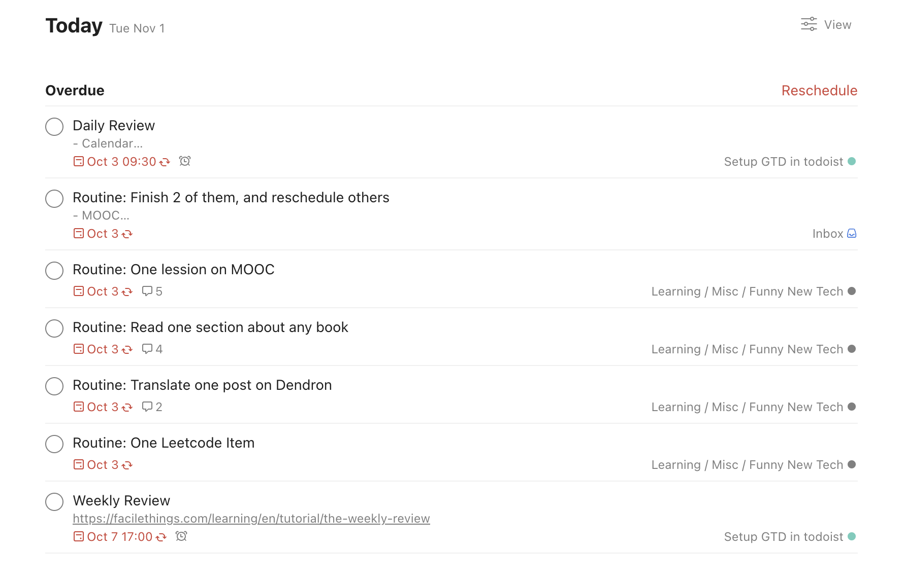

这里又是一份周报, 时间范围是 不知道什么时候开始 到`2022-11-01`, 会记录一些工作及生活上有意思的事情.

## 工作/代码/计算机相关

### 看 KUBECON NA 2022

这次的 KUBECON 又有好多内容感兴趣, 关于我的观后感, 记录在这里了:

<https://www.notion.so/strrl/KUBECON-22-NA-c39e92e4277d4aa2b4d1cf45077a86a6>

### 买了些新设备

AirPods Pro 2, 很不幸, AirPods Pro 泡洗衣机了洗了, 它没有撑过来, 被迫买了新款. 好心疼.

Windows Dev Kit 2023, 微软新出的开发者主机, 高通骁龙的计算平台, 4 大核 4 小核, 32G 内存, ¥4488, 比 mac mini 实惠. 但是目前还没法装 Linux. 有潜力成为最好的 arm64 linux 开发机.

## 生活相关

### 停滞的 GTD

TLDR; 这周需要把停滞的 GTD 重新捡回来. 目标: 每天爬山之前过一遍 Daily Review.

在今年年初的一段时间里, 我开始学习 GTD 这种管理要做什么事情的方法, 不得不说有一定的作用.

只是在最近的实践中变得越来越变形, 然后时间停滞在 2022 年 10 月 3 日, 我不再更新我的 GTD, 也不再去做 daily routine:

然后在接下来的一段时间里, 个人状态有明显的下滑, 事情不再能完成, 计划被打乱, 一切回归不可控但又似乎没啥问题的虚无状态中.

即使到现在我还没有感觉到有啥不适, 毕竟每天都没有什么要做的事, 打打混, 写点开心的代码很不错.

为了以防未来将会到来的焦虑和后悔, 决定把 GTD 需要捡回来.

### 好像不晕车了

大约从九月下旬开始早睡觉, 大约十月中旬发现, 我好似又不晕车了, 在的士上玩手机也不会头晕了, 开心!

### 聊天邀约

跟风, 在 cal.com 上创建了一个用来约时间聊天的日历, 有兴趣找俺聊天的同学可以随意定时间, 或者再协调:

<https://cal.com/strrl/30min>

目前和 1 位网友聊过了, 我话太多了, 输出了很多但是听的太少了. 😰
