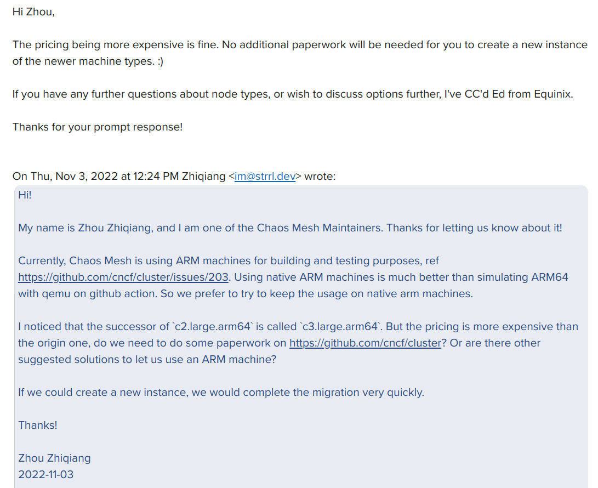
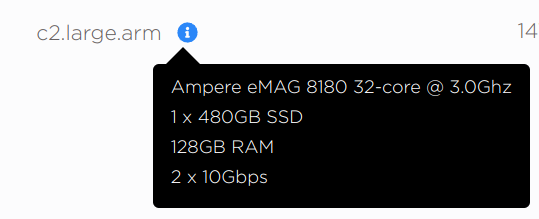
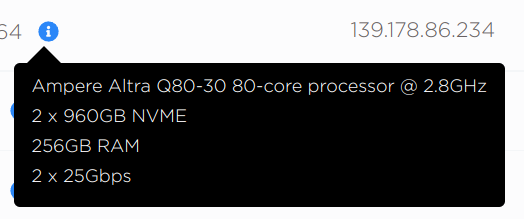
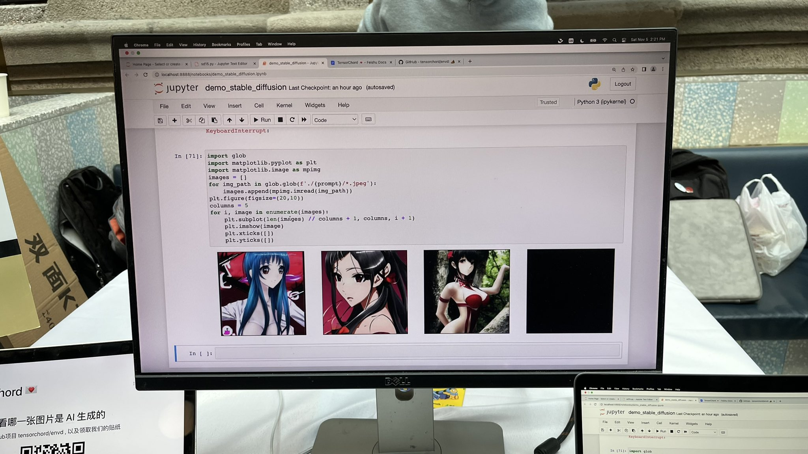
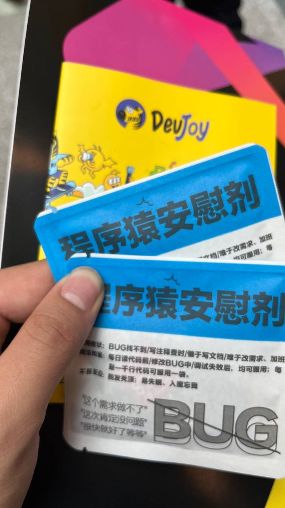
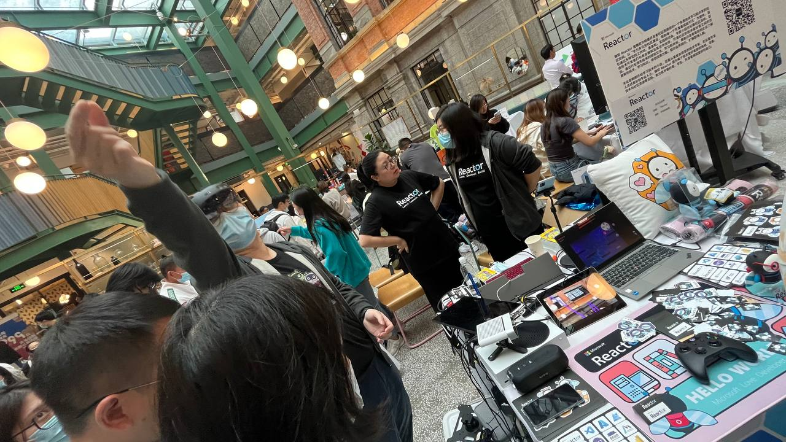
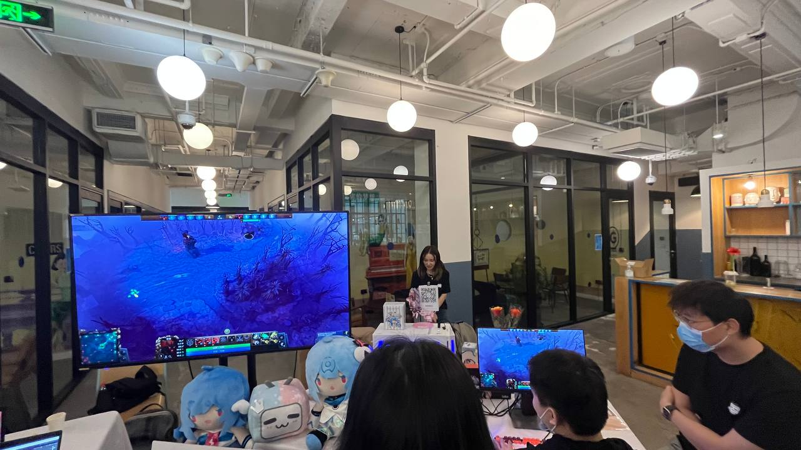
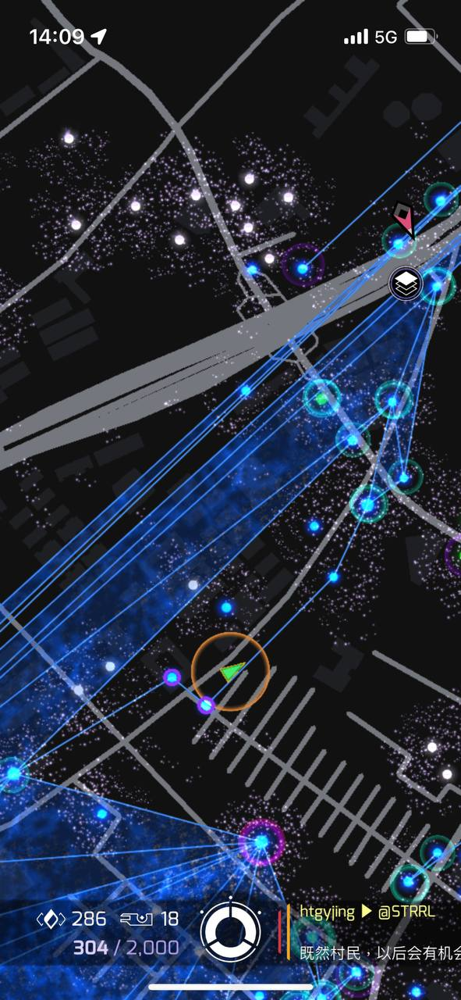

这里又是一份周报, 时间范围是 `2022-11-02` 开始 到`2022-11-08`, 会记录一些工作及生活上有意思的事情.

## 工作/代码/计算机相关

### Chaos Mesh ARM 物理机喜提升杯

最近收到一封邮件, 说是 Equinix Metal 的机房设备升级, 之前 Chaos Mesh 用的 `c2.large.arm` 实例需要被铲, 询问了下, 可以直接升级到 `c3.large.arm64`.

机器的配置有了整体的提升:

> 另外我也估算了下目前手上的存储资源, 全部大约有 1.4 TiB 可用, 平均分布 3 副本也有 480 GiB 可用, 对于跑 Prow bot 看上去相当够了.

### GitHub API GraphQL vs REST

之前写了个统计 GitHub Action 失败率的小应用嘛: <https://github.com/STRRL/gha-ci-grid>, 图开发方便, 使用的 Octokit 的 REST Client 实现的逻辑, 后来发现统计 Job 成功率的时候就特别麻烦, 需要 repo -> workflow -> workflow run -> job run 查四层. 看了下 GraqhQL 貌似可以写一个 query 直接拿到所有的信息, 感觉非常香, 准备后面更新一下.

### 准备再去考点证

自从上次考了 CKA 以后就没在关注其他的认证了, 后续我的安排应该也不会很紧, 还是需要拿一些新的认证.

方向大约是 LF 和 AWS 的一些认证吧.

另外学习 AWS Cloud Practitioner Essentials 的时候确实了解到好多新知识.

## 生活相关

### 参加了 DevJoy

关于 DevJoy 是什么可以看这里: <https://www.devjoy.org/>.

对俺来说是大型网友见面会, 见到了 Mila, 彦青姐, 高策哥哥, 天翼哥哥, 高松哥哥.

展会上也有一些好玩的东西, 比如说:

- 高策哥哥铺子上搭建了一个 stable diffusion 的环境, 我起手一个 `bishojo` 开始进行召唤
- Microsoft Reactor 的铺子上带来了 Hololens 2, 可惜工作人员不让顾客玩, 只能看投屏, 而且价格感人, $3500
- 哔哩哔哩铺子上进行 AI Solo 赛, 打赢了 AI 就送赫斯缇亚(线上球)手办.

### 天气转凉, 感冒了

上周天气转凉了, 我头铁得, 又穿着速干 T 恤爬山了, 结果被冻麻了.

这两天身体不太舒服, 鼻塞流鼻涕喉咙痛.

虽然自己核酸一直都是阴性, 但是不敢在外面咳嗽, 擤鼻涕. 😇
