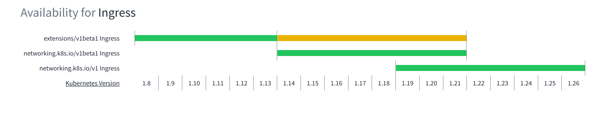

这里是鸽了将近 2 个月周报, 顺便是年终总结.

## 2022 年

### 周报

从 2022 年的 1 月 29 日起开始写第一篇周报, 到现在断断续续写了 42 篇周报.

其实当时写周报的时候就已经预感到了会有这一天到来, 读着自己之前写的周报, 再回想一下当时的心境, 是一种什么样的体验.

### 变无业

我于 2022 年 8 月 31 日从 PingCAP 离职了, 离职的原因嘛, 也在 [2022-27: 找新坑](https://strrl.dev/post/weekly-report/2022/27-%E6%89%BE%E6%96%B0%E5%9D%91/) 这篇文章里提及了.

后来面了若干家公司, 也拿到了一些 Offer, 甚至工资算下来能够有 30% - 50% 的涨幅, 但是最终还是选择没有接下任何一家公司的 Offer, 而是期望在一个看上去更"不错"的方向里.

> 感谢帮助我内推的朋友们, 也非常感谢猎头 Danny 给我介绍了很多好机会.

用 Chaos Mesh 这个产品去创业.

当然后来发展逐渐变得差了起来, 今年的投资圈非常的冷, 尽管有建信金科, Adobe, Databricks 的用户们愿意为我们站台, 接受 VC 们的询问, 但是还是没有能够拿到乐观的数字. 这个事情算是告一段落了.

后续又有一次甚至能够直接有望润出去的工作机会, 无奈最后技术面结束后, 被 HR 告知后续不计划再在大陆招同学了, 也是比较可惜.

> 也是因为我还没有优秀到能让对方公司帮我润出去吧.

在这段时间里, 以兼职的形式帮助前老板强哥做一些事情, 补贴家用, 非常感谢强哥.

于是乎我目前的状态就是一个在杭州的灵活就业人员, 但是上两天买退烧药的时候发现自己的医保没有续上, 不能用了, 烦心事还是有一些的.

### 买车车

不知道为什么今年的冬天格外的冷, 雪好像已经下了好几场了, 迫于现在住的比较偏远, 出行太不方便了, 于是买了一辆车.

人生中第一次买车, 也是第一次拥有车, 还是蛮激动的, 毕竟拿了驾照三年了没开过车, 有了车以后开了个爽.

不过我应该是当时在买车附近的时候感染的新冠, 那天女朋友就嗓子不舒服, 喝了很多水, 我开车也是眼睛不太舒服.

### 得新冠

自己觉得新冠还是比感冒要凶很多的, 我自己的话是烧了两天, 晚上睡觉十分煎熬, 差不多 1 小时到 2 小时就要醒一次, 上厕所并再次补充很多水分.

谢谢住在附近的朋友们, 在俺们发烧的时候借给了俺们布洛芬, 在发烧的时候没有过于难受.
今天是第 8 天了, 还是比较容易感觉累, 身体 + 精神. 开车的时候能明显感觉注意力比较难集中, 有时候意识会突然掉几个 ticks 的感觉.

另外身体在病的时候, 情绪也很容易感觉到 emo. 比如说最近一段时间就特别害怕变成肺炎重症, 然后因为没有医保没有办好, 没有办法治病就死掉了 / 或者是自己花光了钱也没有治好死掉了 / 或者是治好了没有钱吃饭饿死了. 🥲

特别感谢女朋友在这段时间的陪伴和开导, 家人的支持能给我很多温暖和动力.

### 整了一堆没搞好的个人修养 / 方法论

#### GTD

GTD 的效果是明显的, 但是由于个人的懒惰没有坚持下来, 总想着这会"沉迷在 XX 事情中", 过一会再去 trigger GTD 吧, 久而久之很容易忘记 GTD 这个工具.

而且目前为止也依旧没有非常好用的工具来实践它, 目前我的方案是使用 Notion 里自建的 database 来存储我的这些事情, 然后建了一些不同的 view 来查看不同的 stuff. 有时会参考 facilethings 里的文章来作为流程指导.

我预感到接下来如果无论是工作还是生活, 使用 GTD 来驱动各种事情的推进是**非常有必要的**. 不要让自己的那些小的地方偷懒, 这不想去做那不想去做, 慢慢地积攒到自己崩溃.

#### 健身

最近天气变冷后, 就再也没有去参加有氧和力量训练了.

体力和精神状态有明显地下滑.

我觉得需要 2 周后, 新冠恢复地差不多了, 立刻恢复训练.

#### 冥想

冥想有助于让我不瞎想, 控制自己的思绪. 很惭愧只看了书籍 <十分钟冥想> 的第一章, 尝试着用了它的方法, 用了以后确实会有点所谓 "六根清净" 的感觉.

很遗憾, 每天都 coding 到十一点才睡觉, 没腾出时间来看书和冥想.

### 整了一堆烂尾的项目

#### growth-of.codes

揭示项目复杂度随时间增加的项目, 类似于 <https://star-history.com>, 但是纵轴是代码复杂度.

ref: <https://strrl.dev/post/weekly-report/2022/09-%E6%87%88%E6%80%A0%E7%9A%84%E4%B8%80%E5%91%A8/#growth-ofcodes>

没有继续迭代下去的原因是发现自己并不熟悉其他的项目, 而且代码复杂度其实是"虚高"的, 参考意义不大.

#### dodo rooster

这个项目是想通过密码学 + 可信计算的方式来实现一个可审计地真匿名论坛, 大家使用自己的密钥来发言, 通过投票来禁言或者"开盒"大家认为需要被开盒的匿名身份.

没有继续迭代下去的原因是一方面我不再需要这个项目了, 另外一方面是因为大家对于言论和身份的敏感也没有到这种地步. (是没需求了.)

#### kaniuse

完成度还算不错的作品?

<https://kaniuse.vercel.app/>

能够展示 CRD API 版本随着 kubernetes 版本变化, 展示可用情况的图表. 拿最常说的 Ingress 为例:

下一步向做的是能够自动生成 Kubernetes Upgrade / Migration Guide. 比如说选定某个升级路径(比如 Kubernetes 1.19 -> 1.25)后, 会提示哪些 API 版本将要 deprecated 了, 哪些 API 要被删除了, 要做哪些 migration 工作.

没有再继续迭代下去的原因是因为精神状态不好, 去瞎想别的东西去了.

这个应该还会继续做下去. ( GTD 捡起来以后. )

#### GHA CI Grid

完成度比较低但是"能用".

<https://gha-ci-grid.vercel.app/>

借鉴了 prow bot 和 testgrid, 展示 GitHub Action 历史执行历史的网页.

没有再继续迭代下去的原因, 是因为当前这个程度已经能够量化的分析出 Chaos Mesh 的 E2E 测试的稳定性了, (flake rate 56% 左右 🥲), 没需求了.

#### 学 Nand2Tetris

这个作业写到了 Assembler, 后来失去了 cue, 就没有再捡起来.

#### 学 Google UX

这个倒在了后来想整理到 dendron 去, 遗失了进度, 后来失去了 cue, 就没有再捡起来.

> 其实 GTD 在很多时候都是充当了一个 cue 的作用.

#### 看 KubeCon 宣讲

两次都列了想看的 Talk 列表, 在最开始几天还是一天能看三四个的. 后来也是因为去忙别的/玩别的去了, 遗失了 cue, 再没有捡起来.

### 买了一些电子设备

- Samsung Galaxy Z Fold 4; 不推荐, 别买.
- iPhone 13 mini; 好东西, 果子家的东西真的是精品.
- Microsoft dev kit 2023; 不推荐, 别买.
- HP Color Laser 150nw 打印机; 有打印机确实方便, 但是用处不多.
- DJI Mini 2; 大号玩具, 挺好玩的.
- Macbook Air 2020; 好东西, 强力的生产力工具, 果子精品.

## 未来, the Right or the Easy

先列几个需要做的事情吧:

- 依旧需要 discipline 来鞭策自己的行为, 自己实在是太懒散了.
- 做安排和计划, 比如说看书的计划, 练琴的计划等等, 而不是每天吃完饭就做到电脑前开始敲不知道哪来的代码, 一敲敲到晚上十一点.
- 恢复健身, 保持身体健康和心情愉悦.

再就是一个方向的问题, 我未来的事业要何去何从.

还记得 2020 年 5 月份, 我从第一家公司跳到第二家公司, 身份从 Java CRUD Boy 变成了 Senior DevOps Engineer, 从此我就开始了我和 Kubernetes 的孽缘.

刚开始新工作还是很开心的, 但是后来被自己的组长建议每个季度都要花 3 - 4 周的时间整理述职和新 OKR 的时候我显然绷不住了. 而且我在 SRE 小组也需要轮流 oncall 以及处理和其他组的对接杂务, 真正能安静下心 coding 的时间不多.

> 陷入了自我怀疑. 我发现我这个人就老喜欢自我怀疑, 担心自己哪天就被淘汰了.

在那时我开始好好想未来的规划, 刚好 PingCAP 在招 Chaos Mesh 相关的岗位, 要求熟悉 Linux 和 Kubernetes, 而且我挺早前就听说 PingCAP 这家公司名声不错, 氛围好. 于是在尝试下, 我加入了 PingCAP.

其实当时我已经比较怀疑国内的工程氛围已经比较毒了, 但是我还是抱着试一试的心态去了 PingCAP. 如果 PingCAP 还是不行, 那我也就只能考虑国外的 IT 氛围了.

一开始 PingCAP 氛围确实不错, 但是后来不行了. 这也是我离职的原因之一.

于是乎我已经有了前车之鉴, 国内氛围就是这样的毒, 其他的公司我现在看上去虽然现在还好, 但是未来也不一定会继续保持得多好. 我应该怎么办呢?

正确的路应该是时候考虑北美了, 这可能是正确的事情. 但是我现在处于 gap 的状态, 虽然经济上应该能够维持到去北美上个学再去找个工作, 但是心理上的负担非常大. 🥲

或者说还是找个国内的公司继续假装无事发生? (直到下一次自己再崩溃?)

我的内心里其实是有答案了, 但是我依旧缺少信心和决心.

无论如何, 现在先开始学英语吧, 无论是不是出去, 都不亏.

然后在新的一年里, 把自己的状态调整好, 在年初的 1 - 2 个月内, 把选择做出来, 把选择坚定地做下来.
