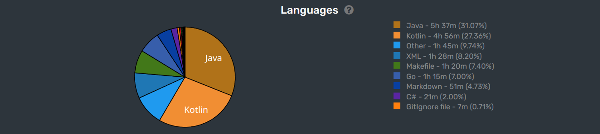

这里又是一份周报, 时间范围是`2023-01-09`到`2023-01-15`, 会记录一些工作及生活上有意思的事情.

## 代码/计算机相关

### 有趣的工具: lnav

从推友那里得知了一个有趣的工具: [lnav](https://github.com/tstack/lnav).

ref: <https://twitter.com/AFutureD/status/1612297761357189121>

这是一个强大的命令行工具, 主要是用来花式查看/统计/分析日志的. 有了它, 你可以做到:

- 同时在一个视图/多个视图中查看多个日志文件/日志流
- 高亮日志中的 JSON / XML 内容
- 统计日志的频率, error, warning, info 等级别的频率
- 将日志作为数据源, 使用 sql 语句进行查询/统计/分析

而且最近就直接用上了: chaos mesh 的 `make` 命令性能比较差, 想 profile 一下到底是哪里慢了.

但是 make 不像 service 那样方便和 tracing 系统集成, 它又不是一个 CPU 密集型应用, 所以我的一个歪门邪道的想法是: 用 `strace` + `lnav` 来分析是哪里慢了.

执行命令 `trace make help 2>&1 | lnav -t`, 然后按 `i` 进入 histogram 视图, 使用 `z`/`shift+z` 缩放到合理的比例尺后可以看到, 有某个时间窗口内的日志特别少, 一定程度上说明这个时间窗口内, 等待的时间比较长.

然后再根据这个时间戳看原来的日志, 发现慢的原因是执行了若干个脚本, 然后赋值给变量.

> 问题定位了. 改进在路上了.

### 准备参加 Game Jam

第一次了解到 Game Jam, 是在 BK 的纪录片里: [Game Jam 2022 在上海 独立游戏 纪录片 | 钱从哪来 S01 Documentary](https://www.youtube.com/watch?v=ygWbvkzqTKU).

因为我本科是数字媒体技术专业的嘛, 大学里学了不少游戏相关的课程, 虽然工作后没有在游戏领域折腾, 但是对于制作一款游戏还是依旧感兴趣的.

这次的 Game Jam 联系了大学的同学, 在这周六下午喝了杯咖啡, 简单沟通了一下想法, 基本上达成一致(准备偷跑)了.

实际上, 树莓专业的同学, 在毕业后保持初心在多媒体相关行业的真不算多, 10% - 20% 还在, 其余的(比如说我)都去其他方向了.

这次 Game Jam 的时间是 2023/2/5 - 2023/2/7, 线上线下均可参加, 线下地点有北京, 广州, 重庆, 武汉, 杭州, 深圳, 上海, 济南多个站点.

总是还是蛮兴奋的.

### 最近的 coding 状态

最近回归了猛草 JVM 语言的时代, Kotlin 出活真的不要太爽.

## 生活相关

### 准备英语考试

最近开始开始逐渐在英语上投入精力了, 自己的基础还是非常弱, 许多单词和语法都不怎么会.

参加了一次线下的英语角, 感觉能听懂个三四成. 说的话我倒是没有心理压力(脸比较大), 但是语言磕磕巴巴, 比较困难.

短期内的计划是:

- 背单词
- 学语法
- 跟着 Official Guide to the TOEFL iBT Test 学
- 参加英语角

### 快过年了

这周周末应该是最后一个工作日的周末了, 大家都在商场里备年货, 非常的热闹, 也非常的拥挤.

本来也想去商场屯一点东西, 结果停车半小时都没有找到车位, 放弃了, 工作日再过来.

节日对于我来说其实也没有太多什么不一样, 从*枫言枫语*的 Justin 提出过的一个观点: **这个世界是连续的, 节日只是人为规定的, 事情并不会在某个具体的时间点后突然变好, 或者突然变差.**

因此我也没有给过年做特别的安排, 照常过就可以了, 朝着自己的目标努力.
